# Basic English 850 Words / 基础英语850单词

Basic English 850 words 是一种基础英语词汇表，包含了850个常用的英语单词。这个词汇表旨在帮助非英语为母语的人学习英语，以便能够进行基本的日常交流。这些单词被认为是最常见和最基础的英语词汇，涵盖了各种常见的主题和概念。通过掌握这些基础词汇，学习者可以构建起初步的英语语言能力，并逐渐扩展词汇量和语言技能。

## 850章节开始

<!-- 本区间由 scene-cards-850/scripts/sync-readme.py 从已审定卡片数据机械生成，请勿手动编辑；数据或布局变化后重跑该脚本。 -->

这里汇总 **C001–C100 共 100 个场景、850 个目标词**的场景学习卡：每张卡配一张场景图，逐词给出英文、中文释义与原创中英例句（例句保留目标词高亮）。

想更快掌握这850个词，可以下载[《摄影学英语》](https://apps.apple.com/cn/app/id6808490052)，免费使用850词场景卡组，把看图、单词和例句练习结合起来。

### C001 · 清晨醒来

| 单词 | 中文 | 例句 |
| --- | --- | --- |
| bed | 床；用来睡觉的家具 | I am still in **bed**. 我还在床上。 |
| sleep | 睡觉；处于睡眠状态（本例回顾昨夜） | I **slept** well last night. 我昨晚睡得很好。 |
| awake | 醒着的；没有在睡觉 | I am **awake** now. 我现在醒着。 |
| morning | 早晨；一天中醒来后至中午前的一段时间 | The room is bright this **morning**. 今天早晨房间很明亮。 |
| clock | 钟；摆放或悬挂的计时器 | The **clock** is beside my bed. 钟在我的床边。 |
| curtain | 窗帘；挂在窗前遮挡光线的布 | Light comes past the **curtain**. 光从窗帘旁边透进来。 |
| light | 光；本卡指从窗外照入的自然光 | **Light** falls on the bed. 光照在床上。 |
| early | 早的；本卡指一天刚开始、时间还早 | It is still **early**. 时间还早。 |
| be | 系动词，用来说明状态；本卡以 am/is 连接主语与状态或位置 | I **am** awake now. 我现在醒着。 |

### C002 · 窗前的昼夜

| 单词 | 中文 | 例句 |
| --- | --- | --- |
| window | 窗户 | She sits by the **window**. 她坐在窗边。 |
| day | 白天 | The room is bright during the **day**. 白天房间很明亮。 |
| night | 夜晚 | The sky is dark at **night**. 夜晚天空很暗。 |
| bright | 明亮的 | The room is **bright** in the left picture. 左图里的房间很明亮。 |
| dark | 昏暗的 | The room is **dark** in the right picture. 右图里的房间很昏暗。 |
| sun | 太阳 | The **sun** is in the blue sky. 太阳在蓝天中。 |
| moon | 月亮 | The **moon** is in the night sky. 月亮在夜空中。 |
| star | 星星 | I can see a **star** in the sky. 我能看见天空中一颗星星。 |

### C003 · 整理房间

| 单词 | 中文 | 例句 |
| --- | --- | --- |
| room | 房间 | This is my **room**. 这是我的房间。 |
| floor | 地板 | The **floor** is made of wood. 地板是木制的。 |
| wall | 墙 | The **wall** is pale grey. 墙是浅灰色的。 |
| shelf | 搁板 | The books are on the **shelf**. 书放在搁板上。 |
| drawer | 抽屉 | The **drawer** is open. 抽屉开着。 |
| box | 盒子 | The **box** fits in the drawer. 这个盒子能放进抽屉。 |
| cushion | 靠垫 | A **cushion** is on the sofa. 沙发上有一个靠垫。 |
| put | 放置 | I **put** the box in the drawer. 我把盒子放进抽屉。 |
| a | 一个（初次提及） | I have **a** box. 我有一个盒子。 |
| the | 这个（已知的） | I put **the** box in **the** drawer. 我把那个盒子放进那个抽屉。 |
| space | 可用空间 | There is **space** on the floor. 地板上有空地方。 |

### C004 · 开门迎客

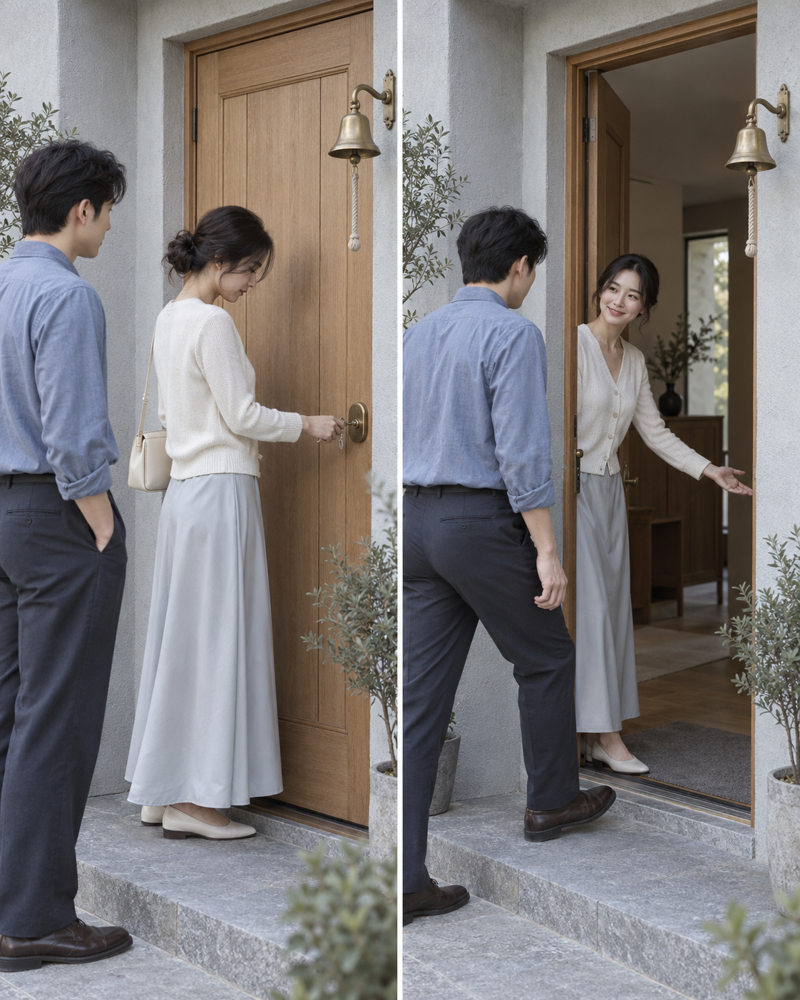

| 单词 | 中文 | 例句 |
| --- | --- | --- |
| door | 门 | The **door** is made of wood. 门是木制的。 |
| key | 钥匙 | I turn the **key**. 我转动钥匙。 |
| lock | 锁 | The key is in the **lock**. 钥匙插在锁里。 |
| open | 开着的 | The door is **open** in the right picture. 右图里的门开着。 |
| shut | 关着的 | The door is **shut** in the left picture. 左图里的门关着。 |
| house | 房子 | My **house** has a wooden door. 我的房子有一扇木门。 |
| come | 来 | Please **come** in. 请进。 |
| in | 在……里 | The key is **in** the lock. 钥匙插在锁里。 |
| bell | 铃 | The **bell** hangs by the door. 铃挂在门旁。 |

### C005 · 一家人围桌

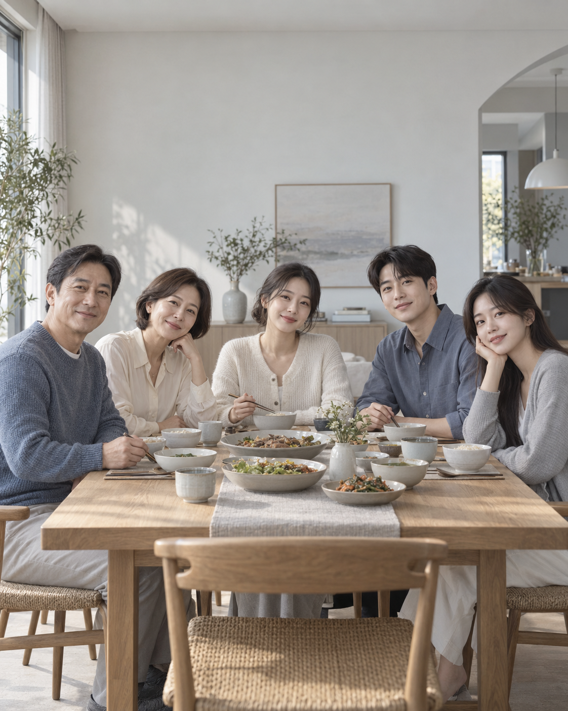

| 单词 | 中文 | 例句 |
| --- | --- | --- |
| family | 家人 | We are a **family**. 我们是一家人。 |
| father | 父亲 | My **father** sits on the left. 我的父亲坐在左边。 |
| mother | 母亲 | My **mother** sits beside my father. 我的母亲坐在父亲旁边。 |
| brother | 兄弟 | My **brother** wears a blue shirt. 我的兄弟穿着蓝色衬衫。 |
| sister | 姐妹 | My **sister** wears a grey cardigan. 我的姐妹穿着灰色开衫。 |
| table | 桌子 | The plates are on the **table**. 盘子放在桌上。 |
| together | 一起 | We sit **together** at the table. 我们一起坐在桌旁。 |

### C006 · 照顾小宝宝

| 单词 | 中文 | 例句 |
| --- | --- | --- |
| baby | 宝宝 | The **baby** is in my arms. 宝宝在我怀里。 |
| son | 儿子 | Our **son** sits beside us. 我们的儿子坐在我们旁边。 |
| daughter | 女儿 | Our **daughter** sits beside us. 我们的女儿坐在我们旁边。 |
| birth | 出生 | We were happy at the **birth** of our baby. 宝宝出生时，我们很开心。 |
| care | 照料 | Our baby needs love and **care**. 我们的宝宝需要爱与照料。 |
| kiss | 亲吻 | I **kiss** the baby on the forehead. 我亲吻宝宝的额头。 |
| dear | 亲爱的 | You are my **dear** baby. 你是我亲爱的宝宝。 |
| love | 爱 | We give our baby **love**. 我们给予宝宝爱。 |
| dependent | 依赖的 | The baby is **dependent** on us. 宝宝依赖我们。 |

### C007 · 洗漱台前

| 单词 | 中文 | 例句 |
| --- | --- | --- |
| basin | 洗手盆 | I wash my hands in the **basin**. 我在洗手盆里洗手。 |
| bath | 浴缸（英式） | There is a white **bath** behind me. 我身后有一个白色浴缸。 |
| soap | 肥皂 | The **soap** is on a small dish. 肥皂放在一个小碟子上。 |
| brush | 刷子 | The **brush** is beside the basin. 刷子在洗手盆旁边。 |
| wash | 洗 | I **wash** my hands with soap. 我用肥皂洗手。 |
| clean | 干净的 | My hands are **clean** after washing. 洗完后，我的双手很干净。 |
| water | 水 | **Water** flows from the tap. 水从水龙头流出。 |
| drain | 排水口 | Water goes down the **drain**. 水从排水口流下去。 |

### C008 · 打扫与晾干

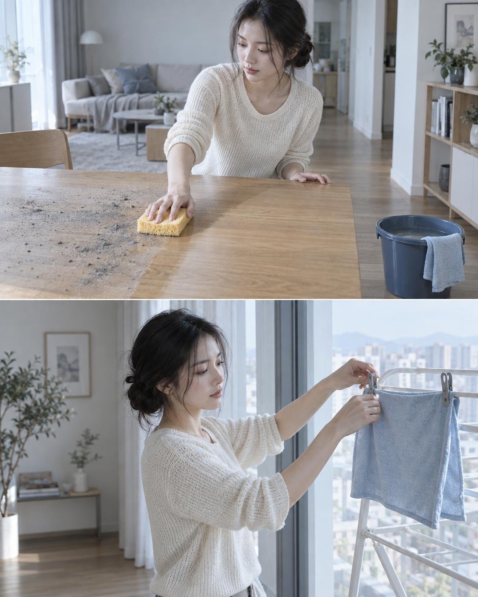

| 单词 | 中文 | 例句 |
| --- | --- | --- |
| dirty | 脏的 | The table is **dirty** before I wipe it. 擦拭前，桌子很脏。 |
| dust | 灰尘 | There is **dust** on the table. 桌上有灰尘。 |
| sponge | 海绵 | I wipe the table with a **sponge**. 我用海绵擦桌子。 |
| bucket | 桶 | The **bucket** holds water. 桶里装着水。 |
| wet | 湿的 | The cloth is **wet** after washing. 洗过之后，布是湿的。 |
| dry | 晾干 | I hang the cloth to **dry**. 我把布挂起来晾干。 |
| rub | 擦 | I **rub** the table with a sponge. 我用海绵擦桌子。 |
| cloth | 布 | The **cloth** hangs on the rack. 布挂在晾晒架上。 |
| do | 做 | I **do** the cleaning every week. 我每周打扫。 |

### C009 · 沙发边的小宠物

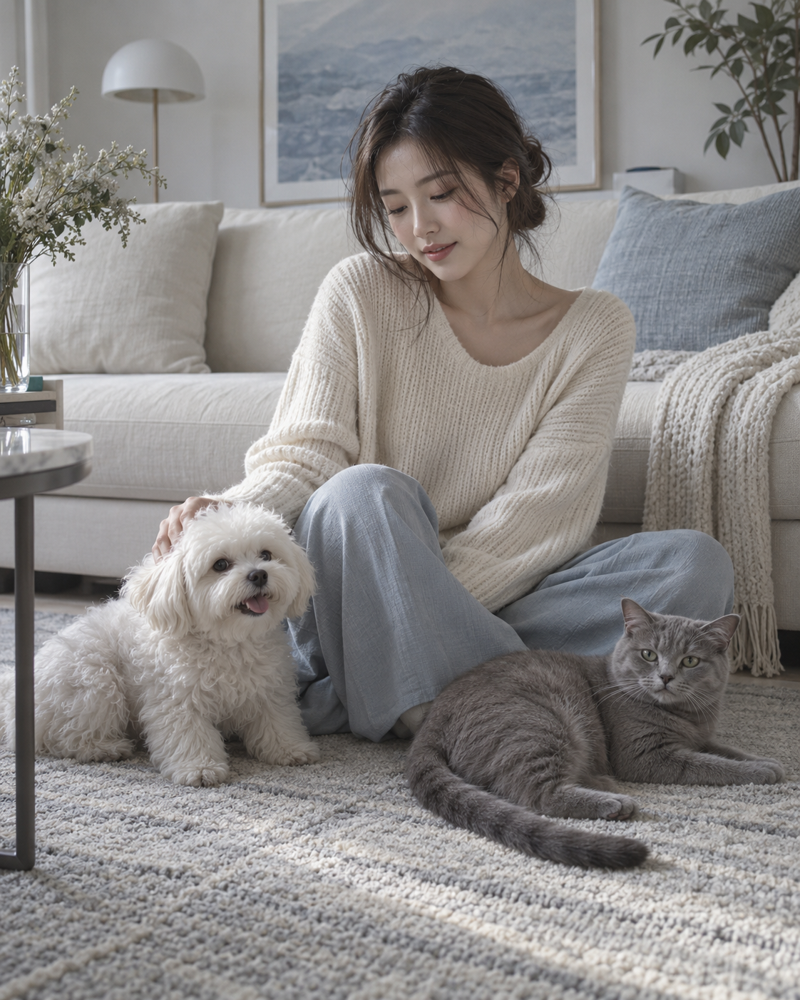

| 单词 | 中文 | 例句 |
| --- | --- | --- |
| dog | 狗 | The **dog** sits beside the sofa. 狗坐在沙发旁边。 |
| cat | 猫 | The **cat** lies on the rug. 猫躺在地毯上。 |
| tail | 尾巴 | The cat has a long **tail**. 猫有一条长尾巴。 |
| animal | 动物 | A dog is an **animal**. 狗是一种动物。 |
| soft | 柔软的 | The dog has **soft** fur. 狗的毛很柔软。 |
| touch | 触摸 | I **touch** the dog gently. 我轻轻摸着狗。 |
| comfort | 慰藉 | My pets bring me **comfort**. 我的宠物给我带来慰藉。 |
| rest | 休息 | The cat likes to **rest** beside me. 猫喜欢在我旁边休息。 |

### C010 · 睡前安静下来

| 单词 | 中文 | 例句 |
| --- | --- | --- |
| tired | 疲倦的 | I am **tired** after a long day. 忙了一整天后，我很累。 |
| quiet | 安静的 | The room is **quiet** with the door shut. 门关上后，房间很安静。 |
| noise | 噪声 | I hear **noise** in the hall. 我听见走廊里的噪声。 |
| loud | 响亮的 | Their voices are **loud**. 他们说话的声音很响。 |
| sound | 声音 | The **sound** of voices comes from the hall. 说话声从走廊传来。 |
| still | 不动的 | I sit **still** on the bed. 我在床上坐着不动。 |
| back | 回到原处 | I go **back** to my room. 我回到自己的房间。 |
| keep | 使保持 | Please **keep** the room quiet. 请让房间保持安静。 |

### C011 · 准备早餐

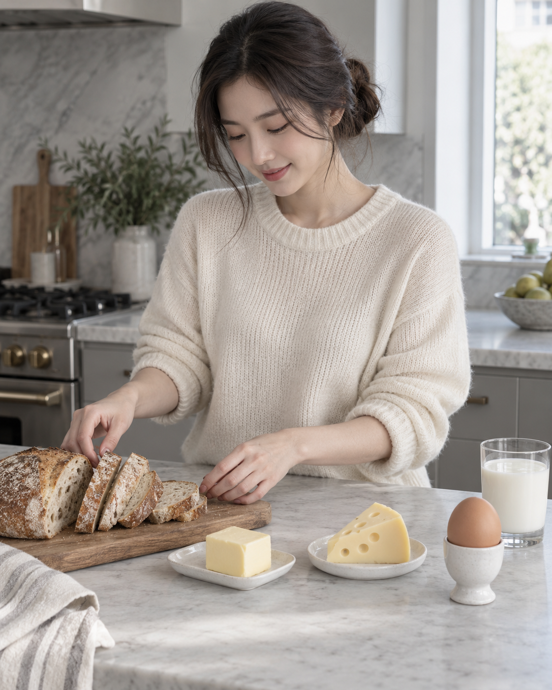

| 单词 | 中文 | 例句 |
| --- | --- | --- |
| bread | 面包 | The **bread** is on the board. 面包在木板上。 |
| butter | 黄油 | I spread **butter** on bread. 我在面包上涂黄油。 |
| cheese | 奶酪 | The **cheese** is on a plate. 奶酪在盘子上。 |
| egg | 鸡蛋 | The **egg** is in an **egg** cup. 鸡蛋在蛋杯里。 |
| milk | 牛奶 | I have a glass of **milk**. 我喝一杯牛奶。 |
| food | 食物 | Bread is **food**. 面包是食物。 |
| meal | 一餐 | Breakfast is my first **meal**. 早餐是我的第一餐。 |
| ready | 准备好的 | Breakfast is **ready**. 早餐准备好了。 |
| have | 吃；喝 | I **have** breakfast at home. 我在家吃早餐。 |

### C012 · 炉边热汤

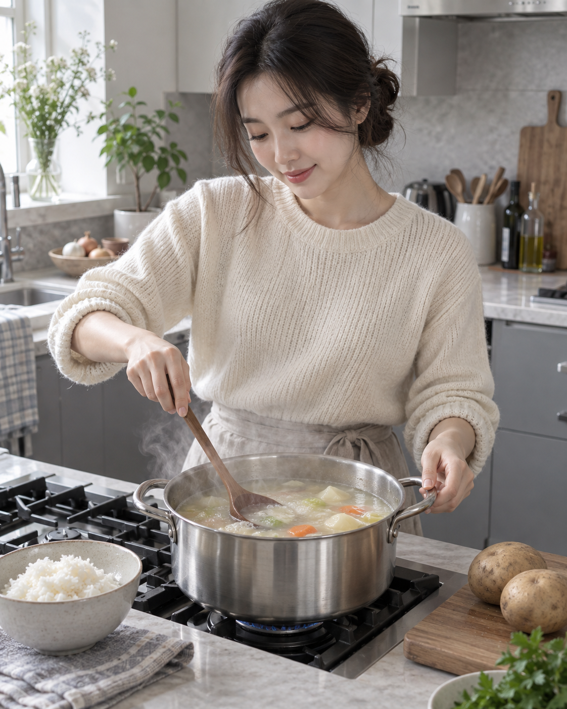

| 单词 | 中文 | 例句 |
| --- | --- | --- |
| cook | 烹饪 | I **cook** soup for lunch. 我为午餐煮汤。 |
| pot | 锅 | The **pot** is on the stove. 锅放在炉子上。 |
| soup | 汤 | The **soup** is in the pot. 汤在锅里。 |
| potato | 土豆 | A **potato** is on the board. 木板上有一个土豆。 |
| rice | 米饭 | The **rice** is in a bowl. 米饭在碗里。 |
| boiling | 正在沸腾 | The soup is **boiling**. 汤正在沸腾。 |
| steam | 蒸汽 | **Steam** rises from the pot. 蒸汽从锅里升起。 |
| heat | 热 | The stove gives off **heat**. 炉子散发热量。 |
| make | 制作 | I **make** soup at home. 我在家做汤。 |

### C013 · 摆好餐具

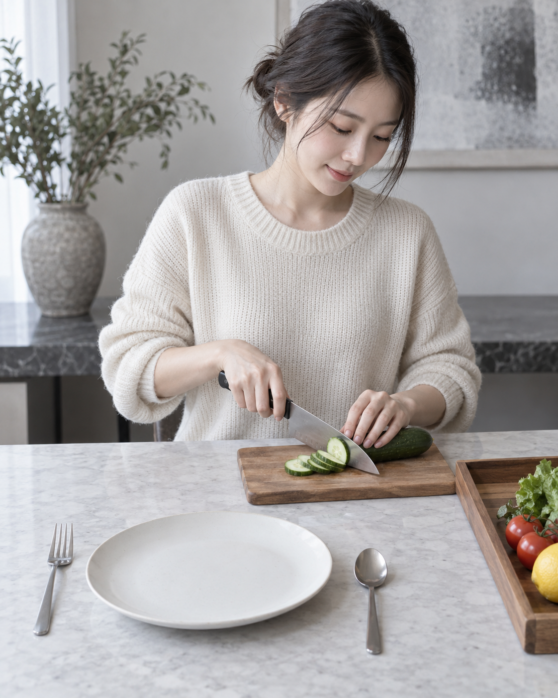

| 单词 | 中文 | 例句 |
| --- | --- | --- |
| plate | 盘子 | The **plate** is white. 盘子是白色的。 |
| fork | 叉子 | The **fork** has four points. 叉子有四个尖齿。 |
| knife | 刀 | I hold the **knife** by its handle. 我握着刀柄拿刀。 |
| spoon | 勺子 | The **spoon** is beside the plate. 勺子在盘子旁边。 |
| tray | 托盘 | The **tray** is on the table. 托盘在桌上。 |
| sharp | 锋利的 | The knife is **sharp**. 刀很锋利。 |
| edge | 刃口 | The **edge** of the knife cuts food. 刀的刃口切开食物。 |
| cut | 切 | I **cut** the cucumber. 我切黄瓜。 |
| blade | 刀片 | The **blade** is made of steel. 刀片是钢制的。 |

### C014 · 温热的甜饮

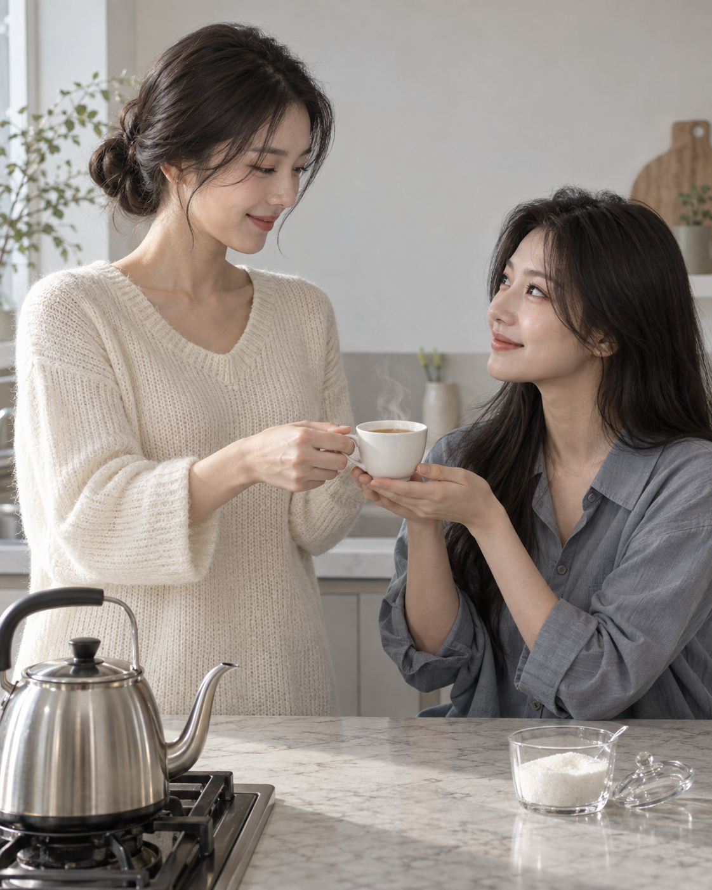

| 单词 | 中文 | 例句 |
| --- | --- | --- |
| cup | 杯子 | The **cup** is white. 杯子是白色的。 |
| kettle | 水壶 | The **kettle** is on the counter. 水壶在台面上。 |
| sugar | 糖 | The **sugar** is in the bowl. 糖在碗里。 |
| sweet | 甜的 | The tea is **sweet** with sugar. 加糖的茶是甜的。 |
| warm | 温热的 | The tea is **warm**. 茶是温热的。 |
| drink | 饮品 | Tea is a **drink**. 茶是一种饮品。 |
| give | 给；递给 | I **give** you a cup of tea. 我递给你一杯茶。 |
| take | 接过 | Please **take** the cup. 请接过杯子。 |
| for | 给；为了 | This cup is **for** you. 这杯是给你的。 |
| with | 带有 | I like tea **with** sugar. 我喜欢加糖的茶。 |

### C015 · 水果摊上的颜色

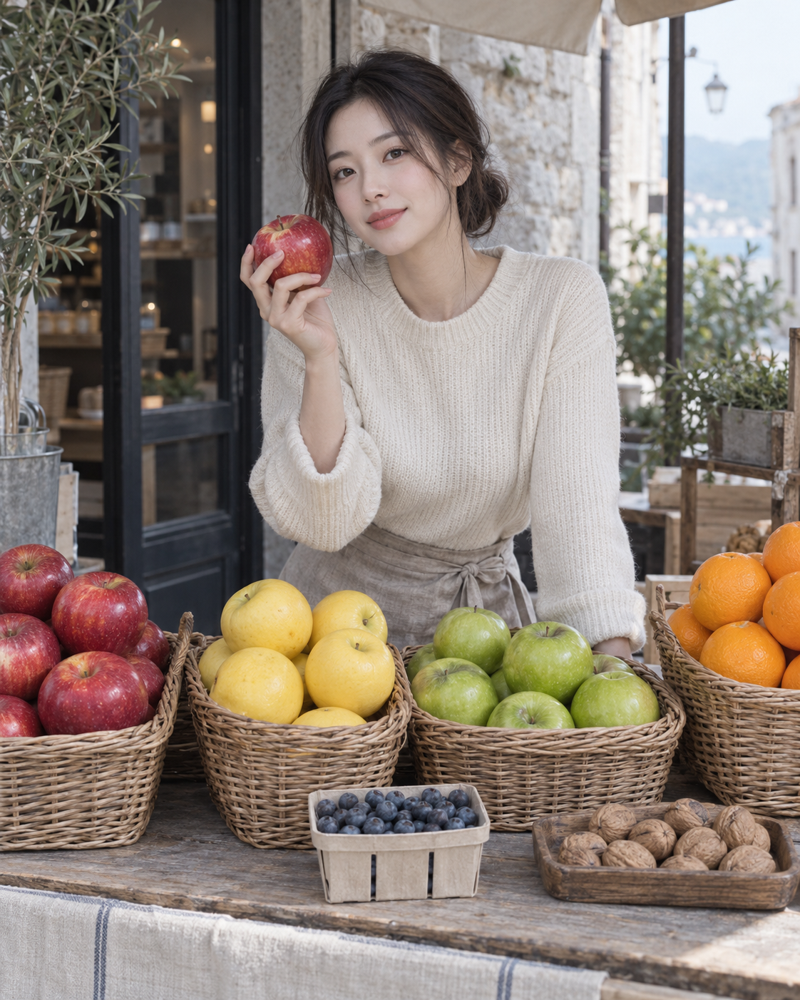

| 单词 | 中文 | 例句 |
| --- | --- | --- |
| apple | 苹果 | I hold an **apple**. 我拿着一个苹果。 |
| orange | 橙子 | The **orange** is round. 橙子是圆的。 |
| berry | 浆果 | A blueberry is a small **berry**. 蓝莓是一种小浆果。 |
| fruit | 水果 | Apples are **fruit**. 苹果是水果。 |
| nut | 坚果 | A walnut is a **nut**. 核桃是一种坚果。 |
| red | 红色的 | The apple in my hand is **red**. 我手里的苹果是红色的。 |
| yellow | 黄色的 | The apples in the middle are **yellow**. 中间的苹果是黄色的。 |
| green | 绿色的 | Some apples are **green**. 有些苹果是绿色的。 |

### C016 · 面包店的烤箱

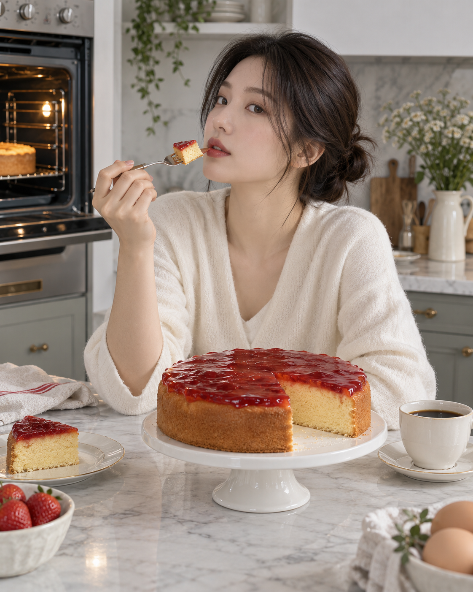

| 单词 | 中文 | 例句 |
| --- | --- | --- |
| oven | 烤箱 | The cake comes out of the **oven**. 蛋糕从烤箱里取出来。 |
| cake | 蛋糕 | The **cake** is on a stand. 蛋糕放在蛋糕架上。 |
| jelly | 果冻状果酱 | I spread fruit **jelly** on the cake. 我在蛋糕上涂果冻状果酱。 |
| taste | 味道 | The cake has a sweet **taste**. 蛋糕有甜甜的味道。 |
| smell | 气味 | I love the **smell** of fresh cake. 我喜欢新鲜蛋糕的香气。 |
| bitter | 苦的 | The coffee tastes **bitter**. 咖啡喝起来是苦的。 |
| good | 好的 | This is a **good** cake. 这是个不错的蛋糕。 |
| bad | 不好的 | Burned cake has a **bad** taste. 烤焦的蛋糕味道不好。 |
| bite | 一口 | I take a **bite** of cake. 我吃一口蛋糕。 |

### C017 · 切肉与备菜

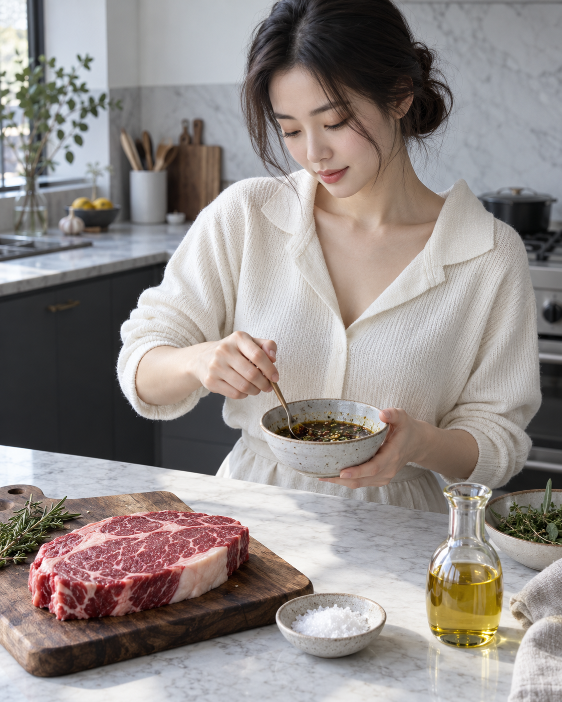

| 单词 | 中文 | 例句 |
| --- | --- | --- |
| meat | 肉 | The **meat** is on the board. 肉放在木板上。 |
| fat | 脂肪 | The meat has a little white **fat**. 这块肉带有少许白色脂肪。 |
| oil | 油 | The **oil** is in a glass carafe. 油装在玻璃小壶里。 |
| salt | 盐 | The **salt** is in a small dish. 盐在小碟里。 |
| mixed | 混合好的 | The ingredients are **mixed** together. 这些配料混合好了。 |
| amount | 数量 | I use a small **amount** of oil. 我用少量油。 |
| addition | 添加 | The **addition** of salt gives the meat more flavor. 加盐让肉更有味道。 |
| enough | 足够的 | We have **enough** salt for the meat. 我们有足够的盐给肉调味。 |
| sticky | 黏的 | The sauce becomes **sticky** as it cooks. 酱汁在烹煮时变黏。 |

### C018 · 瓶塞与玻璃杯

| 单词 | 中文 | 例句 |
| --- | --- | --- |
| bottle | 瓶子 | The **bottle** is on the table. 瓶子在桌上。 |
| cork | 软木塞 | The **cork** lies beside the bottle. 软木塞放在瓶子旁边。 |
| wine | 葡萄酒 | The glass holds red **wine**. 杯里装着红葡萄酒。 |
| glass | 玻璃杯 | The **glass** has a long stem. 这只玻璃杯有细长的杯柄。 |
| liquid | 液体 | Wine is a **liquid**. 葡萄酒是一种液体。 |
| full | 满的 | The glass is nearly **full**. 杯子快满了。 |
| little | 少量 | There is only a **little** wine in the bottle. 瓶里只剩少许葡萄酒。 |
| much | 很多 | There is too **much** wine in this glass. 这只杯子里葡萄酒太多了。 |
| of | ……的 | A glass **of** wine is on the table. 桌上有一杯葡萄酒。 |

### C019 · 老式茶室礼貌点单

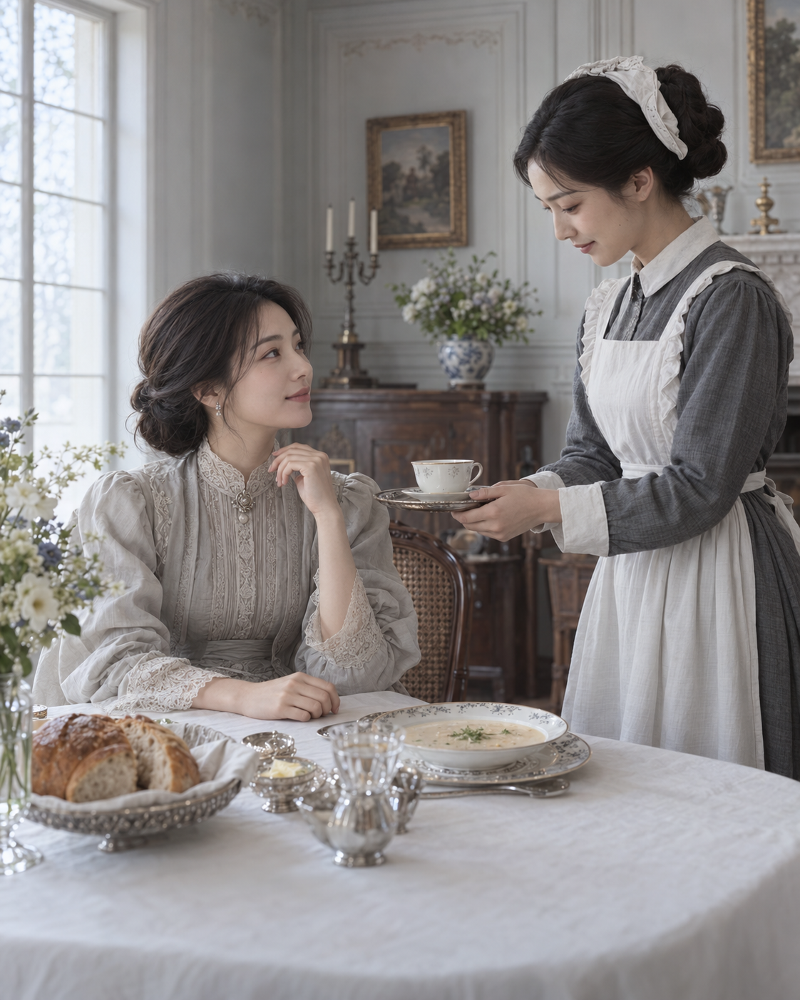

| 单词 | 中文 | 例句 |
| --- | --- | --- |
| please | 请 | Soup, **please**. 请给我汤。 |
| request | 请求 | My **request** is for a bowl of soup. 我请求来一碗汤。 |
| offer | 主动提供 | I **offer** the guest a cup of tea. 我主动给客人提供一杯茶。 |
| need | 需要 | I **need** a spoon for the soup. 我需要一把勺子喝汤。 |
| desire | 渴望 | I have a **desire** for a quiet cup of tea. 我想安静地喝杯茶。 |
| selection | 选择范围 | The **selection** includes bread and soup. 可选食物包括面包和汤。 |
| or | 或者 | Would you like bread **or** soup? 你想要面包还是汤？ |
| some | 一些 | I would like **some** bread. 我想要一些面包。 |
| no | 不；不要 | **No**, thank you. I do not want sugar. 不用了，谢谢。我不想加糖。 |
| yes | 是；好的 | **Yes**, please. I would like tea. 好的，请给我茶。 |
| servant | 仆人（历史称呼） | In this fictional old manor, a **servant** brings tea. 在这座虚构的旧式庄园里，一位仆人端来茶。 |

### C020 · 餐后收拾

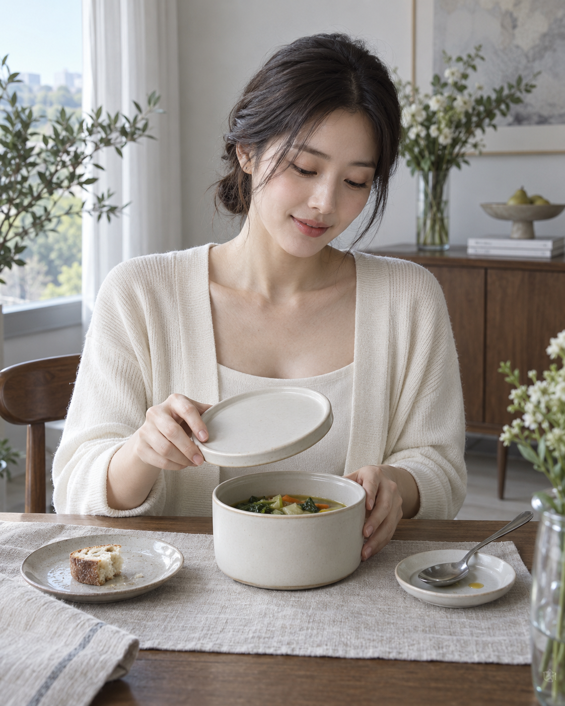

| 单词 | 中文 | 例句 |
| --- | --- | --- |
| waste | 浪费 | I do not **waste** food. 我不浪费食物。 |
| cover | 盖子 | The **cover** fits the vessel. 盖子与容器相配。 |
| vessel | 容器 | The **vessel** holds the soup. 容器里装着汤。 |
| drop | 一滴 | A **drop** of soup is on the saucer. 托碟上有一滴汤。 |
| bit | 少量 | I save a **bit** of food for tomorrow. 我留一点食物明天吃。 |
| last | 最后的 | This is the **last** piece of bread. 这是最后一块面包。 |
| end | 结束 | I clear the table at the **end** of the meal. 用餐结束时我收拾餐桌。 |
| because | 因为 | I cover the food **because** we need it tomorrow. 我把食物盖好，因为我们明天还需要它。 |

### C021 · 出门穿衣

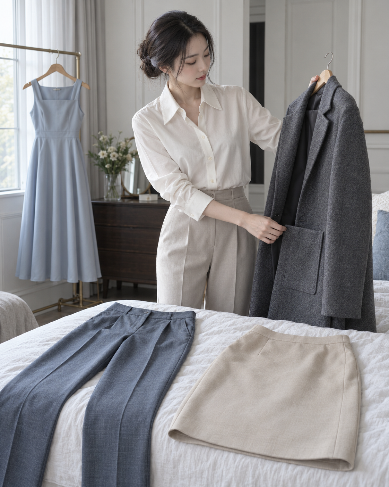

| 单词 | 中文 | 例句 |
| --- | --- | --- |
| shirt | 衬衫 | I wear a white **shirt**. 我穿着白衬衫。 |
| coat | 外套 | The **coat** has a pocket. 这件外套有一个口袋。 |
| trousers | 长裤 | The **trousers** have two long legs. 这条长裤有两条长裤腿。 |
| skirt | 半身裙 | The **skirt** is on the bed. 半身裙在床上。 |
| dress | 连衣裙 | The **dress** hangs on the rack. 连衣裙挂在衣架上。 |
| pocket | 口袋 | The **pocket** is on the coat. 口袋在外套上。 |
| collar | 衣领 | The **collar** is part of the shirt. 衣领是衬衫的一部分。 |
| button | 纽扣 | A **button** closes the shirt. 一颗纽扣扣住衬衫。 |

### C022 · 门口换鞋

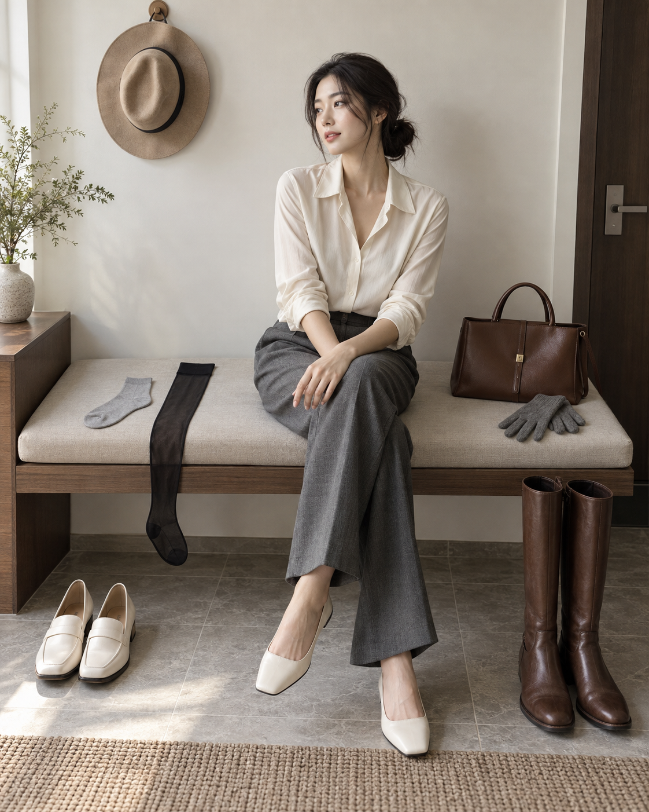

| 单词 | 中文 | 例句 |
| --- | --- | --- |
| shoe | 鞋 | A white **shoe** is beside the bench. 一只白鞋在长凳旁边。 |
| boot | 靴子 | The **boot** covers the ankle. 这只靴子盖住脚踝。 |
| sock | 短袜 | The **sock** is short. 这只袜子是短袜。 |
| stocking | 长筒袜 | The **stocking** reaches the knee. 这只长筒袜到膝盖。 |
| hat | 帽子 | The **hat** hangs on the wall. 帽子挂在墙上。 |
| glove | 手套 | The **glove** has five fingers. 这只手套有五个指头。 |
| bag | 包 | The **bag** has a handle. 这个包有提手。 |
| leather | 皮革 | The bag is made of **leather**. 这个包是皮革制成的。 |

### C023 · 布料店选材

| 单词 | 中文 | 例句 |
| --- | --- | --- |
| cotton | 棉布 | This white fabric is **cotton**. 这块白布是棉布。 |
| wool | 羊毛织物 | The grey sample is **wool**. 灰色样布是羊毛织物。 |
| silk | 丝绸 | The pink fabric is **silk**. 粉色布料是丝绸。 |
| linen | 亚麻布 | The beige sample is **linen**. 米色样布是亚麻布。 |
| canvas | 帆布 | The blue-grey fabric is **canvas**. 蓝灰色布料是帆布。 |
| material | 材料；布料 | Silk is a **material** for clothes. 丝绸是一种制衣材料。 |
| color | 颜色 | I like the **color** of this silk. 我喜欢这块丝绸的颜色。 |
| smooth | 光滑的 | The silk feels **smooth**. 这块丝绸摸起来光滑。 |
| like | 喜欢 | I **like** the pink silk. 我喜欢粉色丝绸。 |

### C024 · 缝补一处破洞

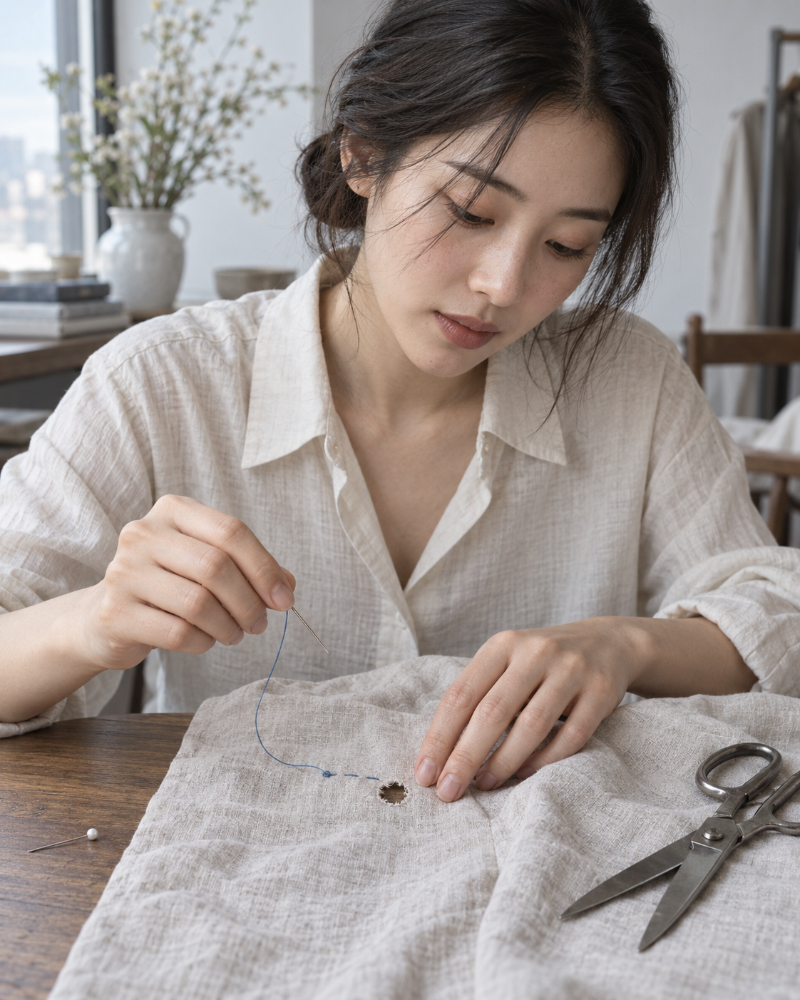

| 单词 | 中文 | 例句 |
| --- | --- | --- |
| needle | 缝衣针 | I hold the **needle** above the cloth. 我把缝衣针拿在布上方。 |
| thread | 线 | The **thread** passes through the needle. 线穿过针眼。 |
| stitch | 针脚 | A **stitch** joins the cloth. 一个针脚把布缝在一起。 |
| pin | 大头针 | The **pin** lies on the table. 大头针放在桌上。 |
| scissors | 剪刀 | The **scissors** are beside the cloth. 剪刀在布旁边。 |
| knot | 结 | The **knot** keeps the thread in place. 这个结固定住线。 |
| hole | 洞 | The cloth has a **hole**. 这块布有一个洞。 |
| loose | 松的 | I pull the **loose** thread gently. 我轻轻拉那根松线。 |
| separate | 分开的 | I keep the tools **separate**. 我把工具分开放。 |

### C025 · 试衣镜前比较

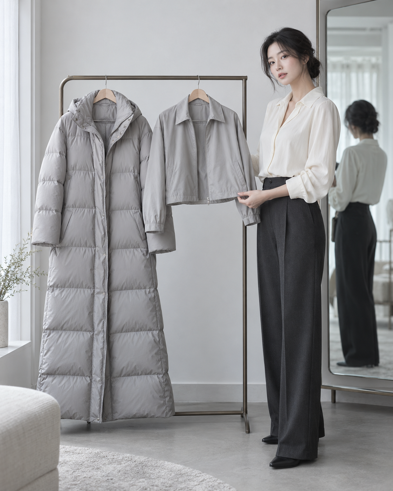

| 单词 | 中文 | 例句 |
| --- | --- | --- |
| size | 尺寸 | I check the **size** of the coat. 我检查外套的尺寸。 |
| long | 长的 | The padded coat is **long**. 这件棉外套很长。 |
| short | 短的 | The summer jacket is **short**. 这件夏季夹克很短。 |
| thick | 厚的 | The winter coat is **thick**. 这件冬季外套很厚。 |
| thin | 薄的 | The summer jacket is **thin**. 这件夏季夹克很薄。 |
| tight | 紧的 | If the coat feels **tight**, I try a larger size. 如果外套穿着紧，我就试大一号。 |
| different | 不同的 | The coats have **different** lengths. 两件外套长度不同。 |
| same | 相同的 | The coats are the **same** color. 两件外套颜色相同。 |
| than | 比 | The winter coat is longer **than** the summer jacket. 冬季外套比夏季夹克长。 |

### C026 · 雨天走进商店

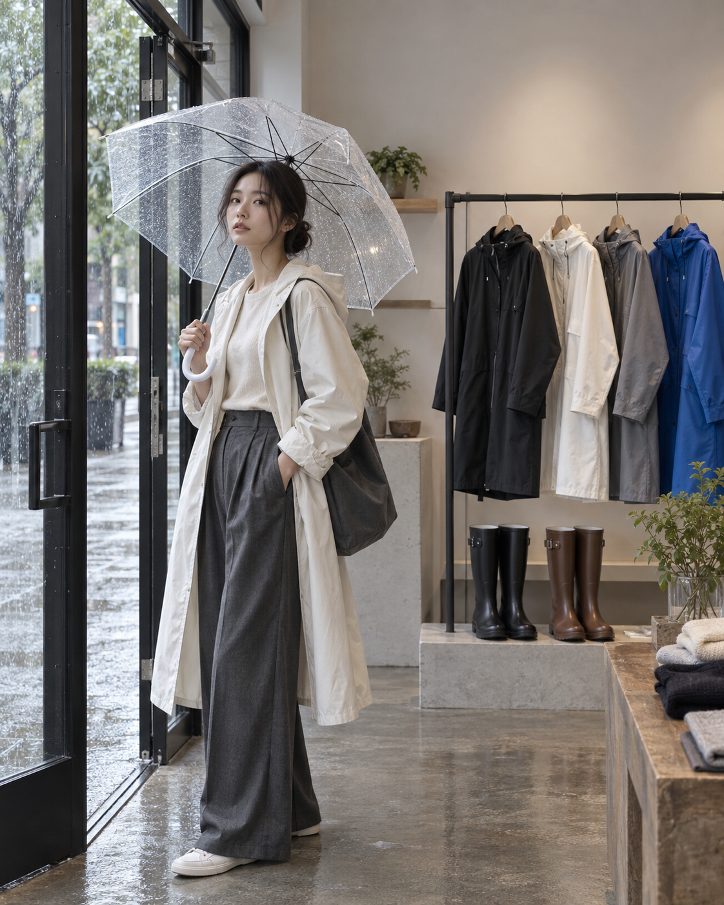

| 单词 | 中文 | 例句 |
| --- | --- | --- |
| umbrella | 雨伞 | I hold an **umbrella** by the door. 我在门边拿着一把雨伞。 |
| rain | 雨 | The **rain** falls outside the store. 雨落在商店外。 |
| store | 商店 | I enter the **store**. 我走进商店。 |
| black | 黑色的 | The raincoat on the rack is **black**. 架上有一件黑色雨衣。 |
| white | 白色的 | One raincoat is **white**. 有一件雨衣是白色的。 |
| grey | 灰色的 | The **grey** raincoat is beside the white one. 灰色雨衣在白色雨衣旁边。 |
| brown | 棕色的 | The boots are **brown**. 靴子是棕色的。 |
| blue | 蓝色的 | The jacket is **blue**. 夹克是蓝色的。 |

### C027 · 买菜装篮子

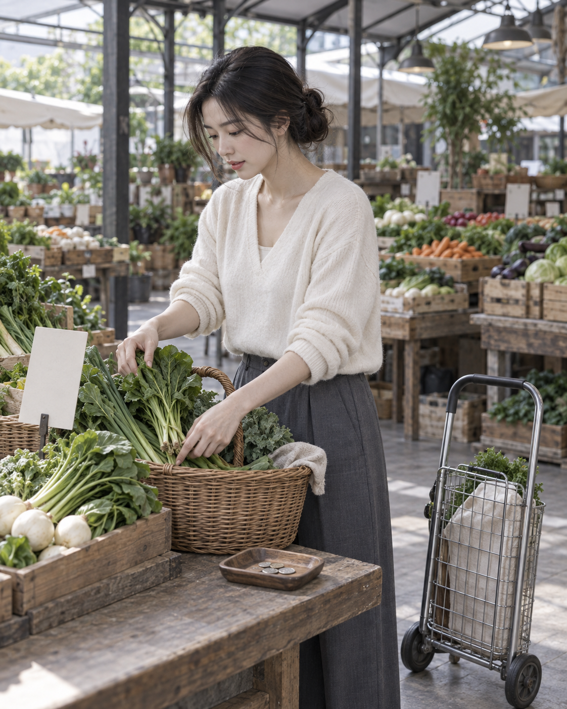

| 单词 | 中文 | 例句 |
| --- | --- | --- |
| market | 市场 | I buy vegetables at the **market**. 我在市场买蔬菜。 |
| basket | 篮子 | The **basket** holds vegetables. 篮子里装着蔬菜。 |
| cart | 手推车 | The **cart** has wheels. 这辆手推车有轮子。 |
| price | 价格 | The **price** of the vegetables is low. 这些蔬菜的价格低。 |
| cheap | 便宜的 | These vegetables are **cheap** today. 这些蔬菜今天很便宜。 |
| money | 钱 | I pay **money** for the vegetables. 我付钱买蔬菜。 |
| get | 买到 | I **get** fresh vegetables at the market. 我在市场买到新鲜蔬菜。 |

### C028 · 收银台算账

| 单词 | 中文 | 例句 |
| --- | --- | --- |
| payment | 付款 | I make a **payment** for the cup. 我付款买这只杯子。 |
| receipt | 收据 | I keep the **receipt**. 我保留收据。 |
| account | 账目 | The owner keeps an **account** of each sale. 店主记录每笔销售的账目。 |
| credit | 赊购 | In this story, the shop lets me buy on **credit**. 在这个故事里，商店允许我赊购。 |
| debt | 债务 | I pay the **debt** I owe to the shop. 我偿还欠商店的债务。 |
| business | 生意 | The owner runs a small **business**. 店主经营一门小生意。 |
| profit | 利润 | The shop makes a **profit** when sales exceed costs. 销售收入超过成本时，商店就有利润。 |
| owner | 店主 | The **owner** gives me a receipt. 店主给我一张收据。 |

### C029 · 礼物与首饰

| 单词 | 中文 | 例句 |
| --- | --- | --- |
| ring | 戒指 | The **ring** is in the box. 戒指放在盒子里。 |
| jewel | 宝石 | The blue **jewel** is on the velvet. 蓝色宝石放在绒布上。 |
| gold | 金 | In this story, the bracelet is made of **gold**. 在这个故事里，手镯是金制的。 |
| silver | 银 | In this story, the ring is made of **silver**. 在这个故事里，戒指是银制的。 |
| ornament | 装饰品 | The star is an **ornament**. 这颗星星是装饰品。 |
| card | 贺卡 | The **card** stands beside the gift. 贺卡立在礼物旁边。 |
| special | 特别的 | The ring is a **special** gift for me. 这枚戒指是给我的特别礼物。 |
| wax | 蜡 | The candle is made of **wax**. 这支蜡烛是蜡制的。 |

### C030 · 退换货的选择

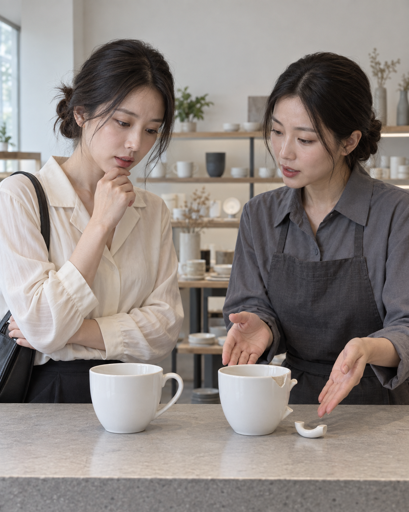

| 单词 | 中文 | 例句 |
| --- | --- | --- |
| new | 新的 | The cup on the left is **new**. 左边的杯子是新的。 |
| old | 旧的 | The cup on the right is **old**. 右边的杯子是旧的。 |
| broken | 破损的 | The old cup has a **broken** handle. 旧杯子的把手断了。 |
| quality | 质量 | I check the **quality** of the new cup. 我检查新杯子的质量。 |
| value | 性价比 | The new cup is good **value** for the money. 新杯子物有所值。 |
| comparison | 比较 | I make a **comparison** of the two cups. 我把两只杯子作比较。 |
| exchange | 换货 | I **exchange** the broken cup for a new one. 我把坏掉的杯子换成一只新的。 |
| change | 改变 | I **change** my choice after checking the cups. 检查杯子后，我改变了选择。 |
| other | 另一个的 | One cup is new; the **other** cup is old. 一只杯子是新的，另一只杯子是旧的。 |

### C031 · 街角问路

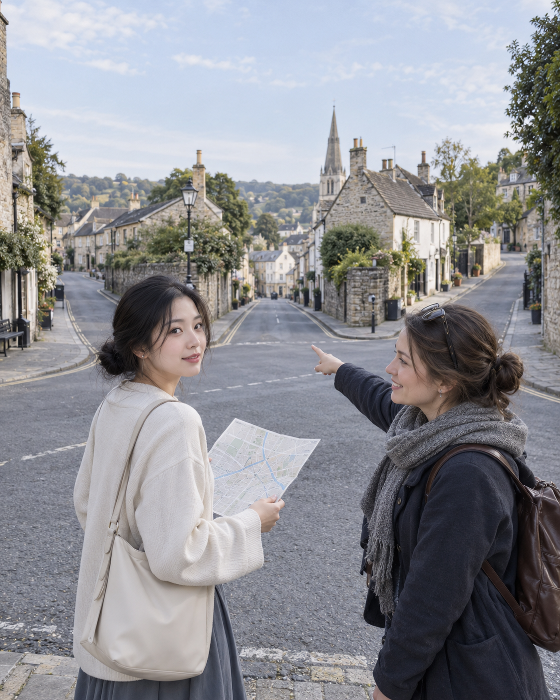

| 单词 | 中文 | 例句 |
| --- | --- | --- |
| street | 街道 | The **street** beside us is quiet. 我们身旁的街道很安静。 |
| road | 道路 | The **road** leads into town. 这条路通向镇里。 |
| town | 小镇 | We explore a small **town**. 我们游览一个小镇。 |
| map | 地图 | I check the **map** in my hands. 我查看手里的地图。 |
| left | 向左 | Turn **left** at the corner. 在拐角处向左转。 |
| right | 向右 | You can turn **right** at this corner. 你可以在这个拐角处向右转。 |
| way | 路线 | The map helps us find the **way**. 地图帮助我们找到路线。 |
| where | 在哪里 | **Where** is the town centre? 镇中心在哪里？ |

### C032 · 穿过一座桥

| 单词 | 中文 | 例句 |
| --- | --- | --- |
| bridge | 桥 | The **bridge** crosses the river. 这座桥横跨河流。 |
| across | 横穿 | We walk **across** the bridge. 我们步行穿过这座桥。 |
| near | 近的 | The **near** part of the bridge is beside me. 桥的近处部分就在我身旁。 |
| far | 在远处 | The other traveller is **far** away. 另一位旅人在远处。 |
| distance | 距离 | There is some **distance** between the two travellers. 两位旅人之间有一段距离。 |
| from | 从 | We walk **from** here to the other bank. 我们从这里走到另一岸。 |
| to | 到 | We walk **to** the other bank. 我们走到另一岸。 |
| walk | 步行 | I **walk** across the bridge. 我步行过桥。 |
| whistle | 哨子 | I carry a small **whistle**. 我带着一个小哨子。 |

### C033 · 车站准备出发

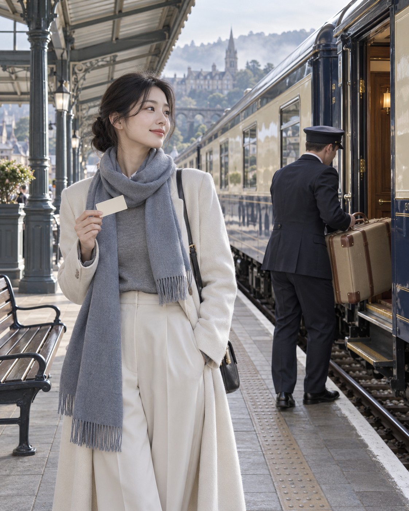

| 单词 | 中文 | 例句 |
| --- | --- | --- |
| station | 车站 | We wait at the **station**. 我们在车站等候。 |
| train | 火车 | The **train** stands beside the platform. 火车停在站台旁。 |
| ticket | 车票 | I hold my train **ticket**. 我拿着火车票。 |
| rail | 铁轨 | A steel **rail** runs beside the platform. 一根钢轨沿着站台延伸。 |
| carriage | 车厢 | The **carriage** door is open. 车厢门开着。 |
| porter | 行李员 | The **porter** carries my case. 行李员提着我的箱子。 |
| waiting | 等候 | **Waiting** for the train gives me time to rest. 等火车让我有时间休息。 |
| journey | 旅程 | Our train **journey** begins here. 我们的火车旅程从这里开始。 |
| seat | 座位 | There is an empty **seat** on the bench. 长椅上有一个空座位。 |

### C034 · 驾驶与刹车

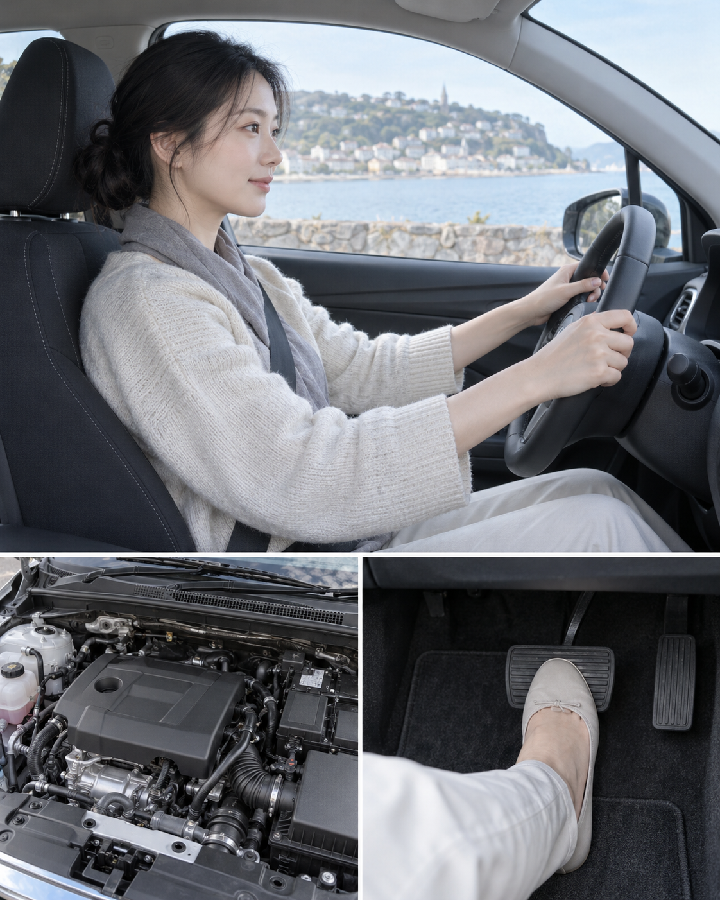

| 单词 | 中文 | 例句 |
| --- | --- | --- |
| driving | 驾驶 | Careful **driving** begins with good control. 谨慎驾驶从良好的操控开始。 |
| engine | 发动机 | The **engine** is under the front cover. 发动机在前方的盖子下面。 |
| wheel | 方向盘 | I hold the steering **wheel** with both hands. 我用双手握住方向盘。 |
| brake | 刹车 | My foot rests on the **brake** pedal. 我的脚放在刹车踏板上。 |
| control | 操控 | I keep **control** with both hands on the wheel. 我用双手握住方向盘来保持操控。 |
| stop | 停下 | I press the brake to **stop** the car. 我踩刹车让汽车停下。 |
| slow | 慢的 | A **slow** start feels smooth. 缓慢起步感觉很平稳。 |
| quick | 迅速的 | I make a **quick** check before driving. 我在驾驶前迅速检查一下。 |
| adjustment | 调整 | A small seat **adjustment** helps me reach the pedals. 稍微调整座椅能让我够到踏板。 |

### C035 · 进出与上下

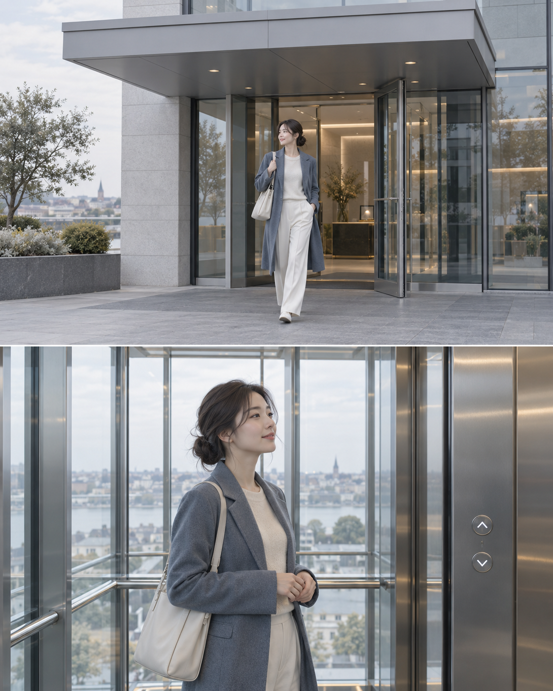

| 单词 | 中文 | 例句 |
| --- | --- | --- |
| building | 建筑 | The **building** has a glass entrance. 这栋建筑有一个玻璃入口。 |
| lift | 电梯 | I take the **lift** to the next floor. 我乘电梯到上一层。 |
| up | 向上 | The arrow points **up**. 箭头指向上方。 |
| down | 向下 | The arrow points **down**. 箭头指向下方。 |
| out | 到外面 | I step **out** through the entrance. 我穿过入口走到外面。 |
| off | 关着 | I turn **off** the light before leaving home. 离家前我把灯关掉。 |
| on | 开着 | The light is **on** inside the lift. 电梯里的灯开着。 |
| go | 去 | I **go** outside through the door. 我穿过门走到外面。 |
| under | 在下面 | I stand **under** the canopy. 我站在雨棚下面。 |
| over | 在上方 | The canopy is **over** the entrance. 雨棚在入口上方。 |

### C036 · 飞机飞过海岛

| 单词 | 中文 | 例句 |
| --- | --- | --- |
| plane | 飞机 | The **plane** flies over an island. 飞机飞过一座海岛。 |
| flight | 飞行 | The **flight** takes us over the sea. 这次飞行带我们越过海面。 |
| wing | 机翼 | I see the **wing** through the window. 我透过窗户看见机翼。 |
| island | 岛屿 | The **island** is surrounded by sea. 海水环绕着这座岛。 |
| high | 在高处 | The plane flies **high** above the island. 飞机在岛屿上方高处飞行。 |
| low | 在低处 | The island lies **low** below the plane. 岛屿位于飞机下方低处。 |
| transport | 运输工具 | The plane is our **transport** to the island. 飞机是我们去岛上的交通工具。 |
| forward | 向前 | The plane moves **forward** through the sky. 飞机在空中向前飞行。 |

### C037 · 港口启航

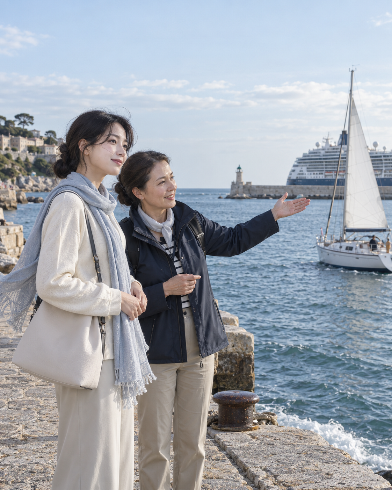

| 单词 | 中文 | 例句 |
| --- | --- | --- |
| harbor | 港口 | The **harbor** shelters the boats. 港口为船只提供庇护。 |
| ship | 大船 | A large **ship** waits beyond the dock. 一艘大船停在码头外。 |
| boat | 小艇 | The small **boat** is beside the dock. 小艇在码头旁。 |
| sail | 船帆 | The boat has a white **sail**. 这条艇有一面白色船帆。 |
| sea | 海 | The **sea** stretches beyond the harbor. 大海在港口外延伸。 |
| wave | 波浪 | A small **wave** reaches the dock. 一阵小波浪来到码头边。 |
| wind | 风 | The **wind** lifts my scarf. 风吹起我的围巾。 |
| guide | 向导 | The **guide** shows me the boat. 向导指给我看那条艇。 |

### C038 · 酒店入住与位置

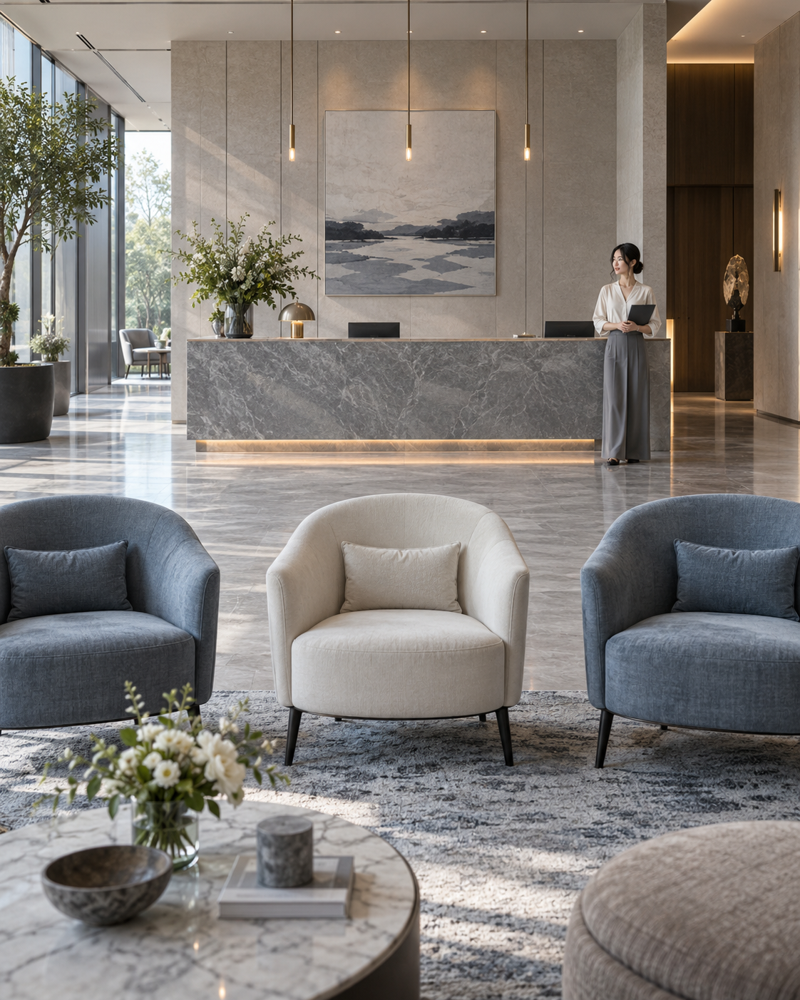

| 单词 | 中文 | 例句 |
| --- | --- | --- |
| place | 地方 | This is a quiet **place** to rest. 这是一个安静的休息地方。 |
| position | 位置 | The **position** of the chair is easy to see. 椅子的位置很容易看出来。 |
| front | 正面 | The **front** of the desk faces the chairs. 前台的正面对着椅子。 |
| side | 侧面 | I can see the **side** of the chair. 我能看见椅子的侧面。 |
| middle | 中间 | The white chair is in the **middle**. 白色椅子在中间。 |
| between | 在之间 | The white chair is **between** two blue chairs. 白色椅子在两把蓝色椅子之间。 |
| opposite | 在对面 | The chairs are **opposite** the desk. 椅子在前台对面。 |
| at | 在 | I wait **at** the hotel desk. 我在酒店前台等候。 |

### C039 · 山路转弯

| 单词 | 中文 | 例句 |
| --- | --- | --- |
| mountain | 山 | A **mountain** rises behind the village. 村庄后面耸立着一座山。 |
| slope | 斜坡 | The path climbs a gentle **slope**. 小径沿着缓坡向上。 |
| narrow | 狭窄的 | The path under the arch is **narrow**. 拱门下的小径很窄。 |
| wide | 宽的 | The road beside the path is **wide**. 小径旁边的道路很宽。 |
| turn | 转弯 | The wide road has a gentle **turn**. 宽路有一个缓弯。 |
| through | 穿过 | The path goes **through** the arch. 小径穿过拱门。 |
| arch | 拱门 | The stone **arch** stands over the path. 石拱门横跨小径。 |
| direction | 方向 | The path shows the **direction** through the arch. 小径指明了穿过拱门的方向。 |

### C040 · 日历上的旅行

| 单词 | 中文 | 例句 |
| --- | --- | --- |
| time | 时间 | I check the **time** on my watch. 我看手表确认时间。 |
| hour | 小时 | The journey takes one **hour**. 旅程需要一小时。 |
| minute | 分钟 | I wait one **minute** before leaving. 出发前我等一分钟。 |
| watch | 手表 | My **watch** is on my wrist. 手表在我的手腕上。 |
| week | 星期 | We travel next **week**. 我们下周旅行。 |
| month | 月份 | We plan another trip next **month**. 我们计划下个月再旅行。 |
| year | 年 | I visit the island this **year**. 我今年去那座岛。 |
| tomorrow | 明天 | We leave **tomorrow** morning. 我们明天早晨出发。 |
| when | 什么时候 | **When** do we leave? 我们什么时候出发？ |
| till | 直到 | We stay here **till** noon. 我们在这里待到中午。 |
| late | 迟到的 | I do not want to be **late**. 我不想迟到。 |

### C041 · 公园里种树

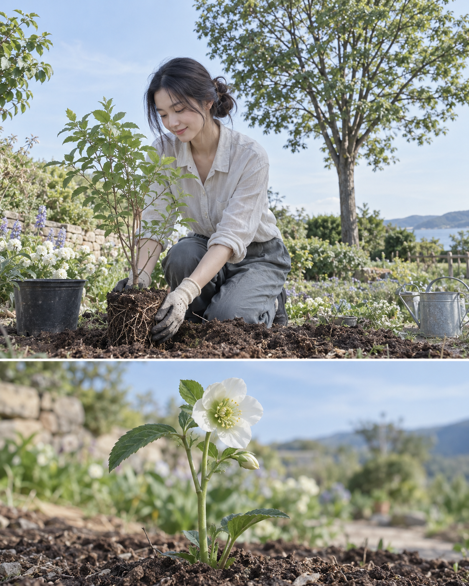

| 单词 | 中文 | 例句 |
| --- | --- | --- |
| garden | 花园 | We plant a tree in the **garden**. 我们在花园里种一棵树。 |
| tree | 树 | The young **tree** has many leaves. 这棵小树有许多叶子。 |
| branch | 树枝 | A **branch** grows from the trunk. 一根树枝从树干上长出。 |
| leaf | 叶子 | A green **leaf** catches the light. 一片绿叶迎着光。 |
| root | 根 | A **root** reaches into the soil. 一条根伸进土里。 |
| stem | 茎 | The flower grows on a green **stem**. 花长在绿色的茎上。 |
| flower | 花 | The plant has a white **flower**. 这株植物开着一朵白花。 |
| plant | 植物 | I water the **plant** beside the tree. 我给树旁的植物浇水。 |
| tall | 高的 | A **tall** tree stands behind us. 一棵高树在我们身后。 |

### C042 · 从种子到收成

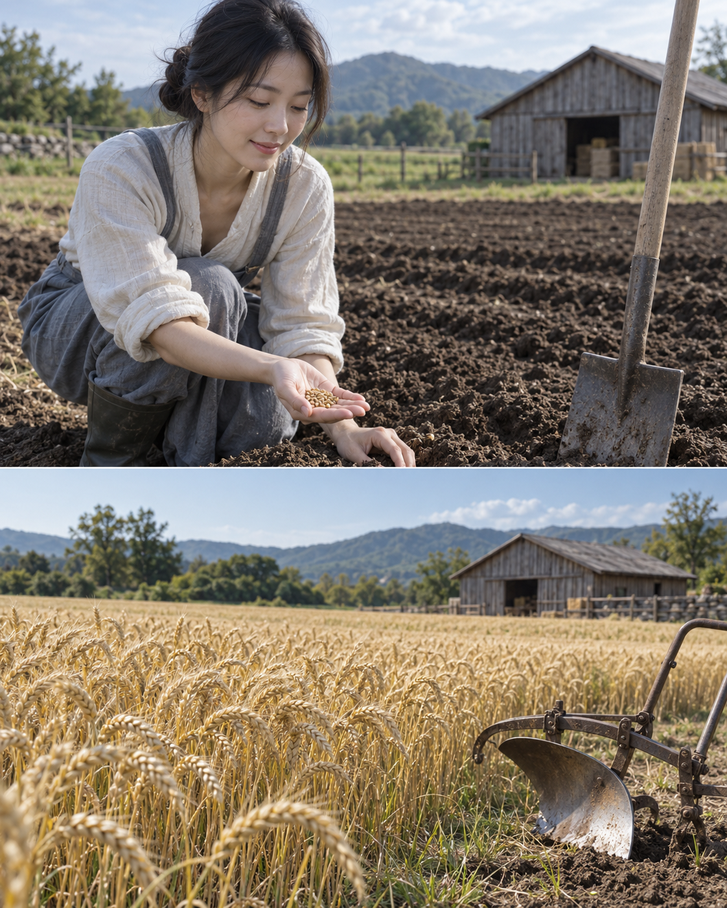

| 单词 | 中文 | 例句 |
| --- | --- | --- |
| farm | 农场 | The **farm** has a barn and a field. 农场有一座谷仓和一块田。 |
| field | 田地 | The **field** is full of wheat. 田地里长满小麦。 |
| seed | 种子 | I hold a **seed** in my hand. 我手里拿着一粒种子。 |
| grain | 谷物 | The ripe **grain** is ready for harvest. 成熟的谷物可以收割了。 |
| spade | 铲子 | The **spade** rests in the soil. 铲子插在土里。 |
| plough | 犁 | The **plough** turns the soil. 犁翻动土壤。 |
| fertile | 肥沃的 | The farm has **fertile** soil. 农场有肥沃的土壤。 |
| growth | 生长 | Plant **growth** changes the field over time. 植物生长让田地随时间变化。 |

### C043 · 草地上的昆虫

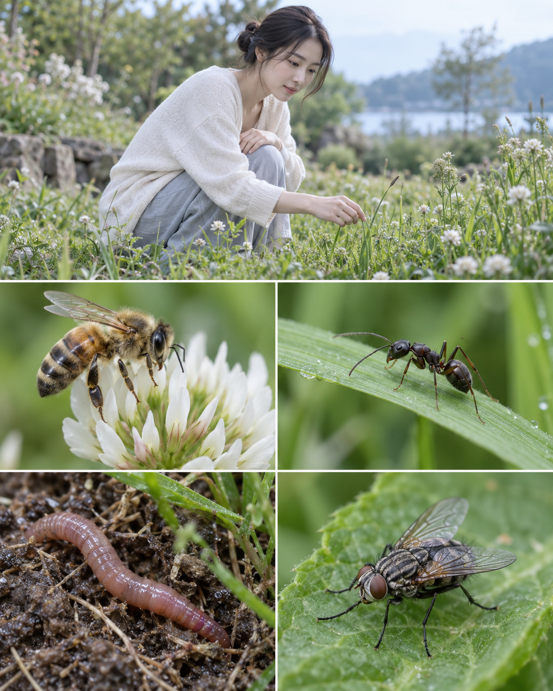

| 单词 | 中文 | 例句 |
| --- | --- | --- |
| grass | 草 | The **grass** is green beside the path. 小径旁的草是绿色的。 |
| bee | 蜜蜂 | A **bee** rests on the flower. 一只蜜蜂停在花上。 |
| ant | 蚂蚁 | An **ant** walks on a blade of grass. 一只蚂蚁在一片草叶上走。 |
| worm | 蠕虫 | The **worm** lies on damp soil. 蠕虫在潮湿土壤上。 |
| fly | 苍蝇 | A **fly** rests on a leaf. 一只苍蝇停在叶上。 |
| insect | 昆虫 | The bee is an **insect**. 蜜蜂是一种昆虫。 |
| small | 小的 | The ant is **small** beside the leaf. 蚂蚁在叶子旁显得很小。 |
| natural | 自然的 | The grass provides a **natural** habitat. 草地提供自然栖息环境。 |

### C044 · 农场动物围栏

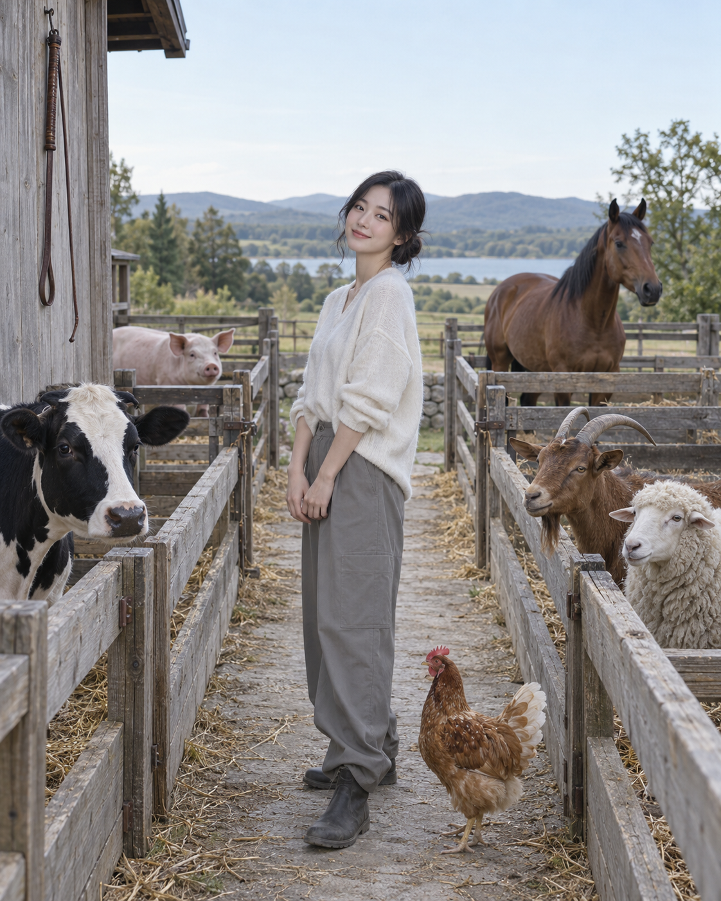

| 单词 | 中文 | 例句 |
| --- | --- | --- |
| cow | 奶牛 | The **cow** rests beside the fence. 奶牛在围栏旁休息。 |
| goat | 山羊 | The **goat** has curved horns. 山羊有弯曲的角。 |
| sheep | 绵羊 | The **sheep** has thick wool. 绵羊长着厚羊毛。 |
| pig | 猪 | The **pig** stands in its pen. 猪站在自己的围栏里。 |
| horse | 马 | The **horse** waits beside the stable. 马在马厩旁等着。 |
| fowl | 家禽 | The **fowl** walks along the path. 家禽沿着小径走。 |
| feather | 羽毛 | A long **feather** is part of the chicken’s tail. 一根长羽毛是鸡尾巴的一部分。 |
| horn | 角 | A curved **horn** grows on the goat’s head. 弯角长在山羊头上。 |
| whip | 马鞭 | The unused **whip** hangs on the wall. 未使用的马鞭挂在墙上。 |

### C045 · 自然观察小径

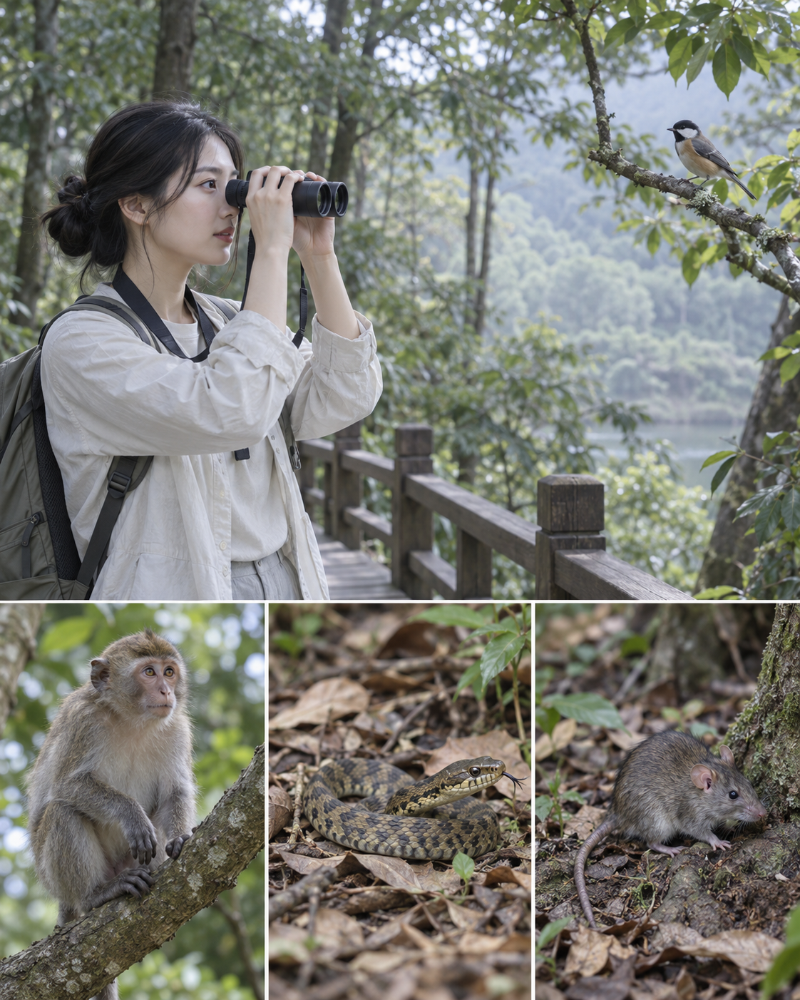

| 单词 | 中文 | 例句 |
| --- | --- | --- |
| bird | 鸟 | A **bird** rests on the branch. 一只鸟停在树枝上。 |
| monkey | 猴子 | The **monkey** sits on a branch. 猴子坐在树枝上。 |
| snake | 蛇 | The **snake** lies on the forest floor. 蛇在林地上。 |
| rat | 鼠 | The **rat** has a long tail. 这只鼠有长尾巴。 |
| observation | 观察 | Careful **observation** helps us notice animals. 仔细观察帮助我们留意动物。 |
| look | 看 | I **look** at the bird through binoculars. 我透过望远镜看鸟。 |
| see | 看见 | I can **see** a bird on the branch. 我能看见枝上的鸟。 |
| attention | 注意力 | I pay **attention** to the animals around me. 我注意周围的动物。 |
| strange | 陌生的 | A **strange** sound comes from the trees. 树间传来陌生的声响。 |

### C046 · 溪边垂钓

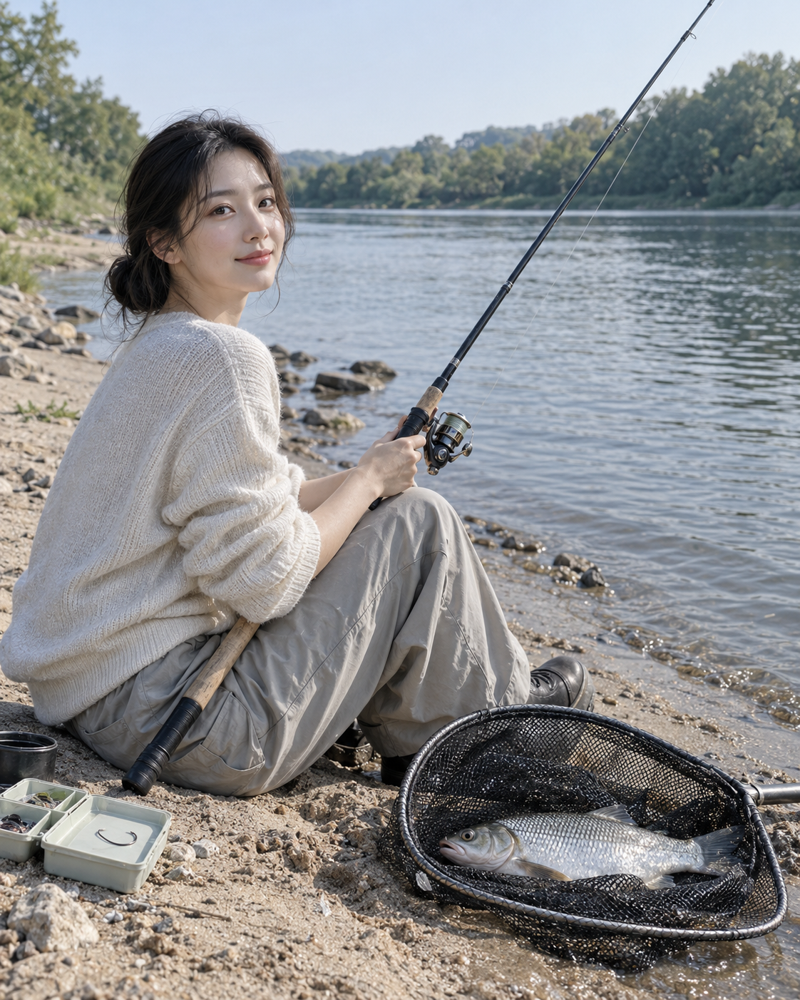

| 单词 | 中文 | 例句 |
| --- | --- | --- |
| river | 河流 | I sit by the **river**. 我坐在河边。 |
| fish | 鱼 | A **fish** rests in the net. 一条鱼在网里。 |
| rod | 钓竿 | I hold a fishing **rod**. 我拿着一根钓竿。 |
| hook | 鱼钩 | The **hook** is on the tray. 鱼钩在托盘上。 |
| net | 渔网 | The **net** holds a fish. 网里装着一条鱼。 |
| sand | 沙 | The net lies on wet **sand**. 网放在湿沙上。 |
| deep | 深的 | The river is **deep** beyond the sandy bank. 沙岸外的河水很深。 |
| land | 陆地 | My feet stay on dry **land**. 我的双脚留在干燥的陆地上。 |

### C047 · 天气突然变化

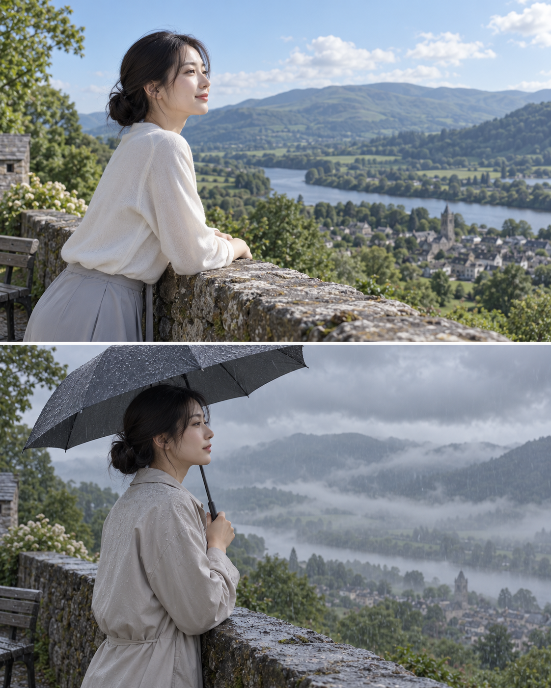

| 单词 | 中文 | 例句 |
| --- | --- | --- |
| sky | 天空 | The **sky** is blue before the rain. 下雨前天空是蓝色的。 |
| cloud | 云 | A white **cloud** crosses the sky. 一朵白云飘过天空。 |
| mist | 薄雾 | **Mist** covers the distant hills. 薄雾笼罩远处的山丘。 |
| weather | 天气 | The **weather** changes while I wait. 我等待时天气变了。 |
| thunder | 雷声 | I hear **thunder** beyond the hills. 我听见山丘那边传来雷声。 |
| sudden | 突然的 | A **sudden** change in the weather surprises me. 天气突然变化让我吃了一惊。 |
| air | 空气 | I breathe the fresh **air**. 我呼吸着新鲜空气。 |

### C048 · 四季的公园

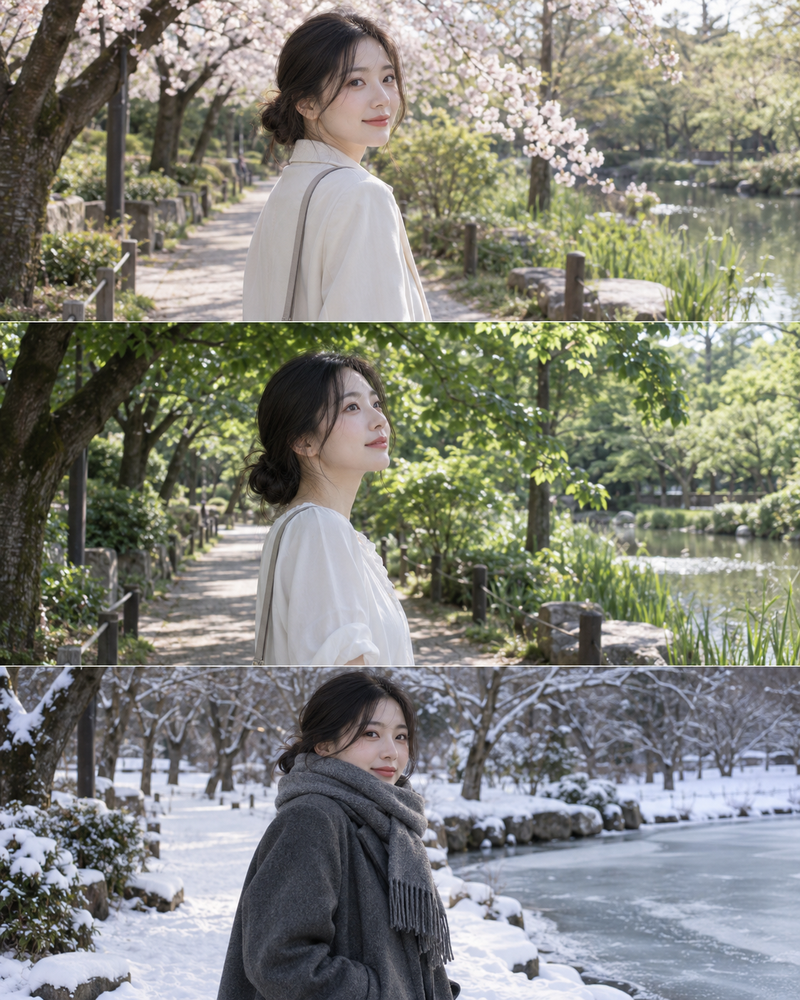

| 单词 | 中文 | 例句 |
| --- | --- | --- |
| spring | 春天 | Flowers open in **spring**. 花朵在春天开放。 |
| summer | 夏天 | The park is green in **summer**. 公园在夏天绿意盎然。 |
| winter | 冬天 | Snow covers the path in **winter**. 冬天，雪覆盖了小径。 |
| snow | 雪 | Fresh **snow** lies beside the pond. 池塘边积着新雪。 |
| ice | 冰 | A layer of **ice** covers the pond. 一层冰覆盖着池塘。 |
| cold | 寒冷的 | It is a **cold** day in the park. 公园里这一天很冷。 |

### C049 · 阳光与阴影

| 单词 | 中文 | 例句 |
| --- | --- | --- |
| ray | 光束 | A **ray** of light reaches the path. 一束光照向小径。 |
| shade | 阴凉处 | I rest in the **shade** of a tree. 我在树荫里休息。 |
| view | 景色 | I enjoy the mountain **view**. 我欣赏山间景色。 |
| beautiful | 美丽的 | I think the view is **beautiful**. 我觉得这景色很美。 |
| clear | 清晰的 | I have a **clear** view of the mountains. 我能清晰地看到群山。 |
| great | 极好的 | This is a **great** place to rest. 这是休息的好地方。 |

### C050 · 辨认东南西北

| 单词 | 中文 | 例句 |
| --- | --- | --- |
| north | 北方 | The hills are to the **north** of this table. 山丘在这张桌子的北方。 |
| south | 南方 | The village is to the **south**. 村庄在南方。 |
| east | 东方 | The sun rises in the **east**. 太阳从东方升起。 |
| west | 西方 | The sun sets in the **west**. 太阳在西方落下。 |
| earth | 地球 | The globe is a model of the **earth**. 地球仪是地球的模型。 |
| country | 国家 | This blue area on the map represents my **country**. 地图上的这块蓝色区域代表我的国家。 |
| nation | 民族 | The people of this **nation** share a history. 这个民族的人们有着共同的历史。 |
| flag | 旗帜 | A blue **flag** stands beside the globe. 一面蓝色旗帜立在地球仪旁。 |

### C051 · 镜前认识面部

| 单词 | 中文 | 例句 |
| --- | --- | --- |
| face | 脸 | I look at my **face** in the mirror. 我看着镜子里的脸。 |
| eye | 眼睛 | One **eye** is visible beside my nose. 一只眼睛在鼻子旁清晰可见。 |
| ear | 耳朵 | My hair is behind my **ear**. 我的头发别在耳后。 |
| nose | 鼻子 | My **nose** is above my mouth. 我的鼻子在嘴巴上方。 |
| mouth | 嘴巴 | My **mouth** is closed. 我的嘴巴闭着。 |
| lip | 嘴唇 | My lower **lip** is below my upper lip. 我的下唇在上唇下方。 |
| chin | 下巴 | My **chin** is below my mouth. 我的下巴在嘴巴下方。 |
| hair | 头发 | My **hair** falls beside my face. 我的头发垂在脸旁。 |
| comb | 梳子 | I hold a **comb** beside my hair. 我在头发旁拿着一把梳子。 |

### C052 · 伸展身体

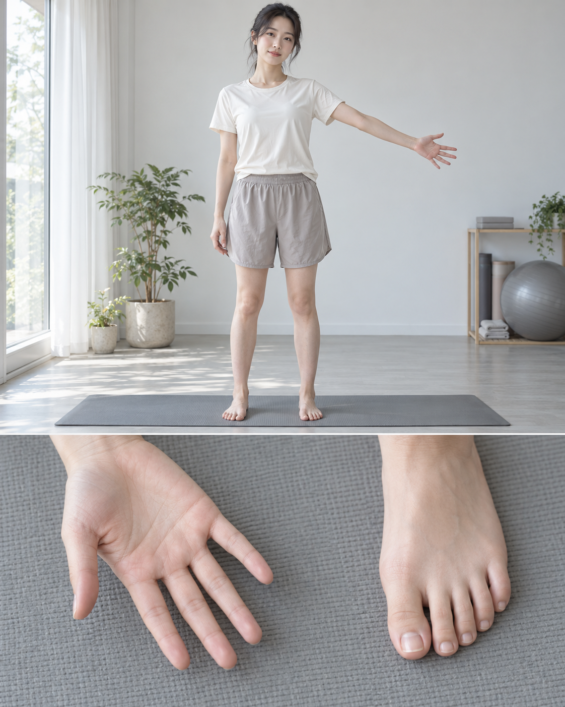

| 单词 | 中文 | 例句 |
| --- | --- | --- |
| body | 身体 | I stretch my **body** on the mat. 我在垫子上舒展身体。 |
| arm | 手臂 | I stretch one **arm** to the side. 我把一只手臂向侧面伸展。 |
| hand | 手 | My **hand** is open. 我的手张开着。 |
| finger | 手指 | My index **finger** is beside my thumb. 我的食指在拇指旁边。 |
| thumb | 拇指 | My **thumb** points away from my fingers. 我的拇指向外展开，与其他手指分开。 |
| leg | 腿 | One **leg** is straight. 一条腿伸直着。 |
| foot | 脚 | My **foot** rests on the mat. 我的脚放在垫子上。 |
| toe | 脚趾 | My big **toe** is beside the other toes. 我的大脚趾在其他脚趾旁边。 |

### C053 · 理解身体内部

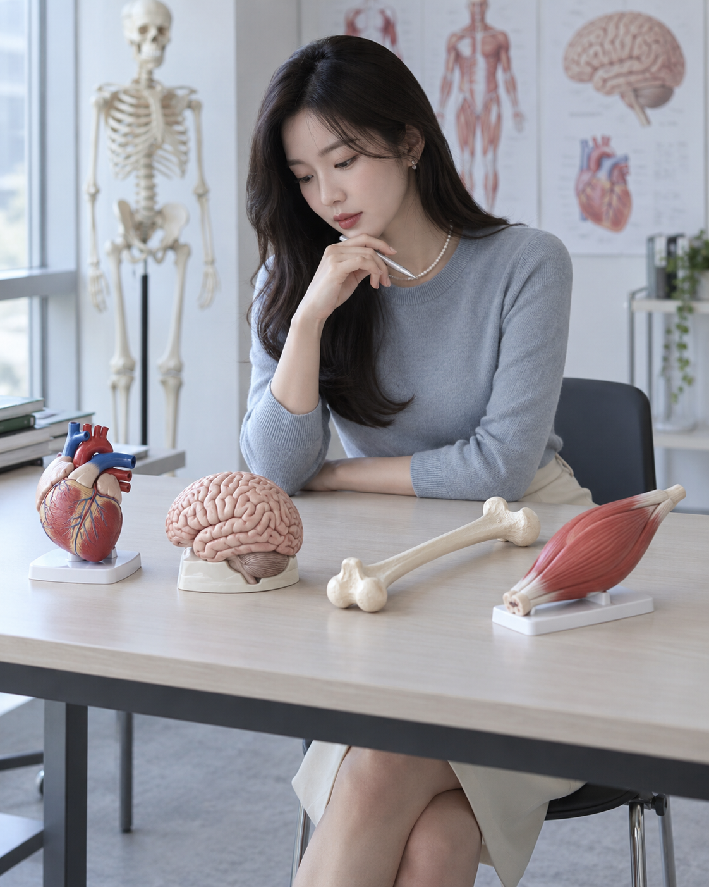

| 单词 | 中文 | 例句 |
| --- | --- | --- |
| head | 头部 | I turn my **head** toward the model. 我把头转向模型。 |
| neck | 颈部 | My **neck** connects my head to my body. 我的颈部连接着头和身体。 |
| chest | 胸部 | My shirt covers my **chest**. 我的上衣盖住胸部。 |
| knee | 膝盖 | My **knee** bends as I sit. 我坐下时膝盖弯曲。 |
| heart | 心脏 | This model represents a **heart**. 这个模型表示心脏。 |
| brain | 大脑 | This model represents a **brain**. 这个模型表示大脑。 |
| bone | 骨头 | The pale model represents a **bone**. 浅色模型表示一根骨头。 |
| muscle | 肌肉 | The red model represents a **muscle**. 红色模型表示一块肌肉。 |

### C054 · 牙科小检查

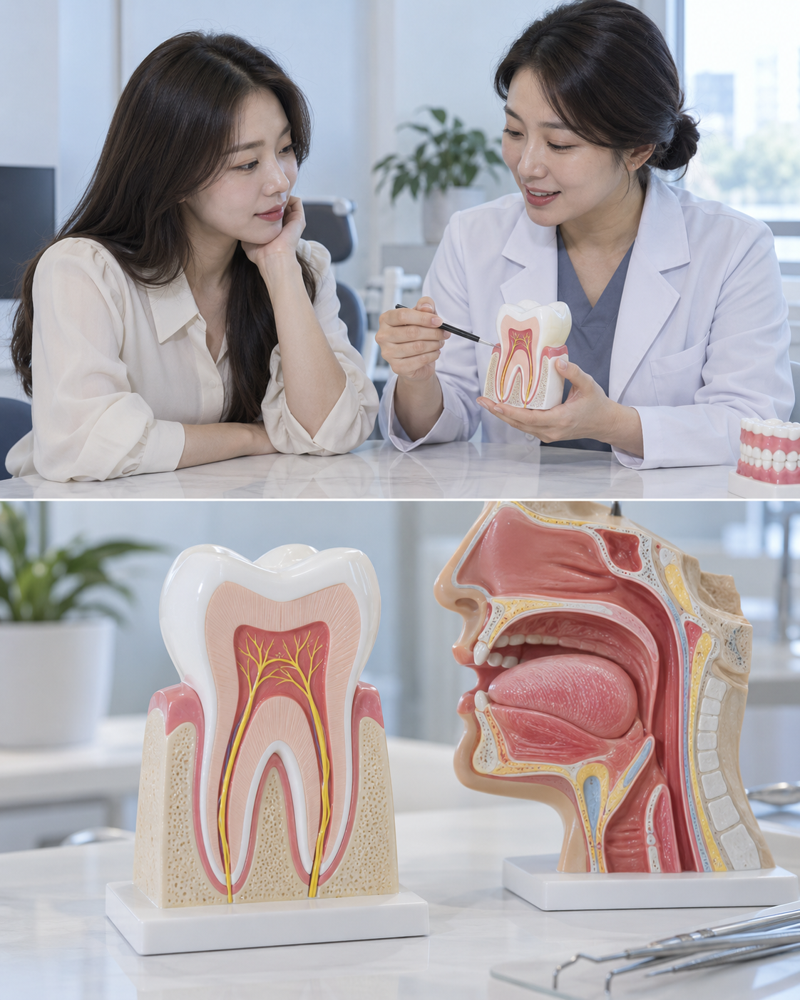

| 单词 | 中文 | 例句 |
| --- | --- | --- |
| tooth | 牙齿 | The dentist shows me a **tooth** model. 牙医给我看一个牙齿模型。 |
| tongue | 舌头 | The pink part of the model represents the **tongue**. 模型的粉色部分表示舌头。 |
| throat | 咽喉 | The passage behind the mouth represents the **throat**. 口腔后方的通道表示咽喉。 |
| skin | 皮肤 | The **skin** on my arm is visible. 我的手臂皮肤露在外面。 |
| nerve | 神经 | The yellow line represents a **nerve** in the tooth. 黄色线条表示牙齿中的一条神经。 |
| medical | 医疗的 | I ask for **medical** help with my tooth. 我为牙齿问题寻求医疗帮助。 |
| pain | 疼痛 | I tell the dentist about my tooth **pain**. 我告诉牙医我的牙痛情况。 |

### C055 · 感冒来就诊

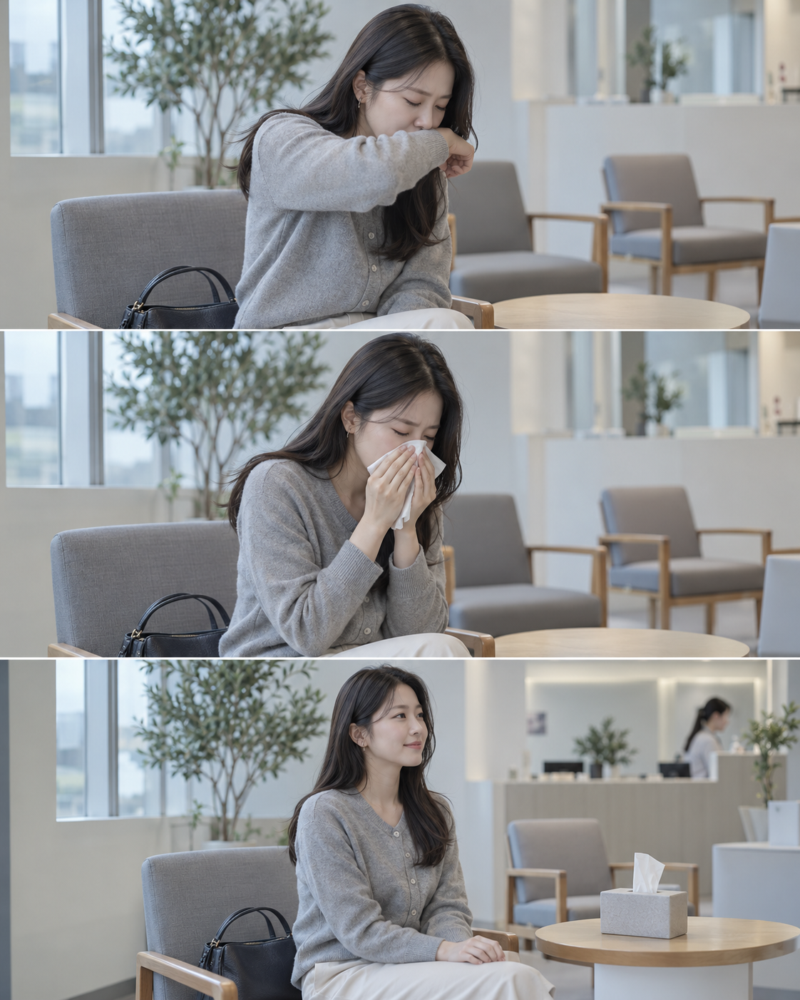

| 单词 | 中文 | 例句 |
| --- | --- | --- |
| hospital | 医院 | I wait at the **hospital**. 我在医院等候。 |
| disease | 疾病 | The doctor explains the **disease**. 医生解释这种疾病。 |
| ill | 生病的 | I feel **ill** and need a rest. 我感觉不舒服，需要休息。 |
| healthy | 健康的 | Later, I feel **healthy** again. 后来，我又觉得身体健康了。 |
| cough | 咳嗽 | I **cough** into my elbow. 我对着肘弯咳嗽。 |
| sneeze | 打喷嚏 | I **sneeze** into a tissue. 我对着纸巾打喷嚏。 |
| feeble | 虚弱的 | I feel **feeble** after being ill. 生病后我感觉虚弱。 |
| normal | 正常的 | I return to my **normal** routine. 我回到正常的日常生活。 |

### C056 · 处理小伤口

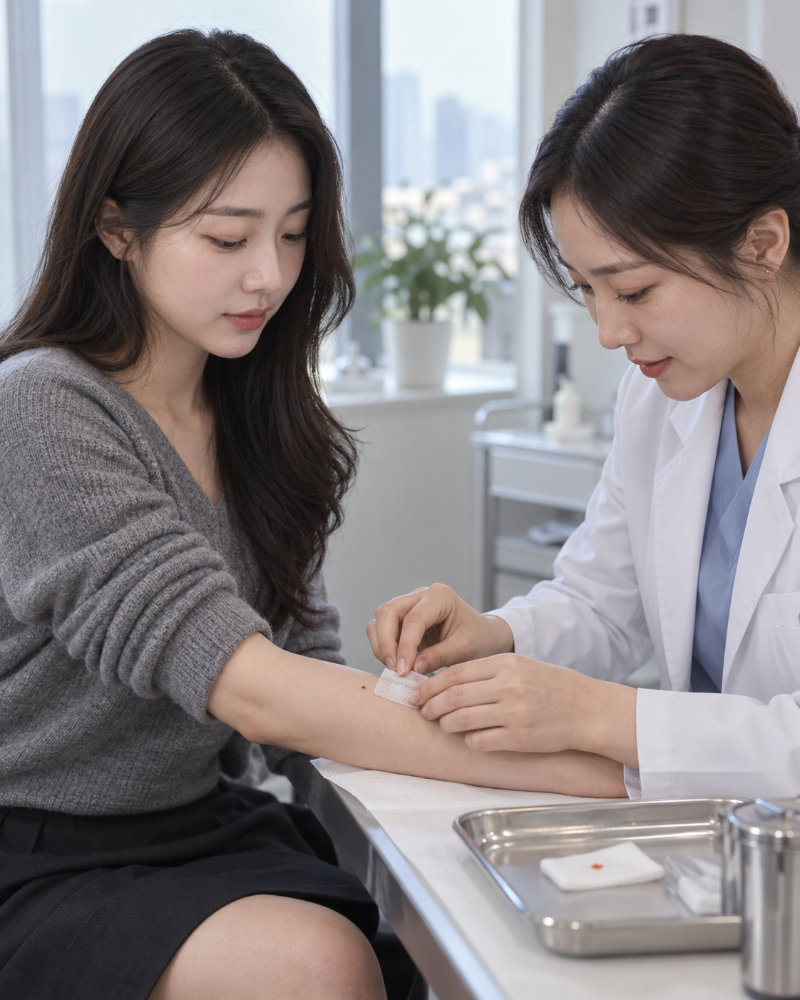

| 单词 | 中文 | 例句 |
| --- | --- | --- |
| wound | 伤口 | There is a small **wound** on my arm. 我的手臂上有一个小伤口。 |
| blood | 血 | A drop of **blood** marks the gauze. 一滴血在纱布上留下痕迹。 |
| operation | 手术 | The doctor says this wound does not need an **operation**. 医生说这个伤口不需要手术。 |
| conscious | 神志清醒的 | I remain **conscious** and answer the nurse. 我保持清醒，回答护士的话。 |
| physical | 身体的 | The wound causes **physical** discomfort. 这个伤口带来身体不适。 |
| serious | 严重的 | The nurse says the injury is not **serious**. 护士说这次受伤并不严重。 |
| help | 帮助 | The nurse **helps** me with the dressing. 护士帮我处理敷料。 |
| safe | 安全的 | I feel **safe** while the nurse helps me. 护士帮助我时，我感觉安心。 |

### C057 · 呼吸与消化

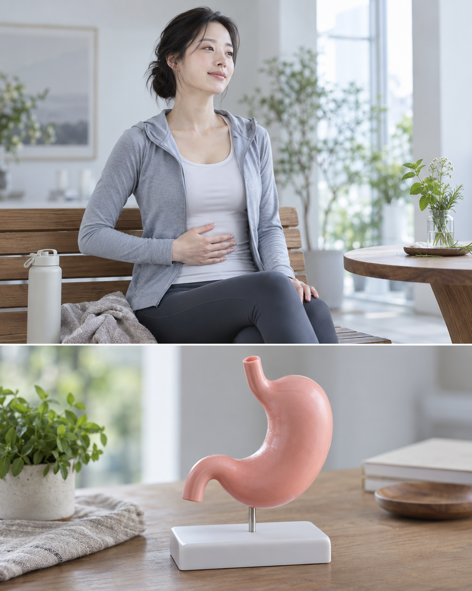

| 单词 | 中文 | 例句 |
| --- | --- | --- |
| breath | 一次呼吸 | I take a slow **breath** after the walk. 散步后，我缓缓吸一口气。 |
| stomach | 胃 | This model represents the **stomach**. 这个模型表示胃。 |
| digestion | 消化 | I learn about **digestion** with the model. 我借助模型了解消化。 |
| sense | 感官 | My **sense** of smell helps me notice the herb. 嗅觉帮助我闻到香草。 |
| feeling | 感受 | I have a **feeling** of calm after resting. 休息后我感到平静。 |
| well | 身体好的 | I feel **well** after a rest. 休息后我感觉身体很好。 |

### C058 · 球场上的运动

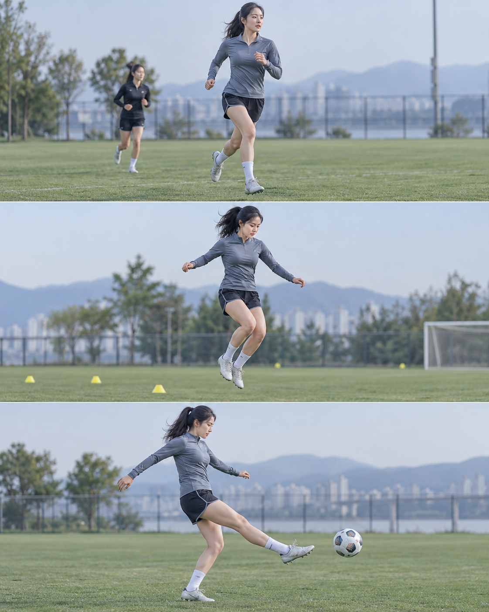

| 单词 | 中文 | 例句 |
| --- | --- | --- |
| ball | 球 | The **ball** is beside my foot. 球在我的脚旁。 |
| kick | 踢 | I **kick** the ball toward my friend. 我把球踢向朋友。 |
| jump | 跳 | I **jump** above the grass. 我从草地上跳起。 |
| run | 跑 | I **run** across the field. 我跑过球场。 |
| motion | 运动 | My legs are in **motion** as I run. 我跑步时双腿在运动。 |
| move | 移动 | I **move** toward the ball. 我向球移动。 |
| stretch | 伸展 | I **stretch** my leg to kick the ball. 我伸展腿部去踢球。 |
| strong | 强壮的 | My legs feel **strong** after practice. 练习后，我感觉双腿很有力量。 |
| let | 让 | **Let** my friend join the match. 让我的朋友加入比赛。 |
| competition | 竞赛 | We enjoy a friendly **competition**. 我们享受一场友好的竞赛。 |
| match | 比赛 | My friend joins the football **match**. 我的朋友加入这场足球比赛。 |

### C059 · 泳池里的平衡

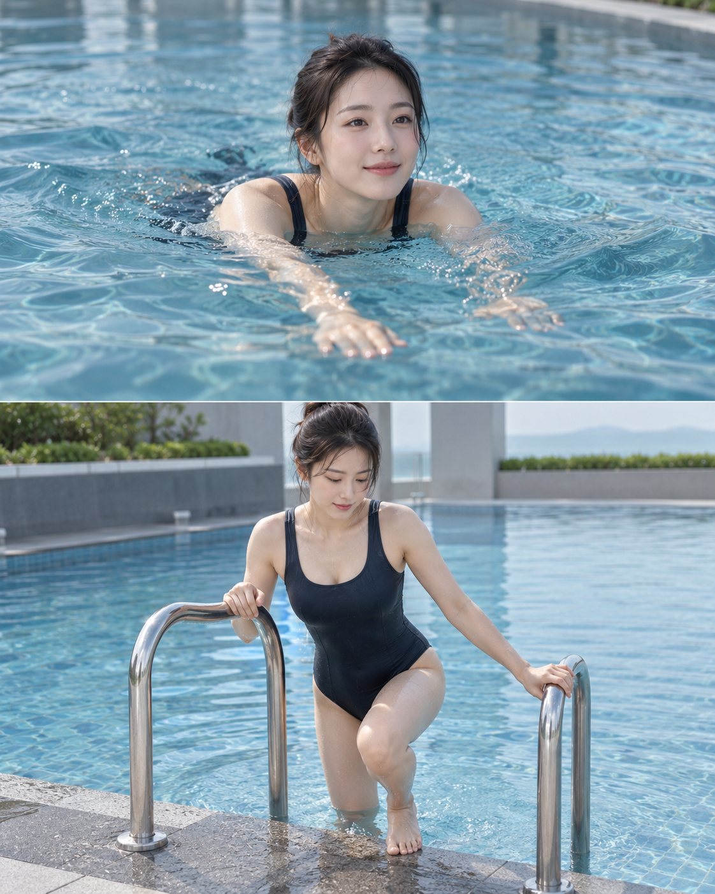

| 单词 | 中文 | 例句 |
| --- | --- | --- |
| swim | 游泳 | I **swim** toward the edge of the pool. 我游向泳池边缘。 |
| balance | 平衡 | I keep my **balance** as I step out. 走出泳池时，我保持平衡。 |
| grip | 握持 | I keep a firm **grip** on the rail. 我牢牢握住扶手。 |
| support | 支撑物 | The metal **support** steadies the rail. 金属支撑固定着扶手。 |
| fall | 跌倒 | I hold the rail so I do not **fall**. 我扶着栏杆，以免跌倒。 |
| slip | 滑倒 | I step carefully so I do not **slip**. 我小心迈步，以免滑倒。 |
| pull | 拉 | I **pull** myself closer to the rail. 我把自己拉向扶手。 |
| push | 推 | I **push** against the rail as I stand. 我站起时撑推着扶手。 |

### C060 · 情绪的几张脸

| 单词 | 中文 | 例句 |
| --- | --- | --- |
| smile | 微笑 | I **smile** at my friend. 我对朋友微笑。 |
| laugh | 大笑 | I **laugh** at a joke. 我听到笑话时大笑。 |
| cry | 哭泣 | I **cry** during a sad film. 我看悲伤的电影时哭了。 |
| sad | 难过的 | I feel **sad** about the story. 我为这个故事感到难过。 |
| angry | 生气的 | I feel **angry** when someone is unkind. 有人不友善时，我会生气。 |
| fear | 害怕 | A loud noise gives me a feeling of **fear**. 一声巨响让我感到害怕。 |
| shock | 震惊 | The unexpected news is a **shock** to me. 这条意外消息让我震惊。 |
| surprise | 惊讶 | My friend brings me a pleasant **surprise**. 朋友给我带来一个惊喜。 |

### C061 · 课堂里的学习

| 单词 | 中文 | 例句 |
| --- | --- | --- |
| school | 学校 | We study at a **school** in the evening. 我们晚上在一所学校学习。 |
| teaching | 教学 | Her **teaching** helps us understand the lesson. 她的教学帮助我们理解这节课。 |
| learning | 学习 | **Learning** a language takes practice. 学习一门语言需要练习。 |
| education | 教育 | Adult **education** gives us another chance to learn. 成人教育给我们再次学习的机会。 |
| knowledge | 知识 | We gain **knowledge** from books and lessons. 我们从书本和课堂中获得知识。 |
| language | 语言 | I practice a new **language** with my class. 我和班上的同学练习一门新语言。 |
| book | 书 | The teacher holds an open **book**. 老师拿着一本打开的书。 |
| chalk | 粉笔 | White **chalk** rests on the ledge. 白色粉笔放在托架上。 |

### C062 · 书桌上的文具

| 单词 | 中文 | 例句 |
| --- | --- | --- |
| paper | 纸 | A sheet of **paper** lies on the desk. 一张纸放在书桌上。 |
| pen | 钢笔 | I hold a **pen** above the paper. 我拿着钢笔，笔在纸上方。 |
| pencil | 铅笔 | The **pencil** has a sharp point. 这支铅笔有尖尖的笔尖。 |
| ink | 墨水 | The bottle contains dark **ink**. 瓶子里装着深色墨水。 |
| note | 便条 | I plan to write a short **note**. 我打算写一张简短的便条。 |
| page | 书页 | This **page** belongs to the open book. 这页属于打开的书。 |
| writing | 写字 | I practice **writing** with my pen. 我用钢笔练习写字。 |
| word | 单词 | I learn one new **word** each day. 我每天学习一个新单词。 |

### C063 · 图书馆选读物

| 单词 | 中文 | 例句 |
| --- | --- | --- |
| library | 图书馆 | I choose a book at the **library**. 我在图书馆挑选一本书。 |
| reading | 阅读 | **Reading** is part of my evening routine. 阅读是我晚间日常的一部分。 |
| fiction | 小说文学 | I enjoy **fiction** about journeys. 我喜欢读有关旅途的小说文学。 |
| story | 故事 | The **story** follows a woman on a journey. 这个故事讲述一位女子的旅程。 |
| prose | 散文体文字 | This story is written in **prose**. 这个故事是用散文体写成的。 |
| verse | 诗歌 | Another book contains **verse** about the sea. 另一本书收录了描写大海的诗歌。 |
| interest | 兴趣 | I have an **interest** in travel stories. 我对旅行故事感兴趣。 |
| memory | 记忆 | The best part stays in my **memory**. 最精彩的部分留在我的记忆里。 |
| ever | 曾经 | Have you **ever** read this story? 你曾经读过这个故事吗？ |

### C064 · 做题与纠错

| 单词 | 中文 | 例句 |
| --- | --- | --- |
| question | 问题 | I ask my friend a **question**. 我向朋友提出一个问题。 |
| answer | 答案 | We compare my **answer** with hers. 我们比较我的答案和她的答案。 |
| example | 例子 | Her **example** helps me understand the rule. 她的例子帮助我理解这个规则。 |
| test | 测验 | This sheet is a practice **test**. 这张纸是一份练习测验。 |
| error | 错误 | I find an **error** in my answer. 我在自己的答案里发现一个错误。 |
| wrong | 错误的 | My first answer is **wrong**. 我的第一个答案是错的。 |
| true | 真实的 | The statement is **true**: water freezes when it is cold enough. 这个陈述是真的：水冷到一定程度会结冰。 |
| false | 不真实的 | The statement that all birds can fly is **false**. “所有鸟都会飞”这个陈述不是真的。 |

### C065 · 手工几何图案

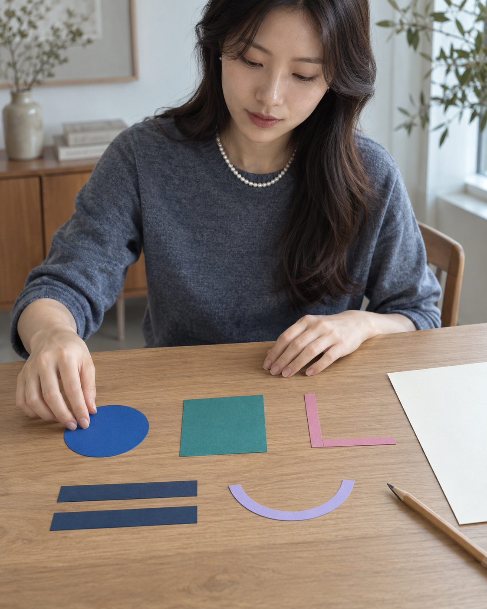

| 单词 | 中文 | 例句 |
| --- | --- | --- |
| circle | 圆 | I cut a **circle** from blue paper. 我用蓝纸剪出一个圆。 |
| square | 正方形 | The **square** has four equal sides. 这个正方形有四条等长的边。 |
| line | 线 | The dark strip represents a **line**. 这根深色纸条表示一条线。 |
| angle | 角 | The two pink strips form a right **angle**. 两根粉色纸条构成一个直角。 |
| curve | 曲线 | The purple strip forms a **curve**. 紫色纸条形成一条曲线。 |
| parallel | 平行的 | The two dark lines are **parallel**. 这两条深色线是平行的。 |
| round | 圆的 | The blue piece is **round**. 这块蓝色纸片是圆的。 |
| straight | 直的 | The dark paper strip is **straight**. 这根深色纸条是直的。 |
| flat | 平的 | The sheet lies **flat** on the table. 这张纸平放在桌上。 |
| point | 尖端 | The pencil has a sharp **point**. 这支铅笔有尖尖的尖端。 |

### C066 · 画室的小作品

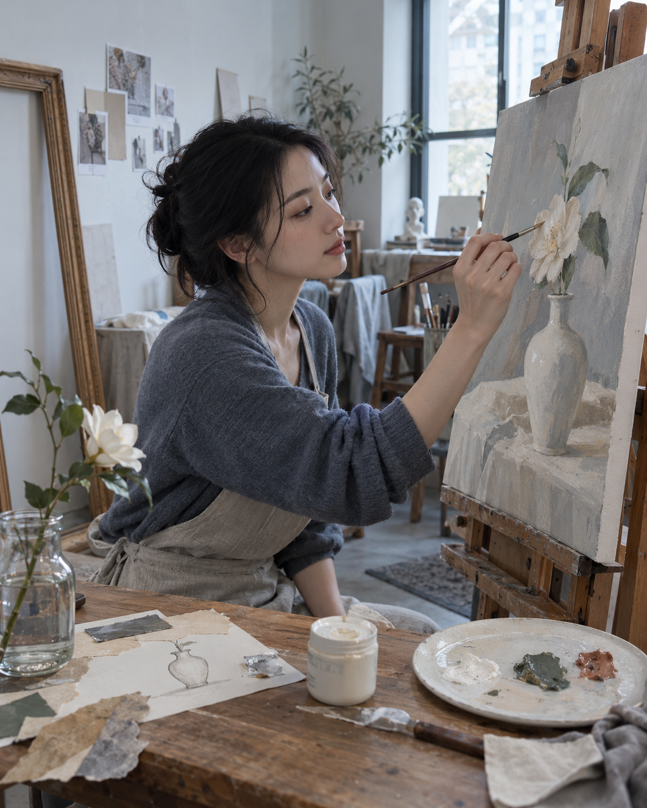

| 单词 | 中文 | 例句 |
| --- | --- | --- |
| art | 艺术 | Making **art** helps me notice small things. 艺术创作帮助我留意细小的事物。 |
| picture | 图画 | I paint a **picture** of a vase. 我画一幅花瓶的画。 |
| frame | 画框 | The wooden **frame** waits beside the picture. 木画框放在画旁，等着装画。 |
| paint | 颜料 | Small blobs of **paint** sit on the palette. 调色板上有小团颜料。 |
| design | 设计图 | My **design** shows the shape of the vase. 我的设计图展示了花瓶的形状。 |
| form | 形状 | The painted vase has a curved **form**. 画里的花瓶有弯曲的形状。 |
| detail | 细节 | One painted petal is a small **detail**. 画出的一片花瓣是一个小细节。 |
| delicate | 纤细的 | The flower has a **delicate** stem. 这朵花有纤细的茎。 |
| paste | 浆糊 | This jar holds **paste** for the paper pieces. 这罐装着粘纸片用的浆糊。 |

### C067 · 舞台音乐排练

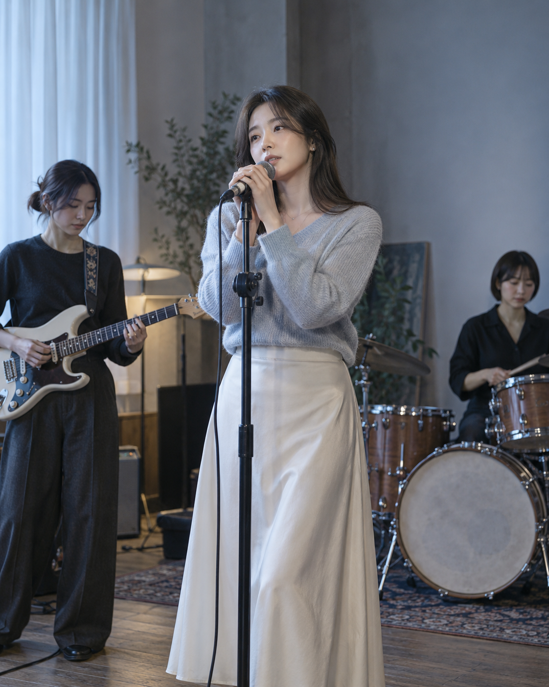

| 单词 | 中文 | 例句 |
| --- | --- | --- |
| music | 音乐 | We make **music** during rehearsal. 我们在排练时演奏音乐。 |
| instrument | 乐器 | The guitar is a musical **instrument**. 吉他是一种乐器。 |
| band | 乐队 | Our **band** has three members. 我们的乐队有三名成员。 |
| song | 歌曲 | I sing a **song** with the band. 我和乐队一起唱一首歌。 |
| rhythm | 节奏 | The drums keep a steady **rhythm**. 鼓保持着稳定的节奏。 |
| harmony | 和声 | Two voices sing in **harmony**. 两个声音唱出和声。 |
| stage | 舞台 | We stand on the wooden **stage**. 我们站在木舞台上。 |
| voice | 嗓音 | My **voice** joins the sound of the guitar. 我的嗓音和吉他声交织在一起。 |
| hearing | 听觉 | My **hearing** helps me follow the music. 我的听觉帮助我跟上音乐。 |

### C068 · 摄影与胶片记录

| 单词 | 中文 | 例句 |
| --- | --- | --- |
| camera | 相机 | I hold the **camera** with both hands. 我用双手拿着相机。 |
| record | 记录 | The photo is a **record** of our trip. 这张照片是我们旅行的记录。 |
| copy | 副本 | The second photo is a **copy** of the first. 第二张照片是第一张的副本。 |
| print | 冲印照片 | A photo **print** comes out of the printer. 一张冲印照片从打印机里出来。 |
| mark | 印记 | A small dark **mark** is on the white border. 白色边框上有一个深色的小印记。 |
| again | 再一次 | I use the camera **again** after lunch. 午饭后，我再次使用相机。 |

### C069 · 游园会小表演

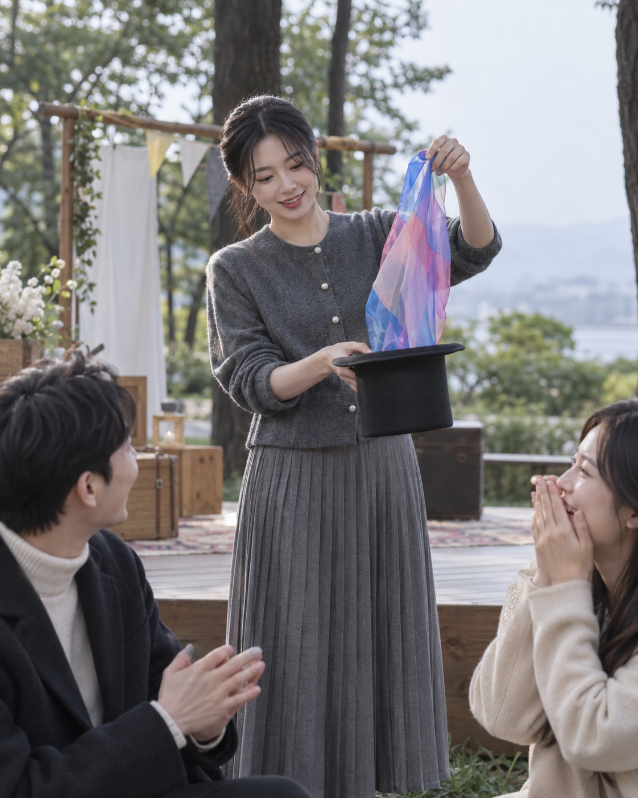

| 单词 | 中文 | 例句 |
| --- | --- | --- |
| play | 玩耍 | We **play** a simple game before the show. 演出前，我们玩一个简单的游戏。 |
| amusement | 娱乐 | The show is a source of **amusement**. 这个节目给人带来娱乐。 |
| pleasure | 愉快 | Watching the act gives me **pleasure**. 观看这个节目让我愉快。 |
| humor | 幽默 | Her gentle **humor** makes us laugh. 她温和的幽默让我们发笑。 |
| trick | 魔术戏法 | She performs a **trick** with a scarf and a hat. 她用丝巾和帽子表演一个戏法。 |
| act | 表演节目 | The magic **act** is part of the event. 这个魔术节目是活动的一部分。 |
| attraction | 吸引人的节目 | The magic show is the main **attraction**. 魔术表演是最吸引人的节目。 |
| happy | 开心的 | I feel **happy** while watching with my friends. 和朋友一起观看时，我感到开心。 |
| event | 活动 | We attend a small **event** in the park. 我们在公园参加一个小活动。 |

### C070 · 安排学习进度

| 单词 | 中文 | 例句 |
| --- | --- | --- |
| list | 清单 | My **list** has three tasks. 我的清单有三项任务。 |
| order | 次序 | I put the books in **order**. 我把书按次序摆好。 |
| first | 第一的 | The **first** box has a check mark. 第一个方框里有一个勾。 |
| second | 第二的 | The **second** box is still empty. 第二个方框还是空的。 |
| step | 步骤 | The next **step** is to sort the pencils. 下一步是给铅笔分类。 |
| complete | 完成的 | The first task is **complete**. 第一项任务已经完成。 |
| regular | 定期的 | **Regular** practice is part of my plan. 定期练习是我计划的一部分。 |
| frequent | 频繁的 | I take **frequent** breaks while studying. 学习时，我经常休息一下。 |
| sort | 分类整理 | I **sort** the stationery into two trays. 我把文具分类放入两个小托盘。 |

### C071 · 办公室开会

| 单词 | 中文 | 例句 |
| --- | --- | --- |
| office | 办公室 | We meet in the **office**. 我们在办公室见面。 |
| work | 工作 | We discuss our **work** at the table. 我们围坐桌旁讨论工作。 |
| company | 公司 | We work for the same **company**. 我们为同一家公司工作。 |
| manager | 经理 | The woman at the head of the table is our **manager**. 坐在桌首的女子是我们的经理。 |
| secretary | 秘书 | Our **secretary** takes notes during the meeting. 我们的秘书在会议中做笔记。 |
| meeting | 会议 | Three colleagues sit together for a **meeting**. 三位同事坐在一起开会。 |
| organization | 组织 | Our **organization** has two teams. 我们的组织有两个团队。 |
| group | 小组 | Our **group** has three people. 我们的小组有三个人。 |
| join | 参加 | I **join** the meeting after lunch. 午饭后我参加会议。 |

### C072 · 白板上的讨论

| 单词 | 中文 | 例句 |
| --- | --- | --- |
| discussion | 讨论 | We have a **discussion** about the problem. 我们讨论这个问题。 |
| opinion | 看法 | I share my **opinion** with my colleague. 我和同事分享我的看法。 |
| argument | 争论 | We avoid an **argument** and listen carefully. 我们避免争论，认真倾听。 |
| suggestion | 建议 | Her **suggestion** is to try a smaller step. 她的建议是先尝试一个较小的步骤。 |
| decision | 决定 | We make a **decision** together. 我们一起作出决定。 |
| agreement | 一致意见 | We reach **agreement** on the next step. 我们就下一步达成一致。 |
| talk | 交谈 | We **talk** beside the whiteboard. 我们在白板旁交谈。 |
| say | 说 | I **say** why I prefer this plan. 我说出偏好这个计划的原因。 |
| about | 关于 | We talk **about** the new plan. 我们谈论这个新计划。 |
| why | 为什么 | **Why** should we try this plan? 我们为什么要尝试这个计划？ |
| how | 怎样 | **How** can we make the plan simpler? 我们怎样能让这个计划更简单？ |

### C073 · 电子邮件与包裹

| 单词 | 中文 | 例句 |
| --- | --- | --- |
| letter | 信 | The **letter** is inside the envelope. 信装在信封里。 |
| stamp | 邮票 | A **stamp** is on the envelope. 信封上贴着一张邮票。 |
| parcel | 包裹 | I hand over a small **parcel**. 我递交一个小包裹。 |
| send | 寄送 | I **send** the parcel to my friend. 我把包裹寄给朋友。 |
| connection | 联系 | Our letters keep a **connection** between us. 我们的信件维系着彼此的联系。 |

### C074 · 报刊摊与广告

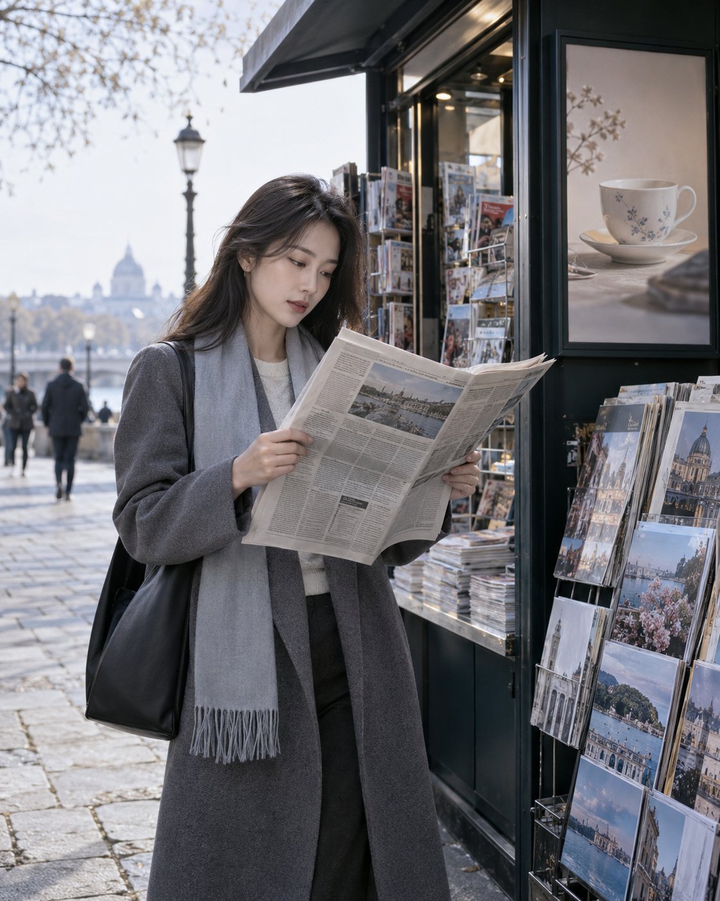

| 单词 | 中文 | 例句 |
| --- | --- | --- |
| news | 新闻 | I read the **news** in a newspaper. 我从报纸上读新闻。 |
| advertisement | 广告 | The poster is an **advertisement** for tea. 这张海报是一则茶的广告。 |
| statement | 声明 | The article includes an official **statement**. 这篇文章包含一份官方声明。 |
| public | 公共的 | The stand is in a **public** place. 这个报刊摊位于公共场所。 |
| fact | 事实 | I check each **fact** before sharing the news. 分享新闻前，我核对每一个事实。 |
| as | 作为 | **As** a reader, I ask careful questions. 作为读者，我审慎地提出问题。 |
| by | 通过 | I learn **by** reading and checking sources. 我通过阅读和核对来源学习。 |

### C075 · 向专家请教

| 单词 | 中文 | 例句 |
| --- | --- | --- |
| expert | 专家 | The woman demonstrating the tool is our **expert**. 演示工具的女子是我们的专家。 |
| experience | 经验 | She shares her **experience** of working with wood. 她分享自己的木工经验。 |
| able | 能够的 | I am **able** to use the tool after practice. 练习之后，我能够使用这个工具。 |
| hard | 困难的 | The task is **hard** for a beginner. 这项任务对初学者来说很困难。 |
| simple | 简单的 | We begin with a **simple** step. 我们从一个简单的步骤开始。 |
| complex | 复杂的 | A **complex** design needs careful planning. 复杂的设计需要仔细规划。 |
| responsible | 负责的 | I am **responsible** for keeping the bench tidy. 我负责保持工作台整洁。 |
| use | 使用 | She shows me how to **use** the screwdriver. 她教我如何使用螺丝刀。 |

### C076 · 创业小摊的账本

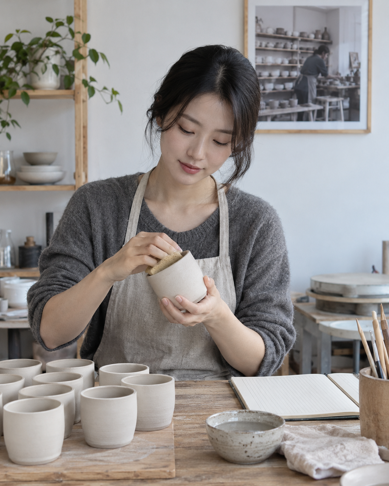

| 单词 | 中文 | 例句 |
| --- | --- | --- |
| trade | 贸易 | Our **trade** brings handmade cups to customers. 我们的贸易把手工杯子带给顾客。 |
| tax | 税 | I record the **tax** separately in my notes. 我在笔记中单独记录税款。 |
| rate | 比率 | I compare the **rate** of growth each month. 我比较每个月的增长率。 |
| increase | 增长 | There is a small **increase** in sales. 销量有小幅增长。 |
| produce | 生产 | We **produce** simple cups by hand. 我们手工制作简单的杯子。 |
| industry | 产业 | Our workshop is part of the pottery **industry**. 我们的工坊属于陶瓷产业。 |
| number | 数量 | I count the **number** of cups on the stall. 我清点摊位上杯子的数量。 |
| unit | 单位 | Each cup counts as one **unit** in my record. 我的记录把每个杯子算作一个单位。 |
| poor | 收入有限的 | We were **poor** when the workshop first opened. 工坊刚开张时，我们收入有限。 |

### C077 · 项目分工板

| 单词 | 中文 | 例句 |
| --- | --- | --- |
| distribution | 分配 | The **distribution** of work is fair. 工作的分配是公平的。 |
| division | 划分 | A clear **division** of work helps the team. 明确的分工有助于团队。 |
| committee | 委员会 | Our **committee** reviews the plan together. 我们的委员会一起审查计划。 |
| representative | 代表 | The woman pointing to the board is our **representative**. 指着工作板的女子是我们的代表。 |
| chief | 负责人 | The colleague seated on the right is our **chief**. 坐在右侧的同事是我们的负责人。 |
| authority | 权限 | The chief has **authority** to approve the plan. 负责人有权批准这个计划。 |
| general | 总体的 | We discuss the **general** plan before the details. 我们先讨论总体计划，再讨论细节。 |
| system | 制度 | The **system** explains how tasks are assigned. 这套制度说明如何分配任务。 |
| lead | 带领 | Our chief will **lead** the next discussion. 我们的负责人将带领下一次讨论。 |

### C078 · 提交申请等回复

| 单词 | 中文 | 例句 |
| --- | --- | --- |
| approval | 批准 | I wait for **approval** of my application. 我等待申请获批。 |
| condition | 条件 | One **condition** is that I provide the missing document. 一个条件是我补交缺少的文件。 |
| possible | 可能的 | An answer today is **possible**. 今天得到答复是可能的。 |
| probable | 很可能的 | A reply tomorrow is more **probable**. 更可能的是明天得到答复。 |
| doubt | 疑虑 | I have a **doubt** about one detail. 我对一个细节有疑虑。 |
| seem | 似乎 | The condition **seems** clear after the explanation. 解释之后，这个条件似乎清楚了。 |
| may | 可能 | The reply **may** arrive tomorrow. 答复可能明天到。 |
| will | 将会 | I **will** check for a reply tomorrow. 我明天会查看有没有答复。 |
| certain | 确定的 | The date is not **certain** yet. 日期还不确定。 |

### C079 · 保护私人资料

| 单词 | 中文 | 例句 |
| --- | --- | --- |
| private | 私人的 | I keep **private** papers in the folder inside the lockable box. 我把私人文件放在可上锁盒子里的文件夹中。 |
| secret | 秘密 | I do not share a personal **secret** without permission. 未经允许，我不分享个人秘密。 |
| property | 财产 | These documents concern my personal **property**. 这些文件涉及我的个人财产。 |
| insurance | 保险 | My **insurance** papers stay in the folder. 我的保险文件放在文件夹里。 |
| loss | 损失 | I keep copies to reduce the risk of **loss**. 我保留副本以降低损失的风险。 |
| limit | 限制 | I **limit** access to the private documents. 我限制对私人文件的访问。 |
| necessary | 必要的 | A safe place for these papers is **necessary**. 为这些文件找一个安全的地方是必要的。 |
| important | 重要的 | Protecting **important** information is part of my routine. 保护重要信息是我日常工作的一部分。 |

### C080 · 日程先后顺序

| 单词 | 中文 | 例句 |
| --- | --- | --- |
| yesterday | 昨天 | I finished the first task **yesterday**. 我昨天完成了第一项任务。 |
| now | 现在 | **Now** I open another notebook. 现在我打开另一本笔记本。 |
| past | 过去 | That finished task belongs to the **past**. 那项已完成的任务属于过去。 |
| present | 现在 | At **present**, I am working on the next task. 目前，我正在做下一项任务。 |
| future | 未来 | I plan to study more in the **future**. 我计划未来学习更多。 |
| before | 在……之前 | I close one notebook **before** opening another. 打开另一本笔记本之前，我先合上这一本。 |
| after | 在……之后 | I begin the next task **after** a short break. 短暂休息之后，我开始下一项任务。 |
| then | 然后 | I open the notebook, **then** pick up my pen. 我打开笔记本，然后拿起钢笔。 |
| start | 开始 | I **start** the new task by opening my notebook. 我通过打开笔记本来开始新任务。 |

### C081 · 修理一把木椅

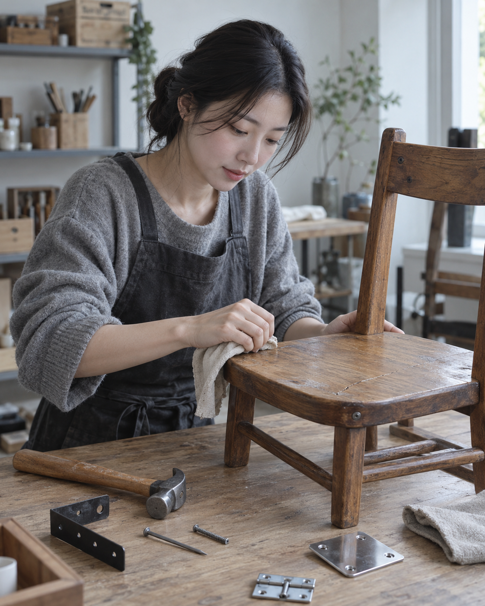

| 单词 | 中文 | 例句 |
| --- | --- | --- |
| wood | 木材 | The chair is made of **wood**. 这把椅子用木材制成。 |
| hammer | 锤子 | The **hammer** rests beside the chair. 锤子放在椅子旁。 |
| nail | 钉子 | A **nail** lies beside the screw. 钉子放在螺丝旁。 |
| screw | 螺丝 | The **screw** has a visible thread. 这颗螺丝有可见的螺纹。 |
| metal | 金属 | The hinge is made of **metal**. 这个铰链由金属制成。 |
| iron | 铁 | In this lesson, the dark bracket is made of **iron**. 本课设定中，深色支架由铁制成。 |
| steel | 钢 | The shiny plate is the **steel** sample in our lesson. 亮亮的板是本课中的钢样品。 |
| part | 零件 | The hinge is one small **part** of the chair. 这个铰链是椅子的一个小零件。 |
| crack | 裂纹 | I notice a small **crack** in the seat. 我注意到椅面上有一条小裂纹。 |
| polish | 擦亮 | I **polish** the wood with a cloth. 我用布擦亮木头。 |

### C082 · 搭建小砖屋

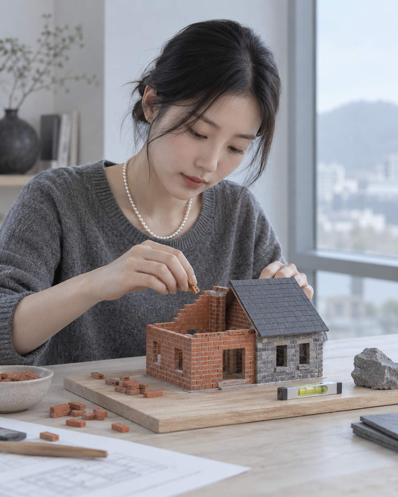

| 单词 | 中文 | 例句 |
| --- | --- | --- |
| brick | 砖 | A red **brick** lies beside the model. 一块红砖放在模型旁。 |
| stone | 石头 | The **stone** has a rough surface. 这块石头有粗糙的表面。 |
| roof | 屋顶 | The small house has a sloping **roof**. 这个小房子有倾斜的屋顶。 |
| base | 底座 | The model stands on a flat **base**. 模型立在平坦的底座上。 |
| structure | 结构 | The open side shows the wall **structure**. 敞开的一侧展示了墙体结构。 |
| level | 水平的 | The board is **level** on the table. 板子水平放在桌上。 |
| fixed | 固定的 | The roof is **fixed** in place in the story. 故事中的屋顶已经固定好。 |
| board | 木板 | A wooden **board** supports the house. 一块木板托着房子。 |
| rough | 粗糙的 | The grey stone looks **rough**. 这块灰色石头看起来粗糙。 |
| top | 顶部 | The roof is at the **top** of the model. 屋顶位于模型顶部。 |

### C083 · 水管与水泵

| 单词 | 中文 | 例句 |
| --- | --- | --- |
| pipe | 管道 | Water passes through the clear **pipe** in the lesson. 本课中的水通过透明管道。 |
| pump | 泵 | The hand **pump** is beside the jar. 手动水泵放在罐子旁。 |
| elastic | 有弹性的 | The blue tube is **elastic** in our demonstration. 我们的演示中，蓝色管子有弹性。 |
| solid | 实心的 | The **solid** rod has no hole through its center. 实心杆的中心没有贯穿孔。 |
| hollow | 空心的 | The **hollow** tube has an open center. 空心管的中间是通的。 |
| stiff | 不易弯曲的 | The clear pipe is **stiff** in this demonstration. 这次演示中的透明管道不易弯曲。 |
| bent | 弯曲的 | The blue tube is **bent** into a U shape. 蓝色管子弯成了U形。 |
| apparatus | 装置 | The **apparatus** helps us study water flow. 这个装置帮助我们学习水流。 |

### C084 · 电路里的连接

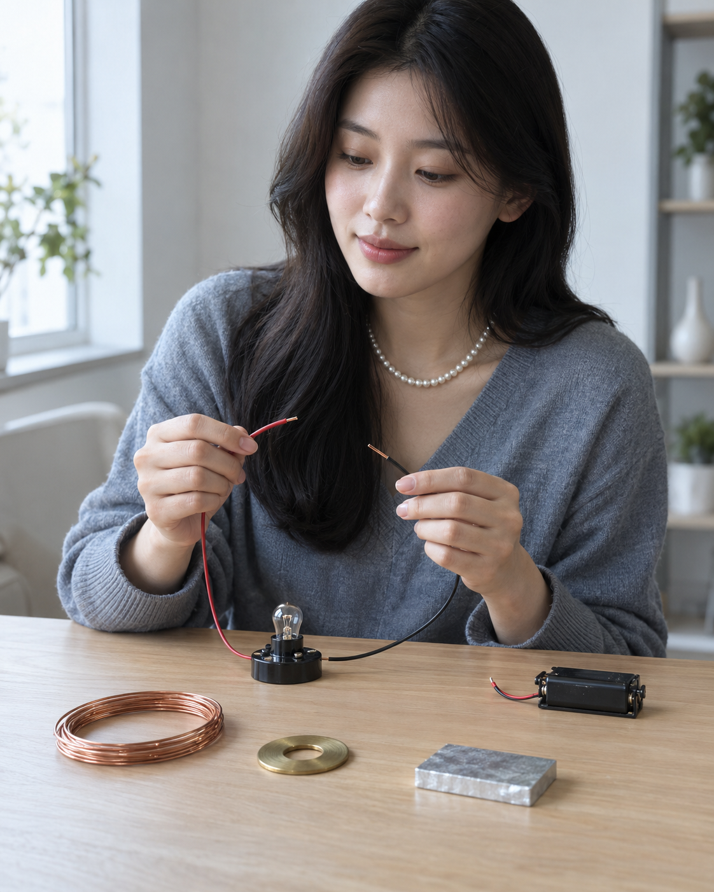

| 单词 | 中文 | 例句 |
| --- | --- | --- |
| wire | 电线 | The **wire** lies beside the bulb. 电线放在灯泡旁。 |
| bulb | 灯泡 | The small **bulb** is not lit. 这个小灯泡没有亮。 |
| electric | 电的 | The **electric** circuit is switched off. 这个电路的电源是关闭的。 |
| copper | 铜 | The reddish coil is our **copper** sample. 红褐色线圈是我们的铜样品。 |
| brass | 黄铜 | The golden washer is our **brass** sample. 金色垫圈是我们的黄铜样品。 |
| tin | 锡 | The silver rectangle is our **tin** sample. 银色长方形片是我们的锡样品。 |
| power | 电能 | We switch off the **power** before checking the circuit. 检查电路前，我们关闭电源。 |
| current | 电流 | No **current** flows through the disconnected circuit. 断开的电路没有电流通过。 |

### C085 · 绳索和小机关

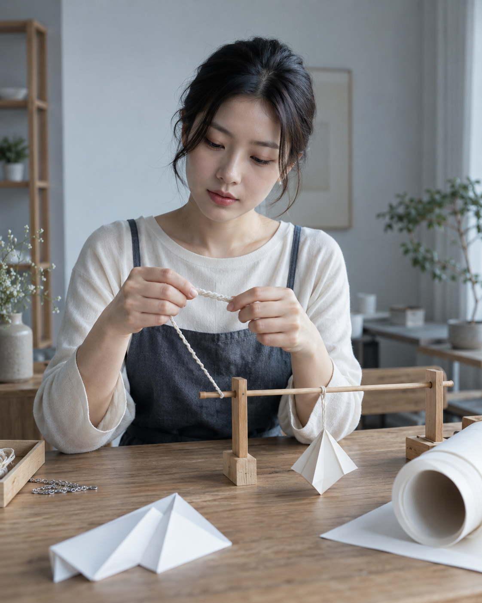

| 单词 | 中文 | 例句 |
| --- | --- | --- |
| chain | 链条 | The short **chain** lies on the bench. 短链条放在工作台上。 |
| cord | 绳索 | I hold two strands of **cord**. 我拿着两股绳索。 |
| stick | 棍 | The wooden **stick** supports the hanging shape. 木棍支撑着悬挂的形状。 |
| hanging | 悬挂着的 | The paper shape is **hanging** from the stick. 纸做的形状悬挂在木棍上。 |
| twist | 拧 | I **twist** the two strands together. 我把这两股拧在一起。 |
| fold | 折叠 | I **fold** the paper in half in the story. 故事中，我把纸对折。 |
| roll | 卷 | A paper **roll** rests on the right. 一卷纸放在右侧。 |

### C086 · 实验室的物质变化

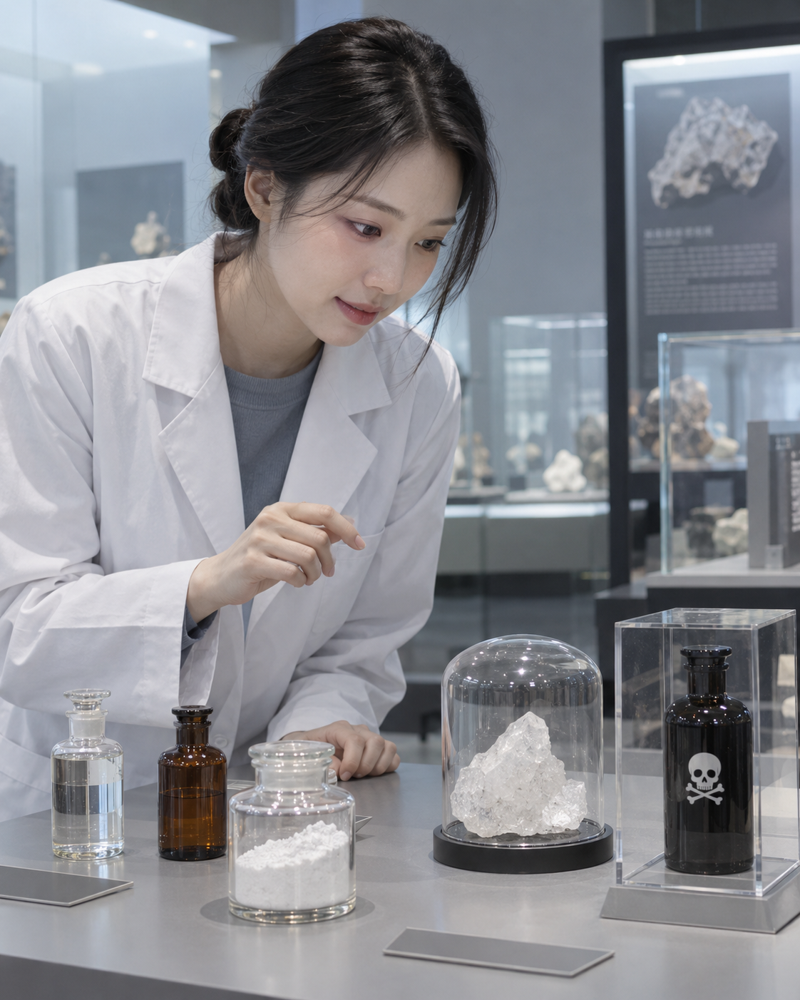

| 单词 | 中文 | 例句 |
| --- | --- | --- |
| acid | 酸 | The clear bottle holds the sealed **acid** sample in our lesson. 本课中，透明瓶装着封存的酸样品。 |
| chemical | 化学物质 | The amber bottle holds a **chemical** sample in the story. 故事中，棕色瓶装着化学物质样品。 |
| powder | 粉末 | White **powder** is sealed inside the jar. 白色粉末封存在罐子里。 |
| substance | 物质 | The solid **substance** is displayed under glass. 这种固体物质陈列在玻璃罩下。 |
| expansion | 膨胀 | Our lesson explains the **expansion** of a gas when it is heated. 本课解释气体受热时的膨胀。 |
| reaction | 反应 | We discuss a chemical **reaction** without opening the samples. 我们不打开样品，只讨论化学反应。 |
| science | 科学 | **Science** helps us ask questions about these substances. 科学帮助我们就这些物质提出问题。 |
| theory | 理论 | A **theory** can explain results and make predictions. 理论可以解释结果并作出预测。 |
| poison | 毒物 | The dark bottle represents **poison** in this teaching display. 深色瓶在这个教学展示中代表毒物。 |

### C087 · 量一量称一称

| 单词 | 中文 | 例句 |
| --- | --- | --- |
| measure | 测量 | I **measure** the length of the board with a ruler. 我用尺子测量木板的长度。 |
| scale | 秤 | The **scale** has a sample on each pan. 秤的两端托盘各有一个样品。 |
| weight | 重量 | We compare the **weight** of the two samples here. 我们在这里比较两个样品的重量。 |
| mass | 质量 | In our lesson, each cube has the same **mass**. 本课设定中，每个立方体的质量相同。 |
| degree | 程度 | We look for any **degree** of difference between the samples. 我们查看样品之间是否存在任何程度的差异。 |
| equal | 相等的 | The two samples have **equal** weight in this demonstration. 这次演示中的两个样品重量相等。 |
| even | 平整的 | The board has an **even** surface. 木板的表面平整。 |
| range | 范围 | Our ruler has a limited measurement **range**. 我们的尺子有有限的测量范围。 |

### C088 · 发现与发明

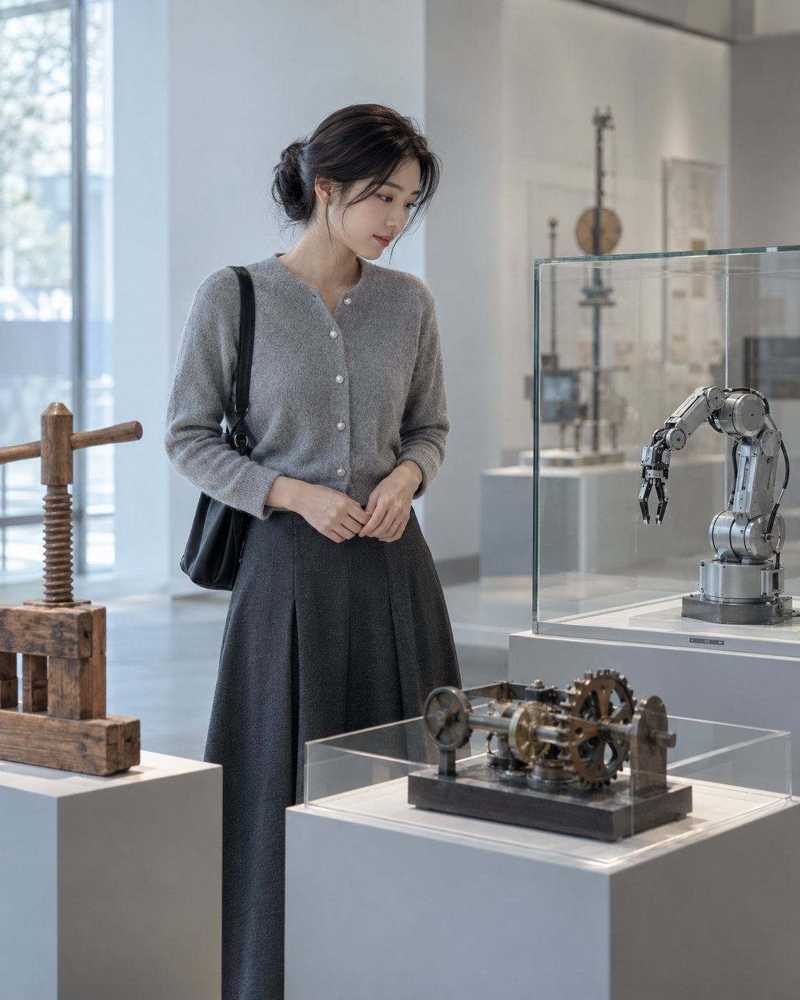

| 单词 | 中文 | 例句 |
| --- | --- | --- |
| discovery | 发现 | A **discovery** reveals something that was already there. 发现揭示原本就存在的事物。 |
| invention | 发明 | The small prototype represents an **invention** in this exhibit. 这个小原型在展览中代表一项发明。 |
| development | 发展 | The exhibit tells a story of technical **development**. 这个展览讲述技术发展的故事。 |
| automatic | 自动的 | The story describes an **automatic** machine that follows a program. 故事描述一台按照程序运行的自动机器。 |
| machine | 机器 | The **machine** is protected by glass. 机器由玻璃罩保护着。 |
| process | 过程 | We discuss the **process** of improving the prototype. 我们讨论改进原型的过程。 |
| purpose | 目的 | The **purpose** of the display is to explain engineering. 这个展示的目的是解释工程技术。 |
| attempt | 尝试 | The prototype began as a first **attempt** at a new design. 这个原型起初是对新设计的第一次尝试。 |

### C089 · 理解原因与结果

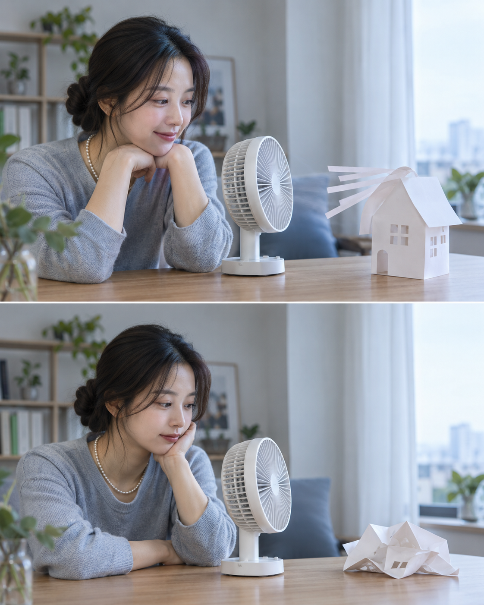

| 单词 | 中文 | 例句 |
| --- | --- | --- |
| cause | 原因 | The wind is the **cause** of the model falling in our story. 故事中，风是模型倒下的原因。 |
| effect | 结果 | The fallen model shows the **effect** of the wind in the story. 倒下的模型展示了故事中风造成的结果。 |
| reason | 理由 | We explain the **reason** for using a light paper model. 我们解释使用轻纸模型的理由。 |
| force | 力 | The moving air exerts **force** on the paper. 流动的空气对纸施加力。 |
| blow | 吹 | The fan makes air **blow** toward the paper house. 风扇让空气朝纸房子吹去。 |
| burst | 爆裂 | An overfilled balloon can **burst**; this model is made of paper. 充气过多的气球可能爆裂；这个模型是纸做的。 |
| crush | 压坏 | Too much pressure can **crush** a paper model. 过大的压力会压坏纸模型。 |
| damage | 损坏 | The lower panel shows **damage** to the paper house. 下方画面展示纸房子受到的损坏。 |
| smash | 砸碎 | A hard impact can **smash** a cup; we use paper for this demonstration. 猛烈撞击可能砸碎杯子；我们用纸做这次演示。 |

### C090 · 消防安全演练

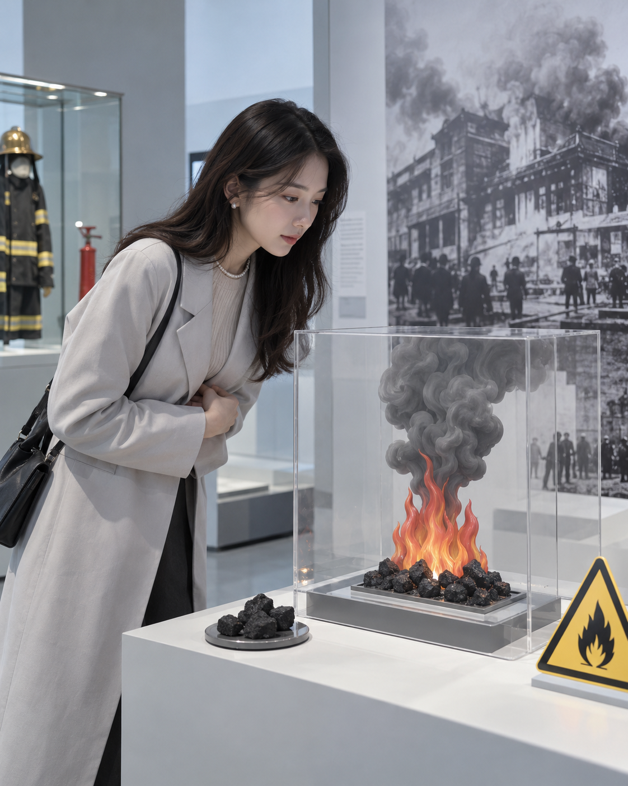

| 单词 | 中文 | 例句 |
| --- | --- | --- |
| fire | 火 | The model represents **fire** in a small hearth. 模型展示小炉膛里的火。 |
| flame | 火焰 | The orange **flame** is part of the teaching model. 橙色火焰是教学模型的一部分。 |
| smoke | 烟 | The grey shape represents **smoke** in the model. 灰色形状在模型中代表烟。 |
| coal | 煤 | A **coal** sample rests in the separate dish. 煤样品放在单独的碟子里。 |
| burn | 燃烧 | Coal can **burn**, but nothing is burning in this model. 煤可以燃烧，但这个模型里没有东西正在燃烧。 |
| danger | 危险 | The lesson explains the **danger** of an uncontrolled fire. 这节课解释失控火灾的危险。 |
| destruction | 毁坏 | An uncontrolled fire can cause **destruction**. 失控的火灾可能造成毁坏。 |
| sign | 标志 | The warning **sign** stands beside the model. 警示标志立在模型旁。 |

### C091 · 认识彼此

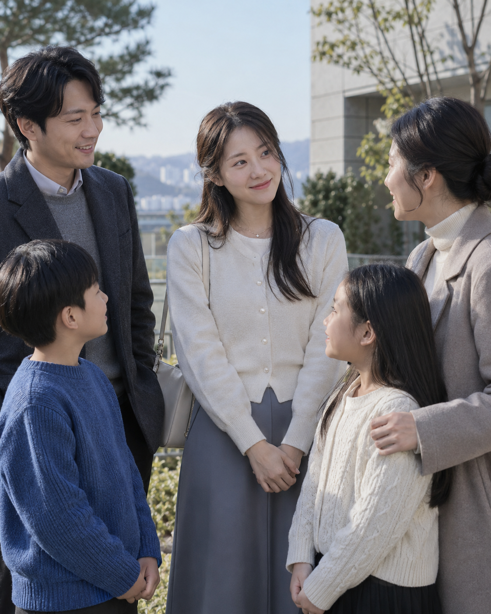

| 单词 | 中文 | 例句 |
| --- | --- | --- |
| person | 人 | Each **person** introduces themselves. 每个人自我介绍。 |
| man | 成年男子 | The **man** on the left introduces himself as Jun. 左边的成年男子介绍自己叫Jun。 |
| woman | 成年女子 | The **woman** in the middle introduces herself as Mina. 中间的成年女子介绍自己叫Mina。 |
| boy | 男孩 | The **boy** in blue is ten in our story. 故事中，穿蓝衣的男孩十岁。 |
| girl | 女孩 | The **girl** in cream is ten in our story. 故事中，穿米白衣的女孩十岁。 |
| young | 年轻的 | The two children are **young** in this story. 故事中的两个孩子年龄小。 |
| male | 男性的 | Jun is a **male** participant in our fictional group. Jun是我们虚构小组中的男性参与者。 |
| female | 女性的 | Mina is a **female** participant in our fictional group. Mina是我们虚构小组中的女性参与者。 |
| among | 在……之中 | I stand **among** the other people. 我站在其他人之中。 |
| sex | 性别 | In this vocabulary lesson, **sex** means a male or female category. 在这节词汇课里，sex指男性或女性的性别类别。 |
| who | 谁 | **Who** is standing beside Mina? 谁站在Mina旁边？ |

### C092 · 朋友相伴的一天

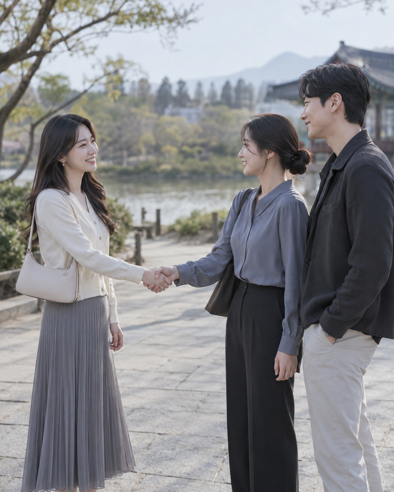

| 单词 | 中文 | 例句 |
| --- | --- | --- |
| friend | 朋友 | The woman greeting me is my **friend**. 向我问好的女子是我的朋友。 |
| married | 已婚的 | My friend and her partner are **married** in this story. 故事中，我的朋友和她的伴侣已婚。 |
| relation | 关系 | We describe the **relation** between the two partners. 我们描述这两位伴侣之间的关系。 |
| kind | 友善的 | I try to be **kind** when meeting new people. 认识新朋友时，我努力友善待人。 |
| respect | 尊重 | I show **respect** by listening carefully. 我通过认真倾听表达尊重。 |
| society | 社会 | Respect helps people live together in **society**. 尊重有助于人们在社会中共同生活。 |
| common | 常见的 | A handshake is a **common** greeting in some places. 在有些地方，握手是常见的问候方式。 |
| behavior | 举止 | Kind **behavior** makes a meeting easier. 友善的举止让见面更轻松。 |
| shake | 握手 | We **shake** hands on the path. 我们在小路上握手。 |

### C093 · 城市规则与公共服务

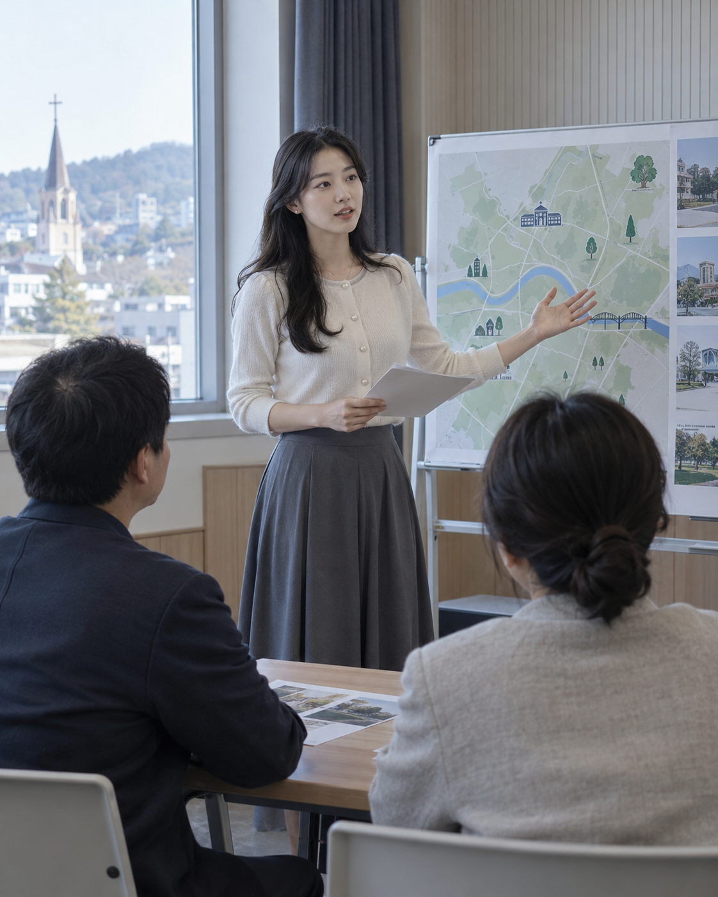

| 单词 | 中文 | 例句 |
| --- | --- | --- |
| government | 政府 | The local **government** holds a public meeting in our story. 故事中的地方政府举行公共说明会。 |
| political | 政治的 | We ask a **political** question about public decisions. 我们就公共决策提出一个政治问题。 |
| law | 法律 | A **law** sets rules that people must follow. 法律规定人们必须遵守的规则。 |
| rule | 规则 | We discuss a **rule** for using the hall. 我们讨论使用大厅的一项规则。 |
| peace | 和平 | People can disagree and still live in **peace**. 人们可以意见不同，仍然和平共处。 |
| protest | 抗议 | The speaker describes a peaceful **protest** in the story. 发言者讲述故事中的一场和平抗议。 |
| religion | 宗教 | **Religion** is one topic in our vocabulary discussion. 宗教是我们词汇讨论的一个话题。 |
| church | 教堂 | A small **church** stands outside the window. 窗外立着一座小教堂。 |
| free | 自由的 | People are **free** to ask questions at this meeting. 人们在这场会议上可以自由提问。 |

### C094 · 历史馆里的战争展

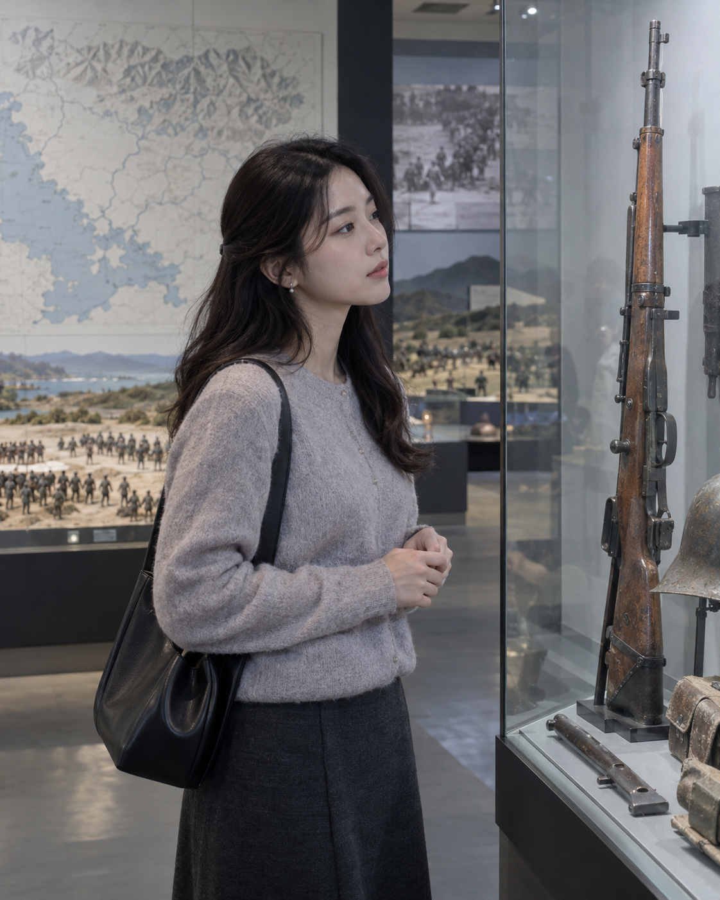

| 单词 | 中文 | 例句 |
| --- | --- | --- |
| history | 历史 | I study **history** at the museum. 我在博物馆学习历史。 |
| war | 战争 | The exhibit explains the cost of **war**. 展览解释战争的代价。 |
| army | 军队 | The miniature figures represent an **army** in this exhibit. 展览中的微型人物代表一支军队。 |
| military | 军事的 | This room presents **military** history. 这个展厅介绍军事历史。 |
| gun | 枪 | An old **gun** is kept behind glass. 一支旧枪保存在玻璃后面。 |
| attack | 进攻 | The guide describes an **attack** in the historical story. 讲解员描述历史故事中的一次进攻。 |
| fight | 战斗 | The story explains why soldiers had to **fight**. 故事解释士兵为什么不得不战斗。 |
| violent | 暴力的 | The exhibit discusses **violent** conflict without showing injuries. 展览讨论暴力冲突，但不展示伤情。 |
| against | 反对 | The message is **against** war. 这个信息表达反对战争。 |
| dead | 死去的 | We remember the **dead** soldiers mentioned in the story. 我们纪念故事中提到的死去的士兵。 |
| death | 死亡 | The guide speaks about **death** and loss during war. 讲解员讲述战争中的死亡与损失。 |

### C095 · 法庭里的公正

| 单词 | 中文 | 例句 |
| --- | --- | --- |
| judge | 法官 | The woman at the raised desk plays the **judge**. 高台桌后的女子扮演法官。 |
| crime | 犯罪 | We discuss a fictional **crime** in the mock court. 我们在模拟法庭讨论一桩虚构犯罪。 |
| prison | 监狱 | The small model shows an empty **prison** cell. 这个小模型展示一间空的监狱牢房。 |
| punishment | 惩罚 | The judge considers fair **punishment** in the story. 故事中的法官考虑公平的惩罚。 |
| cruel | 残忍的 | We explain why **cruel** treatment is wrong. 我们解释残忍的对待为什么不对。 |
| hate | 厌恶 | I **hate** cruelty, but I try to judge facts fairly. 我厌恶残忍，但尽量公平判断事实。 |
| disgust | 厌恶 | The story makes me feel **disgust** at cruelty. 这个故事让我对残忍感到厌恶。 |
| shame | 羞愧 | The fictional speaker describes a feeling of **shame**. 虚构的发言者描述羞愧的感受。 |

### C096 · 挫折后再尝试

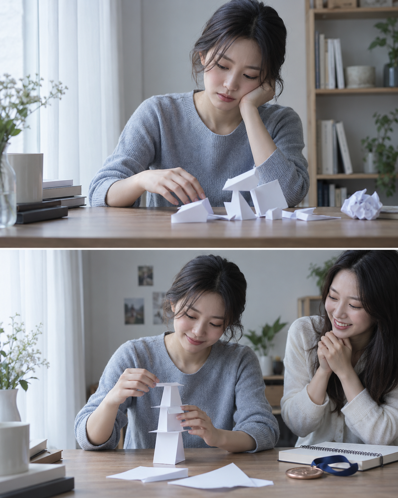

| 单词 | 中文 | 例句 |
| --- | --- | --- |
| hope | 希望 | I have **hope** that the next attempt will work. 我希望下一次尝试会成功。 |
| regret | 遗憾 | I feel **regret** about rushing the first attempt. 我为第一次尝试过于仓促而遗憾。 |
| reward | 奖励 | The medal is a small **reward** for effort in our story. 故事中的奖牌是对努力的小奖励。 |
| chance | 机会 | I give myself another **chance** to try. 我给自己再一次尝试的机会。 |
| trouble | 困难 | I have **trouble** keeping the paper tower upright. 我难以让纸塔保持直立。 |
| foolish | 不明智的 | Rushing without checking was a **foolish** choice in the story. 故事中，不检查就仓促动手是不明智的选择。 |
| wise | 明智的 | Taking time to check is a **wise** choice. 花时间检查是明智的选择。 |
| tendency | 倾向 | I notice my **tendency** to rush when I am excited. 我注意到自己兴奋时容易仓促行事的倾向。 |

### C097 · 思考我是谁

| 单词 | 中文 | 例句 |
| --- | --- | --- |
| self | 自我 | Writing helps me explore my sense of **self**. 写作帮助我探索自我意识。 |
| mind | 心智 | Many questions come into my **mind**. 许多问题进入我的脑海。 |
| thought | 想法 | I write down a **thought** before I forget it. 忘记之前，我记下这个想法。 |
| idea | 点子 | A new **idea** helps me see the problem differently. 一个新点子帮助我换个角度看问题。 |
| belief | 信念 | I question a **belief** that I have held for years. 我反思一个持有多年的信念。 |
| existence | 存在 | I reflect on the meaning of human **existence**. 我思考人类存在的意义。 |
| impulse | 冲动 | I pause before acting on a sudden **impulse**. 我在按照突然的冲动行动之前停一下。 |
| living | 活着的 | I think about the needs of **living** things. 我思考生物的需要。 |

### C098 · 指出这里和那里

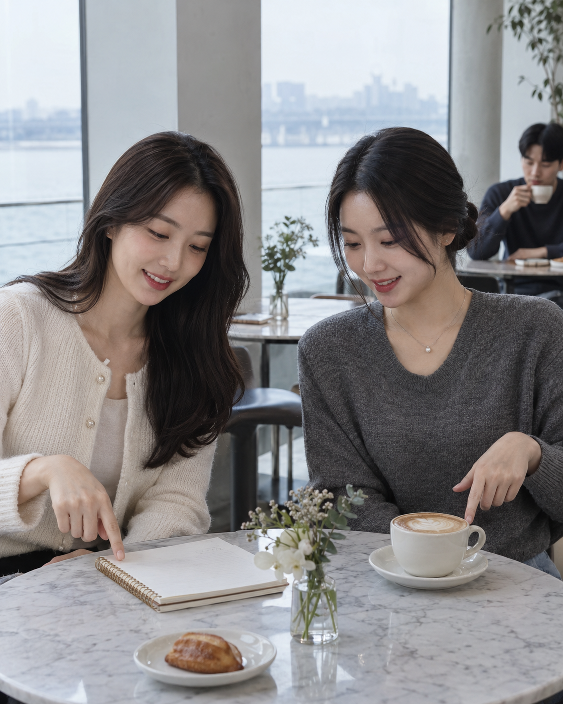

| 单词 | 中文 | 例句 |
| --- | --- | --- |
| I | 我 | **I** point to the notebook near me. 我指向靠近我的笔记本。 |
| you | 你 | This cup is for **you**, my friend. 朋友，这个杯子给你。 |
| he | 他 | **He** is sitting at the other table in our story. 故事中的他坐在另一张桌旁。 |
| this | 这个 | **This** notebook is close to me. 这本笔记本靠近我。 |
| that | 那个 | **That** cup is nearer to you. 那个杯子更靠近你。 |
| here | 这里 | My notebook is **here** beside me. 我的笔记本就在这里，在我旁边。 |
| there | 那里 | Our other friend is sitting **there**. 我们的另一位朋友坐在那里。 |
| mine | 我的 | The notebook is **mine**. 这本笔记本是我的。 |
| name | 名字 | My **name** is Mina in this story. 这个故事中，我的名字是Mina。 |
| thing | 东西 | The cup is one useful **thing** on our table. 杯子是桌上一件有用的东西。 |

### C099 · 数量与范围的小问题

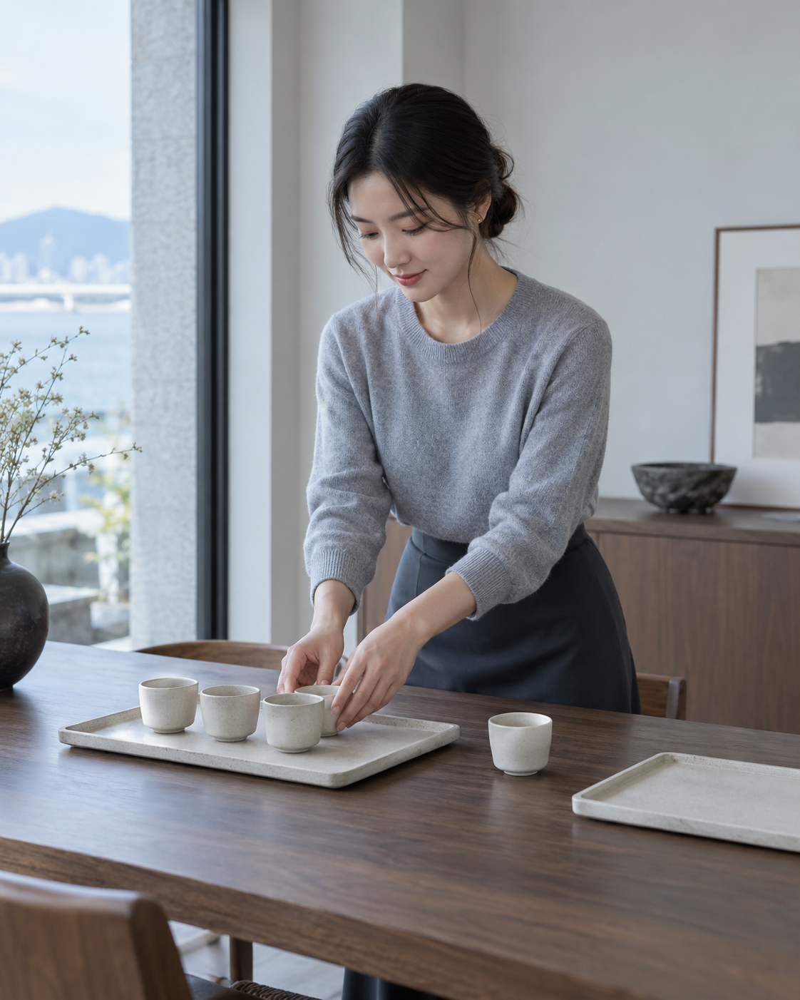

| 单词 | 中文 | 例句 |
| --- | --- | --- |
| all | 所有的 | **All** five cups belong to this set. 五个杯子都属于这一套。 |
| every | 每个 | **Every** cup in this set is plain. 这一套里的每个杯子都没有花纹。 |
| only | 只有 | **Only** one cup is outside the first tray. 只有一个杯子在第一个托盘外。 |
| almost | 几乎 | **Almost** all the cups are on the first tray. 几乎所有杯子都在第一个托盘上。 |
| quite | 相当 | This arrangement is **quite** simple. 这个摆放方式相当简单。 |
| very | 很 | The cups are **very** small in our story. 故事中的杯子很小。 |
| so | 如此 | These cups are **so** small that five fit on the table. 这些杯子如此小，桌上能放下五个。 |
| such | 这样的 | **Such** a simple set is easy to count. 这样简单的一套东西很容易清点。 |
| any | 任何的 | Are there **any** cups on the second tray? 第二个托盘上有杯子吗？ |
| not | 不 | The separate cup is **not** on the first tray. 单独的那个杯子不在第一个托盘上。 |

### C100 · 一句话里的转折与条件

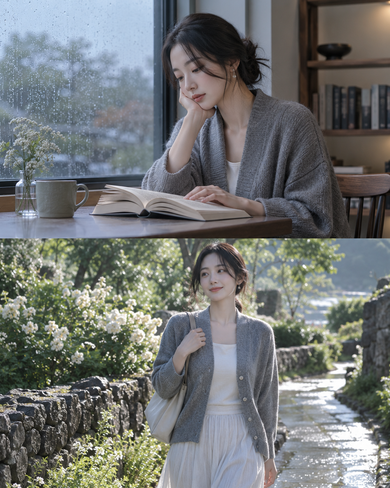

| 单词 | 中文 | 例句 |
| --- | --- | --- |
| and | 并且 | I go outside **and** walk when it is clear. 天气晴朗时，我出门并散步。 |
| but | 但是 | I want to walk, **but** it is raining in the first scene. 我想散步，但是第一个场景中正在下雨。 |
| if | 如果 | **If** it rains, I read indoors. 如果下雨，我就在室内读书。 |
| though | 虽然 | **Though** it is raining, I enjoy my book. 虽然正在下雨，我仍享受读书。 |
| while | 当……时 | I stay indoors **while** the rain falls. 下雨时，我待在室内。 |

## 850章节结束

## 数据来源

https://simple.wikipedia.org/wiki/Wikipedia:Basic_English_alphabetical_wordlist

## 基础英语850单词，中英对照表

| 单词 | 音标(美式发音) | 中文 |
| --- | --- | --- |
| a | /eɪ/ | 一个；一种 |
| able | /ˈeɪbəl/ | 能够的；有能力的 |
| about | /əˈbaʊt/ | 关于；大约 |
| account | /əˈkaʊnt/ | 账户；账目；解释 |
| acid | /ˈæsɪd/ | 酸；酸性的 |
| across | /əˈkrɔs/ | 横穿；穿过 |
| act | /ækt/ | 行动；表演 |
| addition | /əˈdɪʃən/ | 添加；附加 |
| adjustment | /əˈdʒʌstmənt/ | 调整；调节 |
| advertisement | /ˌædvərˈtaɪzmənt/ | 广告 |
| after | /ˈæftər/ | 在...之后；后来 |
| again | /əˈɡɛn/ | 再次；又；重新 |
| against | /əˈɡɛnst/ | 反对；对抗 |
| agreement | /əˈɡrimənt/ | 协议；一致 |
| air | /ɛr/ | 空气；气氛 |
| all | /ɔl/ | 所有的；全部 |
| almost | /ˈɔlˌmoʊst/ | 几乎；差不多 |
| among | /əˈmʌŋ/ | 在...之中；在...之间 |
| amount | /əˈmaʊnt/ | 数量；总数 |
| amusement | /əˈmjuːzmənt/ | 娱乐；消遣 |
| and | /ænd/ | 和；与 |
| angle | /ˈæŋɡəl/ | 角度；角 |
| angry | /ˈæŋɡri/ | 生气的；愤怒的 |
| animal | /ˈænəməl/ | 动物 |
| answer | /ˈænsər/ | 回答；答案 |
| ant | /ænt/ | 蚂蚁 |
| any | /ˈɛni/ | 任何的；一些 |
| apparatus | /ˌæpəˈrætəs/ | 设备；器械 |
| apple | /ˈæpəl/ | 苹果 |
| approval | /əˈpruvəl/ | 批准；认可 |
| arch | /ɑrtʃ/ | 拱门；弓形 |
| argument | /ˈɑrɡjəmənt/ | 争论；论点 |
| arm | /ɑrm/ | 手臂；武器 |
| army | /ˈɑrmi/ | 军队 |
| art | /ɑrt/ | 艺术 |
| as | /æz/ | 如同；当作 |
| at | /æt/ | 在；在于 |
| attack | /əˈtæk/ | 攻击；袭击 |
| attempt | /əˈtɛmpt/ | 尝试；企图 |
| attention | /əˈtɛnʃən/ | 注意；关注 |
| attraction | /əˈtrækʃən/ | 吸引；吸引力 |
| authority | /əˈθɔrəti/ | 权威；当局 |
| automatic | /ˌɔtəˈmætɪk/ | 自动的；自动化的 |
| awake | /əˈweɪk/ | 醒着的；唤醒 |
| baby | /ˈbeɪbi/ | 婴儿；宝宝 |
| back | /bæk/ | 背部；后面 |
| bad | /bæd/ | 坏的；糟糕的 |
| bag | /bæɡ/ | 袋子；包 |
| balance | /ˈbæləns/ | 平衡；均衡 |
| ball | /bɔːl/ | 球 |
| band | /bænd/ | 带子；乐队 |
| base | /beɪs/ | 基础；底部 |
| basin | /ˈbeɪsən/ | 盆地；水盆 |
| basket | /ˈbæskɪt/ | 篮子；筐 |
| bath | /bæθ/ | 洗澡；浴缸 |
| be | /biː/ | 是；存在 |
| beautiful | /ˈbjutəfl/ | 美丽的 |
| because | /bɪˈkɔːz/ | 因为 |
| bed | /bɛd/ | 床 |
| bee | /biː/ | 蜜蜂 |
| before | /bɪˈfɔːr/ | 在...之前 |
| behavior | /bɪˈheɪvjər/ | 行为；举止 |
| belief | /bɪˈliːf/ | 信念；信仰 |
| bell | /bɛl/ | 钟；铃 |
| bent | /bɛnt/ | 弯曲的 |
| berry | /ˈbɛri/ | 浆果 |
| between | /bɪˈtwiːn/ | 在...之间 |
| bird | /bɜːrd/ | 鸟 |
| birth | /bɜːrθ/ | 出生；诞生 |
| bit | /bɪt/ | 一点儿；一些 |
| bite | /baɪt/ | 咬；叮 |
| bitter | /ˈbɪtər/ | 苦的 |
| black | /blæk/ | 黑色的 |
| blade | /bleɪd/ | 刀片；刀刃 |
| blood | /blʌd/ | 血 |
| blow | /bloʊ/ | 吹 |
| blue | /bluː/ | 蓝色的 |
| board | /bɔːrd/ | 板；董事会 |
| boat | /boʊt/ | 船 |
| body | /ˈbɑːdi/ | 身体 |
| boiling | /ˈbɔɪlɪŋ/ | 沸腾的 |
| bone | /boʊn/ | 骨头 |
| book | /bʊk/ | 书 |
| boot | /but/ | 靴子 |
| bottle | /ˈbɑːtl/ | 瓶子 |
| box | /bɑːks/ | 盒子 |
| boy | /bɔɪ/ | 男孩 |
| brain | /breɪn/ | 大脑 |
| brake | /breɪk/ | 刹车 |
| branch | /bræntʃ/ | 分支；树枝 |
| brass | /bræs/ | 黄铜 |
| bread | /brɛd/ | 面包 |
| breath | /brɛθ/ | 呼吸 |
| brick | /brɪk/ | 砖 |
| bridge | /brɪdʒ/ | 桥 |
| bright | /braɪt/ | 明亮的 |
| broken | /ˈbroʊkən/ | 破碎的 |
| brother | /ˈbrʌðər/ | 兄弟 |
| brown | /braʊn/ | 棕色的 |
| brush | /brʌʃ/ | 刷子 |
| bucket | /ˈbʌkɪt/ | 桶 |
| building | /ˈbɪldɪŋ/ | 建筑物 |
| bulb | /bʌlb/ | 灯泡 |
| burn | /bɜːrn/ | 燃烧 |
| burst | /bɜːrst/ | 爆炸 |
| business | /ˈbɪznəs/ | 生意；商业 |
| but | /bʌt/ | 但是 |
| butter | /ˈbʌtər/ | 黄油 |
| button | /ˈbʌtn/ | 按钮 |
| by | /baɪ/ | 通过；靠近 |
| cake | /keɪk/ | 蛋糕 |
| camera | /ˈkæmərə/ | 照相机 |
| canvas | /ˈkænvəs/ | 帆布 |
| card | /kɑrd/ | 卡片 |
| care | /kɛr/ | 关心；照料 |
| carriage | /ˈkærɪdʒ/ | 四轮马车 |
| cart | /kɑrt/ | 手推车 |
| cat | /kæt/ | 猫 |
| cause | /kɔz/ | 原因；导致 |
| certain | /ˈsɜrtn/ | 确定的 |
| chain | /tʃeɪn/ | 链条 |
| chalk | /tʃɔk/ | 粉笔 |
| chance | /tʃæns/ | 机会 |
| change | /tʃeɪndʒ/ | 改变 |
| cheap | /tʃip/ | 便宜的 |
| cheese | /tʃiz/ | 奶酪 |
| chemical | /ˈkɛmɪkəl/ | 化学的；化学物质 |
| chest | /tʃɛst/ | 胸膛；箱子 |
| chief | /tʃif/ | 首领；主要的 |
| chin | /tʃɪn/ | 下巴 |
| church | /tʃɜrtʃ/ | 教堂 |
| circle | /ˈsɜrkl/ | 圆圈 |
| clean | /klin/ | 清洁的 |
| clear | /klɪr/ | 清晰的；明确的 |
| clock | /klɑk/ | 时钟 |
| cloth | /klɔθ/ | 布料 |
| cloud | /klaʊd/ | 云 |
| coal | /koʊl/ | 煤 |
| coat | /koʊt/ | 外套 |
| cold | /koʊld/ | 冷的 |
| collar | /ˈkɑlər/ | 衣领 |
| color | /ˈkʌlər/ | 颜色 |
| comb | /koʊm/ | 梳子 |
| come | /kʌm/ | 来 |
| comfort | /ˈkʌmfərt/ | 安慰；舒适 |
| committee | /kəˈmɪti/ | 委员会 |
| common | /ˈkɑmən/ | 常见的；普遍的 |
| company | /ˈkʌmpəni/ | 公司 |
| comparison | /kəmˈpɛrəsn/ | 比较 |
| competition | /ˌkɑmpəˈtɪʃən/ | 竞争 |
| complete | /kəmˈplit/ | 完整的 |
| complex | /ˈkɑmplɛks/ | 复杂的 |
| condition | /kənˈdɪʃən/ | 条件 |
| connection | /kəˈnɛkʃən/ | 连接 |
| conscious | /ˈkɑnʃəs/ | 有意识的 |
| control | /kənˈtroʊl/ | 控制 |
| cook | /kʊk/ | 烹饪 |
| copper | /ˈkɑpər/ | 铜 |
| copy | /ˈkɑpi/ | 复制 |
| cord | /kɔrd/ | 绳子 |
| cork | /kɔrk/ | 软木塞 |
| cotton | /ˈkɑtn/ | 棉花 |
| cough | /kɔf/ | 咳嗽 |
| country | /ˈkʌntri/ | 国家 |
| cover | /ˈkʌvər/ | 覆盖 |
| cow | /kaʊ/ | 母牛 |
| crack | /kræk/ | 裂缝；破裂声 |
| credit | /ˈkrɛdɪt/ | 信用 |
| crime | /kraɪm/ | 犯罪 |
| cruel | /ˈkruəl/ | 残忍的 |
| crush | /krʌʃ/ | 压碎 |
| cry | /kraɪ/ | 哭泣 |
| cup | /kʌp/ | 杯子 |
| current | /ˈkɜrənt/ | 当前的 |
| curtain | /ˈkɜrtn/ | 窗帘 |
| curve | /kɜrv/ | 曲线 |
| cushion | /ˈkʊʃən/ | 垫子 |
| cut | /kʌt/ | 切割 |
| damage | /ˈdæmɪdʒ/ | 损害；破坏 |
| danger | /ˈdeɪndʒər/ | 危险 |
| dark | /dɑrk/ | 黑暗的 |
| daughter | /ˈdɔtər/ | 女儿 |
| day | /deɪ/ | 白天；一天 |
| dead | /dɛd/ | 死的 |
| dear | /dɪr/ | 亲爱的 |
| death | /dɛθ/ | 死亡 |
| debt | /dɛt/ | 债务 |
| decision | /dɪˈsɪʒən/ | 决定 |
| deep | /dip/ | 深的 |
| degree | /dɪˈɡri/ | 学位；程度 |
| delicate | /ˈdɛlɪkət/ | 精细的；易碎的 |
| dependent | /dɪˈpɛndənt/ | 依赖的；依靠的 |
| design | /dɪˈzaɪn/ | 设计 |
| desire | /dɪˈzaɪər/ | 欲望 |
| destruction | /dɪˈstrʌkʃən/ | 破坏；毁灭 |
| detail | /ˈditl/ | 细节 |
| development | /dɪˈvɛləpmənt/ | 发展 |
| different | /ˈdɪfrənt/ | 不同的 |
| digestion | /dɪˈdʒɛstʃən/ | 消化 |
| direction | /dəˈrɛkʃən/ | 方向 |
| dirty | /ˈdɜrti/ | 脏的 |
| discovery | /dɪˈskʌvəri/ | 发现 |
| discussion | /dɪˈskʌʃən/ | 讨论 |
| disease | /dɪˈziz/ | 疾病 |
| disgust | /dɪsˈɡʌst/ | 厌恶 |
| distance | /ˈdɪstəns/ | 距离 |
| distribution | /ˌdɪstrɪˈbjuʃən/ | 分配；分布 |
| division | /dɪˈvɪʒən/ | 分割；部门 |
| do | /du/ | 做 |
| dog | /dɔɡ/ | 狗 |
| door | /dɔr/ | 门 |
| doubt | /daʊt/ | 怀疑 |
| down | /daʊn/ | 向下 |
| drain | /dreɪn/ | 排水 |
| drawer | /drɔr/ | 抽屉 |
| dress | /drɛs/ | 连衣裙；穿着 |
| drink | /drɪŋk/ | 喝 |
| driving | /ˈdraɪvɪŋ/ | 驾驶 |
| drop | /drɑp/ | 掉落 |
| dry | /draɪ/ | 干的 |
| dust | /dʌst/ | 灰尘 |
| ear | /ɪr/ | 耳朵 |
| early | /ˈɜrli/ | 早期的；早的 |
| earth | /ɜrθ/ | 地球；土壤 |
| east | /ist/ | 东方；东部 |
| edge | /ɛdʒ/ | 边缘；锋利的部分 |
| education | /ˌɛdʒuˈkeɪʃən/ | 教育 |
| effect | /ɪˈfɛkt/ | 影响；效果 |
| egg | /ɛɡ/ | 鸡蛋 |
| elastic | /ɪˈlæstɪk/ | 有弹性的 |
| electric | /ɪˈlɛktrɪk/ | 电的 |
| end | /ɛnd/ | 结束；末尾 |
| engine | /ˈɛndʒɪn/ | 引擎 |
| enough | /ɪˈnʌf/ | 足够的 |
| equal | /ˈikwəl/ | 相等的；平等的 |
| error | /ˈɛrər/ | 错误 |
| even | /ˈivən/ | 甚至；均匀的 |
| event | /ɪˈvɛnt/ | 事件 |
| ever | /ˈɛvər/ | 曾经；永远 |
| every | /ˈɛvri/ | 每个 |
| example | /ɪɡˈzæmpəl/ | 例子 |
| exchange | /ɪksˈtʃeɪndʒ/ | 交流；交换 |
| existence | /ɪɡˈzɪstəns/ | 存在 |
| expansion | /ɪkˈspænʃən/ | 扩张；膨胀 |
| experience | /ɪkˈspɪriəns/ | 经验 |
| expert | /ˈɛkspɜrt/ | 专家 |
| eye | /aɪ/ | 眼睛 |
| face | /feɪs/ | 脸；面孔 |
| fact | /fækt/ | 事实；实际 |
| fall | /fɔːl/ | 落下；跌倒 |
| false | /fɔːls/ | 错误的；虚假的 |
| family | /ˈfæməli/ | 家庭；家族 |
| far | /fɑːr/ | 远的；遥远的 |
| farm | /fɑːrm/ | 农场；农庄 |
| fat | /fæt/ | 脂肪；肥胖的 |
| father | /ˈfɑːðər/ | 父亲；爸爸 |
| fear | /fɪr/ | 害怕；恐惧 |
| feather | /ˈfeðər/ | 羽毛；翎毛 |
| feeble | /ˈfiːbəl/ | 虚弱的；无力的 |
| feeling | /ˈfiːlɪŋ/ | 感觉；情感 |
| female | /ˈfiːmeɪl/ | 女性的；雌性的 |
| fertile | /ˈfɜːrtl̩/ | 肥沃的；富饶的 |
| fiction | /ˈfɪkʃən/ | 小说；虚构 |
| field | /fiːld/ | 田地；领域 |
| fight | /faɪt/ | 打斗；战斗 |
| finger | /ˈfɪŋɡər/ | 手指；指头 |
| fire | /ˈfaɪr/ | 火；火灾 |
| first | /fɜːrst/ | 第一；首先 |
| fish | /fɪʃ/ | 鱼；钓鱼 |
| fixed | /fɪkst/ | 固定的；不变的 |
| flag | /flæɡ/ | 旗帜；国旗 |
| flame | /fleɪm/ | 火焰；火舌 |
| flat | /flæt/ | 平的；扁平的 |
| flight | /flaɪt/ | 飞行；航班 |
| floor | /flɔːr/ | 地板；楼层 |
| flower | /ˈflaʊər/ | 花；开花 |
| fly | /flaɪ/ | 飞行；苍蝇 |
| fold | /foʊld/ | 折叠；褶皱 |
| food | /fuːd/ | 食物；食品 |
| foolish | /ˈfuːlɪʃ/ | 愚蠢的；愚笨的 |
| foot | /fʊt/ | 脚；足 |
| for | /fɔːr/ | 对于；为了 |
| force | /fɔːrs/ | 力量；力 |
| fork | /fɔːrk/ | 叉子；分叉 |
| form | /fɔːrm/ | 形式；形态 |
| forward | /ˈfɔrwərd/ | 向前；前进 |
| fowl | /faʊl/ | 家禽；鸟 |
| frame | /freɪm/ | 框架；结构 |
| free | /friː/ | 自由的；免费的 |
| frequent | /ˈfriːkwənt/ | 频繁的；经常的 |
| friend | /frend/ | 朋友；友人 |
| from | /frɒm/ | 来自；从 |
| front | /frʌnt/ | 前面；正面 |
| fruit | /fruːt/ | 水果；果实 |
| full | /fʊl/ | 满的；充满的 |
| future | /ˈfjuːtʃər/ | 未来；将来 |
| garden | /ˈɡɑrdən/ | 花园 |
| general | /ˈdʒɛnərəl/ | 将军；一般的 |
| get | /ɡɛt/ | 得到；获得 |
| girl | /ɡɜrl/ | 女孩 |
| give | /ɡɪv/ | 给予；给 |
| glass | /ɡlæs/ | 玻璃 |
| glove | /ɡlʌv/ | 手套 |
| go | /ɡoʊ/ | 去 |
| goat | /ɡoʊt/ | 山羊 |
| gold | /ɡoʊld/ | 黄金 |
| good | /ɡʊd/ | 好的 |
| government | /ˈɡʌvərnmənt/ | 政府 |
| grain | /ɡreɪn/ | 谷物 |
| grass | /ɡræs/ | 草 |
| great | /ɡreɪt/ | 伟大的 |
| green | /ɡrin/ | 绿色 |
| grey/gray | /ɡreɪ/ | 灰色 |
| grip | /ɡrɪp/ | 紧握 |
| group | /ɡrup/ | 组；群 |
| growth | /ɡroʊθ/ | 成长；增长 |
| guide | /ɡaɪd/ | 指导；导游 |
| gun | /ɡʌn/ | 枪 |
| hair | /hɛr/ | 头发 |
| hammer | /ˈhæmər/ | 锤子 |
| hand | /hænd/ | 手 |
| hanging | /ˈhæŋɪŋ/ | 悬挂 |
| happy | /ˈhæpi/ | 快乐的 |
| harbor | /ˈhɑrbər/ | 港口 |
| hard | /hɑrd/ | 困难的；努力的 |
| harmony | /ˈhɑrməni/ | 和谐 |
| hat | /hæt/ | 帽子 |
| hate | /heɪt/ | 憎恨 |
| have | /hæv/ | 有 |
| he | /hi/ | 他 |
| head | /hɛd/ | 头 |
| healthy | /ˈhɛlθi/ | 健康的 |
| hearing | /ˈhirɪŋ/ | 听力 |
| heart | /hɑrt/ | 心 |
| heat | /hit/ | 热 |
| help | /hɛlp/ | 帮助 |
| here | /hɪr/ | 这里 |
| high | /haɪ/ | 高 |
| history | /ˈhɪstəri/ | 历史 |
| hole | /hoʊl/ | 洞 |
| hollow | /ˈhɑloʊ/ | 空的 |
| hook | /hʊk/ | 钩子 |
| hope | /hoʊp/ | 希望 |
| horn | /hɔrn/ | 角 |
| horse | /hɔrs/ | 马 |
| hospital | /ˈhɑspɪtl̩/ | 医院 |
| hour | /aʊər/ | 小时 |
| house | /haʊs/ | 房子 |
| how | /haʊ/ | 如何 |
| humor | /ˈhjuːmər/ | 幽默感 |
| I | /aɪ/ | 我 |
| ice | /aɪs/ | 冰 |
| idea | /aɪˈdiə/ | 想法；主意 |
| if | /ɪf/ | 如果 |
| ill | /ɪl/ | 生病的 |
| important | /ɪmˈpɔrtənt/ | 重要的 |
| impulse | /ˈɪmpʌls/ | 冲动 |
| in | /ɪn/ | 在...里面 |
| increase | /ɪnˈkris/ | 增加 |
| industry | /ˈɪndəstri/ | 工业 |
| ink | /ɪŋk/ | 墨水 |
| insect | /ˈɪnsɛkt/ | 昆虫 |
| instrument | /ˈɪnstrəmənt/ | 乐器 |
| insurance | /ɪnˈʃʊrəns/ | 保险 |
| interest | /ˈɪntrəst/ | 兴趣 |
| invention | /ɪnˈvɛnʃən/ | 发明 |
| iron | /ˈaɪərn/ | 铁 |
| island | /ˈaɪlənd/ | 岛屿 |
| jelly | /ˈdʒɛli/ | 果冻；果酱 |
| jewel | /ˈdʒuːəl/ | 珠宝；宝石 |
| join | /dʒɔɪn/ | 加入；参加 |
| journey | /ˈdʒɜrni/ | 旅行；旅程 |
| judge | /dʒʌdʒ/ | 法官；裁判 |
| jump | /dʒʌmp/ | 跳跃；跳动 |
| keep | /kip/ | 保持；继续 |
| kettle | /ˈkɛtəl/ | 水壶；茶壶 |
| key | /ki/ | 钥匙；关键 |
| kick | /kɪk/ | 踢；踢球 |
| kind | /kaɪnd/ | 种类；友善的 |
| kiss | /kɪs/ | 吻；亲吻 |
| knee | /ni/ | 膝盖 |
| knife | /naɪf/ | 刀 |
| knot | /nɑt/ | 结；打结 |
| knowledge | /ˈnɑlɪdʒ/ | 知识 |
| land | /lænd/ | 土地；陆地 |
| language | /ˈlæŋɡwɪdʒ/ | 语言 |
| last | /læst/ | 最后的；持续的 |
| late | /leɪt/ | 迟的；晚的 |
| laugh | /læf/ | 笑 |
| law | /lɔ/ | 法律 |
| lead | /lid/ | 领导；引导 |
| leaf | /lif/ | 叶子 |
| learning | /ˈlɜrnɪŋ/ | 学习 |
| leather | /ˈlɛðər/ | 皮革 |
| left | /lɛft/ | 左边的 |
| leg | /lɛɡ/ | 腿 |
| let | /lɛt/ | 让；允许 |
| letter | /ˈlɛtər/ | 信；字母 |
| level | /ˈlɛvəl/ | 水平；水平的 |
| library | /ˈlaɪˌbrɛri/ | 图书馆 |
| lift | /lɪft/ | 举起；电梯 |
| light | /laɪt/ | 光；轻的 |
| like | /laɪk/ | 喜欢；像 |
| limit | /ˈlɪmɪt/ | 限制；限度 |
| line | /laɪn/ | 线；排队 |
| linen | /ˈlɪnən/ | 亚麻布 |
| lip | /lɪp/ | 嘴唇 |
| liquid | /ˈlɪkwɪd/ | 液体 |
| list | /lɪst/ | 列表 |
| little (less, least) | /ˈlɪtəl/ (lɛs, list) | 小的；少的 |
| living | /ˈlɪvɪŋ/ | 生活的 |
| lock | /lɑk/ | 锁 |
| long | /lɔŋ/ | 长的 |
| look | /lʊk/ | 看；看起来 |
| loose | /lus/ | 松的 |
| loss | /lɔs/ | 损失 |
| loud | /laʊd/ | 大声的 |
| love | /lʌv/ | 爱 |
| low | /loʊ/ | 低的 |
| machine | /məˈʃin/ | 机器；机械 |
| make | /meɪk/ | 制造；做 |
| male | /meɪl/ | 男性的 |
| man | /mæn/ | 男人 |
| manager | /ˈmænɪdʒər/ | 经理；管理人 |
| map | /mæp/ | 地图 |
| mark | /mɑrk/ | 标记；记号 |
| market | /ˈmɑrkɪt/ | 市场 |
| married | /ˈmærid/ | 已婚的 |
| mass | /mæs/ | 大量；质量 |
| match | /mætʃ/ | 比赛；匹配 |
| material | /məˈtɪriəl/ | 材料 |
| may | /meɪ/ | 可能；也许 |
| meal | /mil/ | 餐；膳食 |
| measure | /ˈmɛʒər/ | 测量；度量 |
| meat | /mit/ | 肉 |
| medical | /ˈmɛdɪkl/ | 医学的；医疗的 |
| meeting | /ˈmitɪŋ/ | 会议 |
| memory | /ˈmɛməri/ | 记忆；记忆力 |
| metal | /ˈmɛtəl/ | 金属 |
| middle | /ˈmɪdl/ | 中间的 |
| military | /ˈmɪləˌtɛri/ | 军事的 |
| milk | /mɪlk/ | 牛奶 |
| mind | /maɪnd/ | 心智；思想 |
| mine | /maɪn/ | 我的 |
| minute | /ˈmɪnɪt/ | 分钟 |
| mist | /mɪst/ | 薄雾 |
| mixed | /mɪkst/ | 混合的 |
| money | /ˈmʌni/ | 钱 |
| monkey | /ˈmʌŋki/ | 猴子 |
| month | /mʌnθ/ | 月份 |
| moon | /mun/ | 月亮 |
| morning | /ˈmɔrnɪŋ/ | 早晨 |
| mother | /ˈmʌðər/ | 母亲 |
| motion | /ˈmoʊʃən/ | 运动；动作 |
| mountain | /ˈmaʊntən/ | 山 |
| mouth | /maʊθ/ | 嘴 |
| move | /muv/ | 移动 |
| much (more, most) | /mʌtʃ/ | 很多；大量的 |
| muscle | /ˈmʌsəl/ | 肌肉 |
| music | /ˈmjuzɪk/ | 音乐 |
| nail | /neɪl/ | 钉子 |
| name | /neɪm/ | 名字 |
| narrow | /ˈnæroʊ/ | 狭窄的 |
| nation | /ˈneɪʃən/ | 国家 |
| natural | /ˈnætʃərəl/ | 自然的 |
| near | /nɪr/ | 靠近 |
| necessary | /ˈnɛsəˌsɛri/ | 必要的 |
| neck | /nɛk/ | 脖子 |
| need | /nid/ | 需要 |
| needle | /ˈnidəl/ | 针 |
| nerve | /nɜrv/ | 神经 |
| net | /nɛt/ | 网 |
| new | /nu/ | 新的 |
| news | /nuz/ | 新闻 |
| night | /naɪt/ | 夜晚 |
| no | /noʊ/ | 不 |
| noise | /nɔɪz/ | 噪音 |
| normal | /ˈnɔrməl/ | 正常的 |
| north | /nɔrθ/ | 北方的 |
| nose | /noʊz/ | 鼻子 |
| not | /nɑt/ | 不 |
| note | /noʊt/ | 笔记 |
| now | /naʊ/ | 现在 |
| number | /ˈnʌmbər/ | 数字 |
| nut | /nʌt/ | 坚果 |
| observation | /ˌɑbzɚˈveɪʃən/ | 观察；观测 |
| of | /əv/ | 属于；关于 |
| off | /ɑf/ | 离开；关闭 |
| offer | /ˈɔfɚ/ | 提供；提议 |
| office | /ˈɔfɪs/ | 办公室 |
| oil | /ɔɪl/ | 油 |
| old | /oʊld/ | 老的 |
| on | /ɑn/ | 在...上 |
| only | /ˈoʊnli/ | 只有 |
| open | /ˈoʊpən/ | 打开 |
| operation | /ˌɑpəˈreɪʃən/ | 操作；手术 |
| opinion | /əˈpɪnjən/ | 意见 |
| opposite | /ˈɑpəzɪt/ | 相反的 |
| or | /ɔr/ | 或者 |
| orange | /ˈɔrɪndʒ/ | 橙色；橙子 |
| order | /ˈɔrdər/ | 订单；秩序 |
| organization | /ˌɔrɡənəˈzeɪʃən/ | 组织；机构 |
| ornament | /ˈɔrnəmənt/ | 装饰品 |
| other | /ˈʌðər/ | 其他的 |
| out | /aʊt/ | 出去 |
| oven | /ˈʌvən/ | 烤箱 |
| over | /ˈoʊvər/ | 结束；在...之上 |
| owner | /ˈoʊnər/ | 拥有者 |
| page | /peɪdʒ/ | 页；页面 |
| pain | /peɪn/ | 疼痛；痛苦 |
| paint | /peɪnt/ | 油漆；绘画 |
| paper | /ˈpeɪpər/ | 纸；报纸 |
| parallel | /ˈpærəˌlɛl/ | 平行的；相似的 |
| parcel | /ˈpɑrsəl/ | 包裹；小包 |
| part | /pɑrt/ | 部分；零件 |
| past | /pæst/ | 过去；过去的 |
| paste | /peɪst/ | 糊状物；粘贴 |
| payment | /ˈpeɪmənt/ | 付款；支付 |
| peace | /pis/ | 和平；平静 |
| pen | /pɛn/ | 钢笔；圈禁 |
| pencil | /ˈpɛnsəl/ | 铅笔 |
| person | /ˈpɜrsən/ | 人；个人 |
| physical | /ˈfɪzɪkəl/ | 物理的；身体的 |
| picture | /ˈpɪktʃər/ | 图片；画面 |
| pig | /pɪɡ/ | 猪 |
| pin | /pɪn/ | 针；别住 |
| pipe | /paɪp/ | 管道；烟斗 |
| place | /pleɪs/ | 地方；位置 |
| plane | /pleɪn/ | 飞机；平面 |
| plant | /plænt/ | 植物；工厂 |
| plate | /pleɪt/ | 盘子；板块 |
| play | /pleɪ/ | 玩耍；剧本 |
| please | /pliz/ | 请；使高兴 |
| pleasure | /ˈplɛʒər/ | 快乐；愉悦 |
| plough/plow | /plaʊ/ | 犁；耕地 |
| pocket | /ˈpɑkɪt/ | 口袋；袖珍的 |
| point | /pɔɪnt/ | 点；要点 |
| poison | /ˈpɔɪzən/ | 毒药；毒害 |
| polish | /ˈpɑlɪʃ/ | 擦亮；抛光 |
| political | /pəˈlɪtɪkəl/ | 政治的；政治上的 |
| poor | /pʊr/ | 贫穷的；可怜的 |
| porter | /ˈpɔrtər/ | 搬运工；门房 |
| position | /pəˈzɪʃən/ | 位置；职位 |
| possible | /ˈpɑsəbəl/ | 可能的；可能性 |
| pot | /pɑt/ | 锅；罐 |
| potato | /pəˈteɪtoʊ/ | 土豆 |
| powder | /ˈpaʊdər/ | 粉末；火药 |
| power | /ˈpaʊər/ | 力量；权力 |
| present | /ˈprɛzənt/ | 礼物；现在的 |
| price | /praɪs/ | 价格；价钱 |
| print | /prɪnt/ | 印刷；打印 |
| prison | /ˈprɪzən/ | 监狱；囚禁 |
| private | /ˈpraɪvɪt/ | 私人的；私立的 |
| probable | /ˈprɑbəbəl/ | 可能的；很可能发生的 |
| process | /ˈprɑsɛs/ | 过程；处理 |
| produce | /prəˈdus/ | 生产；农产品 |
| profit | /ˈprɑfɪt/ | 利润；盈利 |
| property | /ˈprɑpərti/ | 财产；性质 |
| prose | /proʊz/ | 散文；散文体 |
| protest | /ˈproʊtɛst/ | 抗议；反对 |
| public | /ˈpʌblɪk/ | 公共的；公众的 |
| pull | /pʊl/ | 拉；拖 |
| pump | /pʌmp/ | 泵；打气筒 |
| punishment | /ˈpʌnɪʃmənt/ | 惩罚；处罚 |
| purpose | /ˈpɜrpəs/ | 目的；意图 |
| push | /pʊʃ/ | 推；按 |
| put | /pʊt/ | 放；放置 |
| quality | /ˈkwɑləti/ | 质量；品质 |
| question | /ˈkwɛstʃən/ | 问题；疑问 |
| quick | /kwɪk/ | 快速的；迅速的 |
| quiet | /ˈkwaɪət/ | 安静的；寂静的 |
| quite | /kwaɪt/ | 相当；非常 |
| rail | /reɪl/ | 铁轨；栏杆 |
| rain | /reɪn/ | 雨；下雨 |
| range | /reɪndʒ/ | 范围；山脉 |
| rat | /ræt/ | 鼠；老鼠 |
| rate | /reɪt/ | 率；速度 |
| ray | /reɪ/ | 光线；射线 |
| reaction | /riˈækʃən/ | 反应；反作用 |
| reading | /ˈridɪŋ/ | 阅读；读物 |
| ready | /ˈrɛdi/ | 准备好的 |
| reason | /ˈrizən/ | 理由；原因 |
| receipt | /rɪˈsipt/ | 收据；收条 |
| record | /ˈrɛkɔrd/ | 记录；唱片 |
| red | /rɛd/ | 红色的 |
| regret | /rɪˈɡrɛt/ | 后悔；遗憾 |
| regular | /ˈrɛɡjələr/ | 规则的；定期的 |
| relation | /rɪˈleɪʃən/ | 关系；亲属 |
| religion | /rɪˈlɪdʒən/ | 宗教 |
| representative | /ˌrɛprɪˈzɛntətɪv/ | 代表；代理人 |
| request | /rɪˈkwɛst/ | 请求；要求 |
| respect | /rɪˈspɛkt/ | 尊重；敬意 |
| responsible | /rɪˈspɑnsəbəl/ | 负责任的 |
| rest | /rɛst/ | 休息；其余部分 |
| reward | /rɪˈwɔrd/ | 奖励；报酬 |
| rhythm | /ˈrɪðəm/ | 节奏；韵律 |
| rice | /raɪs/ | 米饭；稻谷 |
| right | /raɪt/ | 正确的；权利 |
| ring | /rɪŋ/ | 环；戒指 |
| river | /ˈrɪvər/ | 河流 |
| road | /roʊd/ | 道路 |
| rod | /rɑd/ | 杆；棒 |
| roll | /roʊl/ | 卷；滚动 |
| roof | /ruf/ | 屋顶 |
| room | /rum/ | 房间 |
| root | /rut/ | 根；根源 |
| rough | /rʌf/ | 粗糙的；艰难的 |
| round | /raʊnd/ | 圆；回合 |
| rub | /rʌb/ | 摩擦；擦 |
| rule | /rul/ | 规则；统治 |
| run | /rʌn/ | 跑；奔跑 |
| sad | /sæd/ | 悲伤的 |
| safe | /seɪf/ | 安全的 |
| sail | /seɪl/ | 航行；航海 |
| salt | /sɔlt/ | 盐 |
| same | /seɪm/ | 相同的 |
| sand | /sænd/ | 沙子 |
| say | /seɪ/ | 说 |
| scale | /skeɪl/ | 刻度；规模 |
| school | /skul/ | 学校 |
| science | /ˈsaɪəns/ | 科学 |
| scissors | /ˈsɪzərz/ | 剪刀 |
| screw | /skru/ | 螺丝钉 |
| sea | /si/ | 海 |
| seat | /sit/ | 座位 |
| second | /ˈsɛkənd/ | 第二 |
| secret | /ˈsikrɪt/ | 秘密 |
| secretary | /ˈsɛkrəˌtɛri/ | 秘书 |
| see | /si/ | 看见 |
| seed | /sid/ | 种子 |
| seem | /sim/ | 似乎 |
| selection | /səˈlɛkʃən/ | 选择 |
| self | /sɛlf/ | 自己 |
| send | /sɛnd/ | 发送 |
| sense | /sɛns/ | 感觉 |
| separate | /ˈsɛpəˌret/ | 分离 |
| serious | /ˈsɪriəs/ | 严肃的 |
| servant | /ˈsɜrvənt/ | 仆人 |
| sex | /sɛks/ | 性别 |
| shade | /ʃeɪd/ | 阴影 |
| shake | /ʃeɪk/ | 摇动 |
| shame | /ʃeɪm/ | 羞耻 |
| sharp | /ʃɑrp/ | 锋利的 |
| sheep | /ʃip/ | 绵羊 |
| shelf | /ʃɛlf/ | 架子 |
| ship | /ʃɪp/ | 船 |
| shirt | /ʃɜrt/ | 衬衫 |
| shock | /ʃɑk/ | 震惊 |
| shoe | /ʃu/ | 鞋 |
| short | /ʃɔrt/ | 短的 |
| shut | /ʃʌt/ | 关闭 |
| side | /saɪd/ | 侧面 |
| sign | /saɪn/ | 标志 |
| silk | /sɪlk/ | 丝绸 |
| silver | /ˈsɪlvər/ | 银 |
| simple | /ˈsɪmpəl/ | 简单的 |
| sister | /ˈsɪstər/ | 姐妹 |
| size | /saɪz/ | 大小 |
| skin | /skɪn/ | 皮肤 |
| skirt | /skɜrt/ | 裙子 |
| sky | /skaɪ/ | 天空 |
| sleep | /slip/ | 睡觉 |
| slip | /slɪp/ | 滑倒 |
| slope | /sloʊp/ | 坡；斜坡 |
| slow | /sloʊ/ | 慢的 |
| small | /smɔl/ | 小的 |
| smash | /smæʃ/ | 猛击 |
| smell | /smɛl/ | 气味 |
| smile | /smaɪl/ | 微笑 |
| smoke | /smoʊk/ | 抽烟 |
| smooth | /smuð/ | 光滑的 |
| snake | /sneɪk/ | 蛇 |
| sneeze | /sniz/ | 打喷嚏 |
| snow | /snoʊ/ | 雪 |
| so | /soʊ/ | 如此 |
| soap | /soʊp/ | 肥皂 |
| society | /səˈsaɪəti/ | 社会 |
| sock | /sɑk/ | 短袜 |
| soft | /sɔft/ | 柔软的 |
| solid | /ˈsɑlɪd/ | 固体的 |
| some | /sʌm/ | 一些 |
| son | /sʌn/ | 儿子 |
| song | /sɔŋ/ | 歌曲 |
| sort | /sɔrt/ | 种类 |
| sound | /saʊnd/ | 声音 |
| soup | /sup/ | 汤 |
| south | /saʊθ/ | 南方 |
| space | /speɪs/ | 空间 |
| spade | /speɪd/ | 铲子 |
| special | /ˈspɛʃəl/ | 特别的 |
| sponge | /spʌndʒ/ | 海绵 |
| spoon | /spun/ | 勺子 |
| spring | /sprɪŋ/ | 春天 |
| square | /skwɛr/ | 正方形 |
| stage | /steɪdʒ/ | 舞台 |
| stamp | /stæmp/ | 邮票 |
| star | /stɑr/ | 星星 |
| start | /stɑrt/ | 开始 |
| statement | /ˈsteɪtmənt/ | 声明 |
| station | /ˈsteɪʃən/ | 车站 |
| steam | /stim/ | 蒸汽 |
| steel | /stil/ | 钢铁 |
| stem | /stɛm/ | 茎 |
| step | /stɛp/ | 步骤 |
| stick | /stɪk/ | 棍子 |
| sticky | /ˈstɪki/ | 粘的 |
| stiff | /stɪf/ | 僵硬的 |
| still | /stɪl/ | 仍然 |
| stitch | /stɪtʃ/ | 缝合 |
| stocking | /ˈstɑkɪŋ/ | 长袜 |
| stomach | /ˈstʌmək/ | 胃 |
| stone | /stoʊn/ | 石头 |
| stop | /stɑp/ | 停止 |
| store | /stor/ | 商店 |
| story | /ˈstɔri/ | 故事 |
| straight | /streɪt/ | 直的 |
| strange | /streɪndʒ/ | 奇怪的 |
| street | /strit/ | 街道 |
| stretch | /strɛtʃ/ | 伸展 |
| strong | /strɔŋ/ | 强壮的 |
| structure | /ˈstrʌktʃər/ | 结构 |
| substance | /ˈsʌbstəns/ | 物质 |
| such | /sʌtʃ/ | 这样的 |
| sudden | /ˈsʌdən/ | 突然的 |
| sugar | /ˈʃʊgər/ | 糖 |
| suggestion | /səˈdʒɛstʃən/ | 建议 |
| summer | /ˈsʌmər/ | 夏季 |
| sun | /sʌn/ | 太阳 |
| support | /səˈpɔrt/ | 支持 |
| surprise | /sərˈpraɪz/ | 惊喜 |
| sweet | /swit/ | 甜的 |
| swim | /swɪm/ | 游泳 |
| system | /ˈsɪstəm/ | 系统 |
| table | /ˈteɪbəl/ | 桌子 |
| tail | /teɪl/ | 尾巴 |
| take | /teɪk/ | 拿；取 |
| talk | /tɔk/ | 说话 |
| tall | /tɔl/ | 高的 |
| taste | /teɪst/ | 味道；品尝 |
| tax | /tæks/ | 税 |
| teaching | /ˈtiːtʃɪŋ/ | 教学 |
| tendency | /ˈtɛndənsi/ | 倾向；趋势 |
| test | /tɛst/ | 测试 |
| than | /ðæn/ | 比 |
| that | /ðæt/ | 那个 |
| the | /ðə/ | 定冠词 |
| then | /ðɛn/ | 然后 |
| theory | /ˈθiəri/ | 理论 |
| there | /ðɛr/ | 那里 |
| thick | /θɪk/ | 厚的 |
| thin | /θɪn/ | 薄的 |
| thing | /θɪŋ/ | 事物 |
| this | /ðɪs/ | 这个 |
| though | /ðoʊ/ | 虽然 |
| thought | /θɔt/ | 思考 |
| thread | /θrɛd/ | 线 |
| throat | /θroʊt/ | 喉咙 |
| through | /θru/ | 通过 |
| thumb | /θʌm/ | 拇指 |
| thunder | /ˈθʌndər/ | 雷声 |
| ticket | /ˈtɪkɪt/ | 票 |
| tight | /taɪt/ | 紧的 |
| till | /tɪl/ | 直到 |
| time | /taɪm/ | 时间 |
| tin | /tɪn/ | 锡 |
| tired | /ˈtaɪərd/ | 疲倦的 |
| to | /tu/ | 到 |
| toe | /toʊ/ | 脚趾 |
| together | /təˈɡɛðər/ | 一起 |
| tomorrow | /təˈmɑroʊ/ | 明天 |
| tongue | /tʌŋ/ | 舌头 |
| tooth | /tuθ/ | 牙齿 |
| top | /tɑp/ | 顶部 |
| touch | /tʌtʃ/ | 触摸 |
| town | /taʊn/ | 城镇 |
| trade | /treɪd/ | 贸易 |
| train | /treɪn/ | 火车 |
| transport | /ˈtrænspɔrt/ | 运输 |
| tray | /treɪ/ | 托盘 |
| tree | /tri/ | 树 |
| trick | /trɪk/ | 技巧 |
| trouble | /ˈtrʌbəl/ | 麻烦 |
| trousers | /ˈtraʊzərz/ | 裤子 |
| true | /tru/ | 真实的 |
| turn | /tɜrn/ | 转动 |
| twist | /twɪst/ | 扭曲 |
| umbrella | /ʌmˈbrɛlə/ | 雨伞 |
| under | /ˈʌndər/ | 在...下面 |
| unit | /ˈjunɪt/ | 单元 |
| up | /ʌp/ | 向上 |
| use | /jus/ | 使用 |
| value | /ˈvælju/ | 价值 |
| verse | /vɜrs/ | 诗歌 |
| very | /ˈvɛri/ | 非常 |
| vessel | /ˈvɛsəl/ | 容器 |
| view | /vju/ | 视野；看法 |
| violent | /ˈvaɪələnt/ | 暴力的 |
| voice | /vɔɪs/ | 声音 |
| waiting | /ˈweɪtɪŋ/ | 等待 |
| walk | /wɔk/ | 步行 |
| wall | /wɔl/ | 墙 |
| war | /wɔr/ | 战争 |
| warm | /wɔrm/ | 温暖的 |
| wash | /wɑʃ/ | 洗 |
| waste | /weɪst/ | 浪费 |
| watch | /wɑtʃ/ | 手表 |
| water | /ˈwɔtər/ | 水 |
| wave | /weɪv/ | 波浪 |
| wax | /wæks/ | 蜡 |
| way | /weɪ/ | 方式 |
| weather | /ˈwɛðər/ | 天气 |
| week | /wik/ | 周 |
| weight | /weɪt/ | 重量 |
| well | /wɛl/ | 好 |
| west | /wɛst/ | 西方 |
| wet | /wɛt/ | 湿的 |
| wheel | /wil/ | 轮子 |
| when | /wɛn/ | 何时 |
| where | /wɛr/ | 在哪里 |
| while | /waɪl/ | 当...的时候 |
| whip | /wɪp/ | 鞭子 |
| whistle | /ˈwɪsəl/ | 哨子 |
| white | /waɪt/ | 白色 |
| who | /hu/ | 谁 |
| why | /waɪ/ | 为什么 |
| wide | /waɪd/ | 宽的 |
| will | /wɪl/ | 将会 |
| wind | /wɪnd/ | 风 |
| window | /ˈwɪndoʊ/ | 窗户 |
| wine | /waɪn/ | 葡萄酒 |
| wing | /wɪŋ/ | 翅膀 |
| winter | /ˈwɪntər/ | 冬季 |
| wire | /waɪr/ | 电线 |
| wise | /waɪz/ | 明智的 |
| with | /wɪθ/ | 和 |
| woman | /ˈwʊmən/ | 女人 |
| wood | /wʊd/ | 木头 |
| wool | /wʊl/ | 羊毛 |
| word | /wɜrd/ | 单词 |
| work | /wɜrk/ | 工作 |
| worm | /wɜrm/ | 蠕虫 |
| wound | /waʊnd/ | 伤口 |
| writing | /ˈraɪtɪŋ/ | 写作 |
| wrong | /rɔŋ/ | 错误的 |
| year | /jɪr/ | 年 |
| yellow | /ˈjɛloʊ/ | 黄色 |
| yes | /jɛs/ | 是的 |
| yesterday | /ˈjɛstərdeɪ/ | 昨天 |
| you | /ju/ | 你 |
| young | /jʌŋ/ | 年轻的 |

